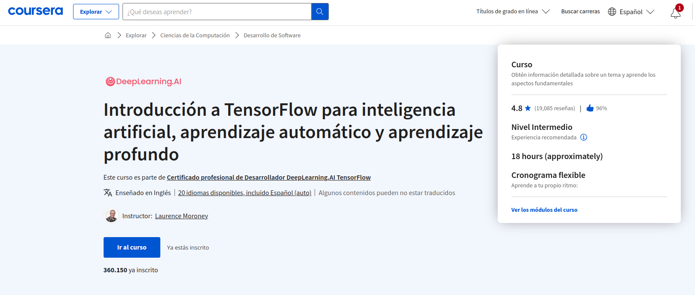
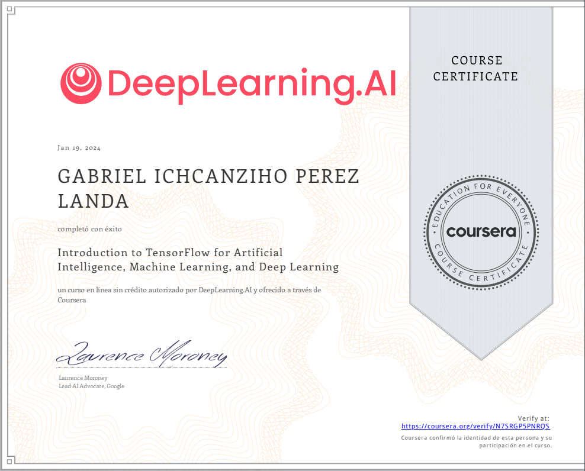

# Introduction to TensorFlow for Artificial Intelligence, Machine Learning, and Deep Learning



[Curso](https://www.coursera.org/learn/introduction-tensorflow?)

En este curso, aprenderás:

- Aprenda las mejores prácticas para utilizar TensorFlow, un popular marco de aprendizaje automático de código abierto

- Construir una red neuronal básica en TensorFlow

- Entrenar una red neuronal para una aplicación de visión por ordenador

- Entienda cómo utilizar las convoluciones para mejorar su red neuronal

Si usted es un desarrollador de software que quiere construir algoritmos escalables impulsados por IA, necesita entender cómo utilizar las herramientas para construirlos. Este curso forma parte de la próxima Especialización en Aprendizaje Automático en Tensorflow y le enseñará las mejores prácticas para utilizar TensorFlow, un popular marco de trabajo de código abierto para el aprendizaje automático. 



[Coursera N7SRGP5PNRQS.pdf](notes%2FCoursera%20N7SRGP5PNRQS.pdf)


El curso de Aprendizaje Automático y la Especialización en Aprendizaje Profundo de Andrew Ng enseñan los principios más importantes y fundacionales del Aprendizaje Automático y el Aprendizaje Profundo. Esta nueva Especialización en TensorFlow de deeplearning.ai le enseña cómo utilizar TensorFlow para implementar esos principios, de forma que pueda empezar a construir y aplicar modelos escalables a problemas del mundo real. Para desarrollar una comprensión más profunda de cómo funcionan las redes neuronales, le recomendamos que realice la Especialización en Aprendizaje Profundo.

## INDEX 0

- [A new programming paradigm](#a-new-programming-paradigm)
- [Weekly Assignment - Your first Neural Network](#weekly-assignment---your-first-neural-network)
- [Introduction to Computer Vision](#introduction-to-computer-vision)
- [Weekly Assignment - Implement a Deep Neural Network to recognize handwritten digits](#weekly-assignment---implement-a-deep-neural-network-to-recognize-handwritten-digits)
- [Enhancing Vision with Convolutional Neural Networks](#enhancing-vision-with-convolutional-neural-networks)
- [Weekly Assignment - Improving DNN Performance using Convolutions](#weekly-assignment---improving-dnn-performance-using-convolutions)
- [Using Real-world Images](#using-real-world-images)
- [Weekly Assignment - Handling Complex Images](#weekly-assignment---handling-complex-images)

## A new programming paradigm
[<- Return to INDEX 0](#index-0)

Bienvenido a este curso sobre cómo pasar de los conceptos básicos a la maestría en TensorFlow. ¡Estamos emocionados de que estés aquí! En la Semana 1, recibirás una introducción suave a lo que son el Aprendizaje Automático y el Aprendizaje Profundo, y cómo ofrecen un nuevo paradigma de programación, dándote un nuevo conjunto de herramientas para abrir escenarios antes inexplorados. Todo lo que necesitas saber son algunas habilidades de programación muy básicas, y el resto lo irás aprendiendo sobre la marcha. Para comenzar, echa un vistazo al primer video, una conversación entre Andrew y Laurence que establece el tema de lo que estudiarás...

**Objetivos de aprendizaje**

- Monitorear la precisión de las predicciones de precios de viviendas.
- Analizar predicciones de precios de viviendas que provienen de una red neuronal de una sola capa.
- Usar TensorFlow para construir una red neuronal de una sola capa para ajustar modelos lineales.

### INDEX 1

- [Introduction: A conversation with Andrew Ng](#introduction-a-conversation-with-andrew-ng)
- [Where to find the notebooks for this course](#where-to-find-the-notebooks-for-this-course)
- [A primer in machine learning](#a-primer-in-machine-learning)
- [The Hello World of neural networks](#the-hello-world-of-neural-networks)
- [Intake Survey](#intake-survey)
- [Join our community](#join-our-community)
- [From rules to data](#from-rules-to-data)
- [Working through Hello World in TensorFlow and Python](#working-through-hello-world-in-tensorflow-and-python)
- [Get started with Google Colaboratory (Coding TensorFlow)](#get-started-with-google-colaboratory-coding-tensorflow)
- [Faqs about Google Colab](#faqs-about-google-colab)
- [Try it for yourself (Lab 1)](#try-it-for-yourself-lab-1)
- [Week 1 Quiz](#week-1-quiz)
- [Lecture Notes 1](#lecture-notes-1)

### Introduction: A conversation with Andrew Ng
[<- Return to INDEX 1](#index-1)


En este video, se da la bienvenida a un curso de TensorFlow, desde lo básico hasta lo avanzado. El presentador, Laurence Moroney, 
un desarrollador en Google, comparte su experiencia en inteligencia artificial (AI) y TensorFlow. 

Destacan las herramientas como TensorFlow, PyTorch y Caffe para implementar algoritmos de aprendizaje profundo y aprendizaje automático. 
Laurence Moroney, agradecido por aprender de cursos anteriores, discute la importancia del aprendizaje automático en diversas 
industrias y la escasez de desarrolladores AI. 

El objetivo es capacitar a más personas en AI para aprovechar nuevas oportunidades. El video promete explorar diferencias 
entre paradigmas de programación y adaptar datos en el contexto de aprendizaje automático.

### Where to find the notebooks for this course
[<- Return to INDEX 1](#index-1)

Todos los cuadernos de este curso pueden ejecutarse en Google Colab o en Coursera Labs. **No necesita tener configurado un entorno local para seguir los ejercicios de codificación**. 
Puede simplemente hacer clic en la insignia `Open in Colab` en la parte superior de los laboratorios no calificados, mientras 
que para las tareas, se le llevará automáticamente a Coursera Labs. 

Sin embargo, si desea ejecutarlos en su máquina local, los laboratorios no calificados y las asignaciones para cada semana se pueden encontrar en este 
[repositorio de Github](https://github.com/https-deeplearning-ai/tensorflow-1-public)
 bajo la carpeta `C1`. Si ya tiene git instalado en su ordenador, puede clonarlo con este comando:

git clone https://github.com/https-deeplearning-ai/tensorflow-1-public

Si no, por favor siga las guías 
[aquí](https://git-scm.com/book/en/v2/Getting-Started-Installing-Git)
 para instalar git en su sistema operativo. Una vez que haya clonado el repositorio, puede hacer un `git pull` de vez en 
cuando para asegurarse de que recibe las últimas actualizaciones de los cuadernos.

Necesitará estos paquetes si va a ejecutar los cuadernos localmente:

```commandline
tensorflow==2.7.0
scikit-learn==1.0.1
pandas==1.1.5
matplotlib==3.2.2
seaborn==0.11.2
```

### A primer in machine learning
[<- Return to INDEX 1](#index-1)


La programación ha sido el pan de cada día para los desarrolladores desde los albores de la informática. Estamos acostumbrados a crear aplicaciones descomponiendo los requisitos en problemas parciales que entonces pueden ser programados. 

Por ejemplo, si tenemos que escribir una aplicación que resuelva un analítico de valores, tal vez el precio dividido por la relación, generalmente podemos escribir un programa para obtener los valores a partir de una fuente de datos, hacer el cálculo y devolver el resultado.


O si estamos escribiendo un juego generalmente podemos seguir las reglas. Por ejemplo, si la bola golpea el ladrillo entonces el ladrillo debe desaparecer y la bola debe rebotar. Pero si la pelota cae fuera de la parte inferior de la pantalla entonces tal vez el jugador pierde su vida. 


Podemos representarlo con este diagrama. Las reglas y los datos entran y las respuestas salen. Las reglas se expresan en un lenguaje de programación, los datos pueden provenir de una variedad de fuentes de variables locales hasta de bases de datos. 


El aprendizaje automático reorganiza este diagrama aquí ponemos respuestas y datos entrando y salen las reglas. En lugar de ser nosotros, como desarrolladores, los que averiguamos las reglas de cuándo debe desaparecer el ladrillo, cuándo debe terminar la vida del jugador, o cuál es el analítico deseado para cualquier otro concepto, lo que haremos es conseguir un montón de ejemplos de lo que queremos ver y entonces el computador averigua las reglas. 


Si estoy construyendo un dispositivo que detecta si alguien, digamos camina y tengo datos de su velocidad, Podría escribir un código como este y si está corriendo, a una velocidad más rápida podría adaptar mi código a esto y si está montando en bicicleta, eso tampoco es tan malo. Puedo adaptar mi código así. Pero luego tengo que hacer reconocimiento de golf también y mi concepto se viene abajo.

Pero no sólo eso, hacerlo solamente por velocidad por supuesto es bastante ingenuo. Caminamos y corremos a diferentes velocidades cuesta arriba y cuesta abajo y otras personas caminan y corren a velocidades diferentes a nosotros. 


Volvamos a este diagrama. En definitiva el aprendizaje automático es muy similar, pero sólo estamos volteando los ejes. En vez de tratar de expresar el problema como reglas cuando a menudo eso ni siquiera es posible, Tengo que llegar a un compromiso. El nuevo paradigma es que tengo montones y montones de ejemplos y tengo etiquetas de esos ejemplos y uso los datos para decir esto es caminar, esto es correr, esto es andar en bicicleta y sí, incluso esto es jugar al golf. Entonces se convierte en respuestas y datos entrando con reglas de siendo inferidas por la máquina. 


 Un algoritmo de aprendizaje automático averigua los patrones específicos de cada conjunto de datos que determina el carácter distintivo de cada uno. Eso es lo que es tan poderoso y emocionante sobre este paradigma de programación. Es más que solo una nueva forma de hacer lo mismo de siempre. Abre nuevas posibilidades que no eran viables de hacer antes. 


### The Hello World of neural networks
[<- Return to INDEX 1](#index-1)


Anteriormente mencionamos que el aprendizaje automático trata de un computador aprendiendo patrones que distinguen cosas. Como para el reconocimiento de actividades era el patrón caminar, correr y andar en bicicleta que pueden ser aprendidos a partir de varios sensores de un equipo.


Para demostrar cómo funciona veamos un conjunto de números y veamos si puedes determinar un patrón entre ellos. Estos son los números. Existe una fórmula que mapea X en Y. ¿La puedes ver? Tómate un momento.

La respuesta es Y es igual a 2X menos 1. Siempre que veas un Y, es el doble del X correspondiente menos 1. Si lo averiguaste por ti mismo, bien hecho. ¿Pero cómo lo hiciste? ¿Cómo piensas que podrías averiguarlo? Tal vez puedes ver que Y incrementa por 2 cada vez que X incrementa por uno. Probablemente parece que Y es igual a 2X más o menos algo. Entonces cuando vistes X igual a 0 e Y igual a -1, así que pensaste que ese algo es menos 1, la respuesta puede ser 2X menos 1


Veámoslo ahora en código. Esta es nuestra primera línea de código. Esto está escrito usando Python y TensorFlow y un API en TensorFlow llamado Keras. Keras hace muy fácil definir redes neuronales. Una red neuronal es básicamente un conjunto de funciones que pueden aprender patrones. No te preocupes si hay muchos conceptos nuevos. Se aclararán bastante rápido a medida que trabajes con ellos.

La red neuronal más simple posible es aquella que tiene una solo neurona en ella, y eso es lo que esta línea de código hace. En Keras usas la palabra dense para definir una capa de neuronas conectadas. Aquí solo hay un dense. Así que solo hay una capa y solo hay una unidad en ella, es una sola neurona. Las sucesivas capas están definidas en secuencia, de aquí la palabra sequential. Pero como dije, solo hay una. Solo tienes una neurona

Defines la forma de la entrada a la red neuronal en la primera y en este caso única capa, puedes ver que nuestra entrada es super simple. Es solamente un valor. Probablemente has visto que, para el aprendizaje automático, necesitas saber y usar un montón de matemáticas, cálculo, probabilidades y cosas similares. Es realmente muy bueno entenderlo al querer optimizar los modelos, pero lo bueno por ahora sobre TensorFlow y Keras es que muchas matemáticas están implementadas para ti en funciones.


Existen dos roles de funciones de los que debes ser consciente estas son las funciones de pérdida y los optimizadores. Este código las define. Me gusta pensar en ello de esta manera. La red neuronal no tiene idea de la relación entre X e Y, así que hace una conjetura. Digamos que conjetura que Y es igual a 10X menos 10. Usará los datos que conoce que son los conjuntos de X's e Y's que ya hemos visto para medir lo buena o lo mala que fue la conjetura. 

La función de pérdida mide esto y luego pasa los datos al optimizador que averigua la siguiente conjetura. El optimizador piensa sobre lo bien o mal que se hizo la conjetura usando los datos con la función de pérdida. La lógica es que cada conjetura debe ser mejor que la anterior. A medida que las conjeturas se mejoran la precisión se acerca al 100 por ciento, se usa el término convergencia. 

En este caso, la pérdida es el error cuadrático medio y el optimizador es SGD que significa descenso de gradiente estocástico. Si deseas aprender más sobre estas funciones particulares así como las otras opciones que pueden ser mejores en otros escenarios, revisa la documentación de TensorFlow. 


Por ahora solo vamos a usar esto. Nuestro siguiente paso es representar los datos conocidos. Estos son los X's e Y's que viste anteriormente. El np.array usa una librería Python llamada numpy que hace la representación de datos particularmente las listas mucho más fácil. Aquí puedes ver que tenemos una lista para las X y otra para las Ys.


El entrenamiento se da con el comando fit. Aquí pedimos al modelo que averigüe cómo ajustar los valores de X a los valores de Y. Los epochs son igual a 500 y significa que vamos a hacer un bucle de entrenamiento 500 veces. Este bucle de entrenamiento es lo que describimos anteriormente. 

Haz una conjetura, mide lo buena o mala que es la conjetura con la función de pérdida, luego usas el optimizador y los datos para hacer otra conjetura y lo repites. Cuando el modelo ha finalizado el entrenamiento te dará valores usando el método de predicción. 


No has visto previamente 10, ¿y qué piensas que dará cuando le pases un 10? Puedes pensar que dará 19 porque después de todo Y es igual a 2X menos 1, y piensas que debe ser 19. Pero cuando pruebes esto en el cuaderno tú mismo, verás que da un valor muy cercano a 19 pero no exactamente 19.

¿Por qué crees que eso es así? Fundamentalmente hay dos razones principales. La primera es que lo entrenaste usando muy pocos datos. Solamente hay seis puntos. Esos seis puntos son lineales pero no hay garantía de que por cada X, la relación será Y igual 2X menos 1. Hay una gran probabilidad de que Y sea igual a 19 para X igual a 10, pero la red neuronal no es positiva. Averiguará un valor realista para Y.

Esa es la segunda razón principal. Cuando se usan redes neuronales, como ellas averiguan las respuestas para todo, ellas tratan con probabilidades. Verás eso mucho y tendrás que ver cómo manejar las respuestas para el ajuste. Tenlo en cuenta mientras trabajas con el código. 

### Intake Survey
[<- Return to INDEX 1](#index-1)

Nos encantaría saber más sobre su experiencia con DeepLearning.AI y con la IA en general. ¡Por favor, considere completar la breve encuesta de 3 preguntas para que podamos servirle mejor!

Este course utiliza una aplicación de terceros, Encuesta de admisión, para mejorar tu experiencia de aprendizaje. La aplicación hará referencia a información básica, como tu nombre, correo electrónico e ID de Coursera.

### Join our community
[<- Return to INDEX 1](#index-1)

¡Hola!

Hemos creado una comunidad para que usted pueda:

- Pedir ayuda sobre las tareas y otros contenidos del curso.

- Discutir temas del curso.

- Compartir sus conocimientos con otros alumnos.

- Crear su red de contactos.

- Enterarse de las novedades, eventos y concursos de DeepLearning.AI.

Para acceder a la comunidad de este curso, marque la casilla que aparece a continuación para indicar que acepta utilizar la aplicación de forma responsable y, a continuación, haga clic en elbotón"Iniciar aplicación" .

Si es nuevo en la comunidad, haga clic en el botón "Iniciar aplicación"  para crear su cuenta y acceder a nuestra comunidad.

Hemos creado esta 
[Guía](https://community.deeplearning.ai/c/faq/391)
 del usuario 
para usted
. Asegúrese de consultar las directrices comunitarias 
[del Código de Conducta ](https://community.deeplearning.ai/c/faq/code-of-conduct/392)
. ¿Tiene problemas para acceder a nuestra comunidad después de pulsar el botón "Iniciar aplicación"? Rellene este
 formulario
 para explicar su problema y nos pondremos en contacto con usted.

¡Esperamos verle pronto en nuestra comunidad!

- El equipo de DeepLearning.AI

### From rules to data
[<- Return to INDEX 1](#index-1)

En estos vídeos, se le ofreció una introducción a los conceptos y paradigmas del aprendizaje automático y el aprendizaje profundo. 
Vio que el paradigma tradicional de expresar reglas en un lenguaje de codificación puede no funcionar siempre para resolver un problema. 

Así, aplicaciones como la visión por ordenador son muy difíciles de resolver con programación basada en reglas. En cambio, si 
alimentamos un ordenador con suficientes datos que describimos (o etiquetamos) como lo que queremos que reconozca -dado que los 
ordenadores son realmente buenos procesando datos y emparejando patrones-, entonces podríamos "entrenar" potencialmente un sistema para 
resolver un problema. 

Vimos un ejemplo super sencillo de ello: ajustar números a una recta. Así que ahora, vamos a revisar un cuaderno y ejecutar el código 
que entrena una red neuronal para aprender cómo un conjunto de números forman una línea. Después, alimentaremos la red entrenada con un 
nuevo punto de datos y veremos si predice correctamente el valor esperado.

### Working through Hello World in TensorFlow and Python
[<- Return to INDEX 1](#index-1)


En la sección anterior, viste algunos detalles detrás del concepto y paradigmas del aprendizaje automático. Viste cómo era un cambio desde expresiones basadas en reglas usando código para obtener datos etiquetar esos datos, y luego tener una red neuronal que averigüe los patrones que generan las reglas. Viste a través de un ejemplo muy sencillo que tomaba algunos valores x e y y averiguaba la relación entre ellos.


Ahora vas a practicar escribiendo este código tú mismo. No necesitas un entorno de desarrollo para hacerlo, una forma en que lo puedes hacer, es usarlo correctamente en el navegador con algo llamado Google Colaboratory. Si estás familiarizado con Jupyter Notebooks en Python, estarás como en casa, y por supuesto también puedes usar Jupyter Notebooks. De otra forma, considera Colab un entorno que se ejecuta en el navegador que permite ejecutar, editar, e inspeccionar el código Python. Es realmente genial para aprender. Si desean más detalles sobre esto, revisa este vídeo en Youtube.


En este segmento, repaso la primera lección del curso y luego me animan a ejecutar el código por mi cuenta. Explico cómo importar y configurar TensorFlow, Keras y NumPy. Luego, defino una red neuronal con una capa, una neurona y un valor de entrada, y procedo a compilar la red utilizando una función de pérdida y un optimizador.


Destaco la importancia de la función de pérdida y el optimizador en ayudar a la red neuronal a aprender patrones. Luego, muestro cómo proporcionar datos conocidos (x) y desconocidos (y) usando NumPy arrays, y describo el proceso de entrenamiento de la máquina para aprender patrones a lo largo de 500 épocas.


Durante el entrenamiento, observo la disminución gradual de la pérdida, indicando que la red neuronal se acerca a identificar la relación entre x e y. Después de las 500 épocas, la pérdida es mínima, lo que sugiere una comprensión cercana de la relación para los datos proporcionados.


Finalmente, presento una nueva x (10) y muestro la predicción de la red neuronal (18.98), destacando que aunque es cercana a la respuesta correcta (19), no es exacta. Me invitan a revisar la lección anterior para comprender las razones detrás de esta discrepancia.

### Get started with Google Colaboratory (Coding TensorFlow)
[<- Return to INDEX 1](#index-1)

Puedes acceder a un breve video de [YouTube](https://www.youtube.com/watch?v=inN8seMm7UI) para conocer los principios
básicos de Cómo se utiliza Google Colab para correr código Python.

### Faqs about Google Colab
[<- Return to INDEX 1](#index-1)

Como ya se ha mencionado, puede utilizar Google Colab para seguir los ejercicios de codificación de este curso. El vídeo anterior mostraba una rápida introducción sobre cómo utilizar este entorno y aquí tiene algunas 
[preguntas frecuentes](https://research.google.com/colaboratory/faq.html)
 por si quiere saber más.

### Try it for yourself (Lab 1)
[<- Return to INDEX 1](#index-1)

Bien, ahora que ha visto la demostración, ¿por qué no lo prueba usted mismo? Puede descargar el libro de ejercicios 
aquí [C1_W1_Lab_1_hello_world_nn.ipynb](notebooks%2FW1%2FC1_W1_Lab_1_hello_world_nn.ipynb)
. 

Ahora bien, aunque esto pueda parecer muy sencillo, en realidad ya ha aprendido lo básico sobre el funcionamiento de las redes neuronales. Continuará utilizando las mismas técnicas a medida que sus aplicaciones se vuelvan más complejas.

### Week 1 Quiz
[<- Return to INDEX 1](#index-1)

1. What is the difference between traditional programming and Machine Learning?

   - [X] In traditional programming, a programmer has to formulate or code rules manually, whereas, in Machine Learning, the algorithm automatically formulates the rules from the data.
   - [ ] Machine learning identifies complex activities such as golf, while traditional programming is better suited to simpler activities such as walking.

   > Correct
   > Exactly! Machine learning algorithms build a model based on sample data, known as "training data", in order to make predictions or decisions without being explicitly programmed to do so.

2. What do we call the process of telling the computer what the data represents (i.e. this data is for walking, this data is for running)?

   - [ ] Learning the Data
   - [ ] Categorizing the Data
   - [X] Labelling the Data
   - [ ] Programming the Data

   > Correct
   > Yes! Labeling typically takes a set of unlabeled data and augments each piece of it with informative tags.

3. What is a Dense layer?

   - [ ] A single neuron
   - [ ] An amount of mass occupying a volume
   - [ ] A layer of disconnected neurons
   - [X] A layer of neurons fully connected to its adjacent layers

   > Correct
   > Correct! In Keras, dense is used to define this layer of connected neurons.

4. How do you measure how good the current ‘guess’ is?

   - [ ] Figuring out if you win or lose
   - [X] Using the Loss function
   - [ ] Training a neural network

   > Correct
   > Absolutely! An optimization problem seeks to minimize a loss function.

5. What does the optimizer do?

   - [ ] Measures how good the current guess is
   - [X] Generates a new and improved guess
   - [ ] Figures out how to efficiently compile your code
   - [ ] Decides to stop training a neural network

   > Correct
   > Nailed it! The optimizer figures out the next guess based on the loss function.

6. What is Convergence?

   - [ ] An analysis that corresponds too closely or exactly to a particular set of data.
   - [ ] A programming API for AI
   - [ ] A dramatic increase in loss
   - [X] The process of getting very close to the correct answer

   > Correct
   > That’s right! Convergence is when guesses get better and better closing to a 100% accuracy.

7. What does model.fit do?

   - [ ] It optimizes an existing model
   - [X] It trains the neural network to fit one set of values to another
   - [ ] It determines if your activity is good for your body
   - [ ] It makes a model fit available memory
   
   > Correct
   > Correct! The training takes place on the fit command.


### Lecture Notes 1
[<- Return to INDEX 1](#index-1)

Los apuntes de las conferencias están disponibles en nuestra plataforma comunitaria. Si ya es miembro, inicie sesión en su cuenta y acceda a los apuntes de las conferencias 
[C1_W1.pdf](notes%2FC1_W1.pdf)
.

NOTA: Si aún no tiene una cuenta, siga las instrucciones 
[aquí](https://www.coursera.org/learn/introduction-tensorflow/ungradedLti/3L0GK/important-have-questions-issues-or-ideas-join-our-community)
 y luego vuelva a esta página.


#### Derechos de autor
Estas diapositivas se distribuyen bajo licencia Creative Commons.

[DeepLearning.](https://www.deeplearning.ai/)
AI pone estas diapositivas a su disposición con fines educativos. No puede utilizar ni distribuir estas diapositivas con fines comerciales. Puede hacer copias de estas diapositivas y utilizarlas o distribuirlas con fines educativos siempre que cite a
[DeepLearning](https://www.deeplearning.ai/)
.AI como fuente de las mismas.

Para conocer el resto de los detalles de la licencia, consulte
https://creativecommons.org/licenses/by-sa/2.0/legalcode

## Weekly Assignment - Your first Neural Network
[<- Return to INDEX 0](#index-0)

### INDEX 3

- [Assignment Troubleshooting Tips](#assignment-troubleshooting-tips)
- [Downloading your Notebook and refreshing your workspace](#downloading-your-notebook-and-refreshing-your-workspace)
- [Housing Prices](#housing-prices)
- [Week 1 Resources](#week-1-resources)

### Assignment Troubleshooting Tips
[<- Return to INDEX 3](#index-3)

He aquí algunas directrices generales antes de entregar sus tareas en este curso. Téngalas en cuenta no sólo para la tarea de esta semana, sino también para las siguientes:

1. Asegúrese de guardar su trabajo antes de hacer clic en el botón `Submit`. De lo contrario, es posible que aparezca un 
mensaje de error como el de la celda de código siguiente. Recuerde que todo lo que tiene que rellenar dentro de las funciones 
calificadas se inicializa en `None`.

   ```commandline
   Failed test case: x has incorrect type.
   Expected:
   some.Type,
   but got:
   <class 'NoneType'>.
   ```

2. Por favor, no cambie el nombre del cuaderno. El calificador buscará el nombre de archivo original y sus metadatos asociados, 
por lo que debe trabajar en el archivo que se abre automáticamente al hacer clic en el botón `Launch Notebook`. 
Si intenta enviar un cuaderno renombrado, es posible que también aparezca un error como el que se muestra arriba.

3. Por favor, no modifique ningún código fuera de las etiquetas `START CODE HERE` y `END CODE HERE`. Su solución sólo debe 
colocarse entre estos marcadores para garantizar una calificación correcta. Modificar los parámetros de las funciones y 
otras celdas de prueba probablemente romperá el calificador. Si desea experimentar con ellas, puede hacerlo después de haber 
superado con éxito la tarea.

4. Después de seguir los consejos anteriores y el calificador le sigue dando 0/100, es posible que los metadatos necesarios para la calificación estén dañados. Por favor, obtenga un nuevo cuaderno de laboratorio refrescando su espacio de trabajo
([instrucciones aquí](https://www.coursera.org/learn/introduction-tensorflow/supplement/M20rh/optional-downloading-your-notebook-and-refreshing-your-workspace)
). A continuación, copie sus soluciones en el nuevo cuaderno. Asegúrese de que todas las celdas siguen funcionando como se espera y, a continuación, vuelva a enviarlas.

5. Si tiene más preguntas, por favor cree un tema en la comunidad Discourse en lugar de los foros de discusión de Coursera. Puede unirse 
[siguiendo las instrucciones aquí](https://www.coursera.org/learn/introduction-tensorflow/ungradedLti/3L0GK/have-questions-join-us-on-discourse)
. Obtendrá ayuda allí más rápidamente porque varios mentores y sus compañeros de aprendizaje están supervisando los mensajes. Sólo asegúrese de crear el tema en la categoría correcta del curso.

### Downloading your Notebook and refreshing your workspace
[<- Return to INDEX 3](#index-3)

Este curso utiliza Coursera **Labs** para proporcionar un entorno de cuadernos y calificar su trabajo. Puede haber algunos casos en 
los que necesite descargar sus cuadernos o actualizar su espacio de trabajo para empezar desde cero. Este elemento de lectura 
describe los pasos para hacerlo.

#### Descarga de su cuaderno

En caso de que necesite descargar su cuaderno para solucionar problemas o para ejecutarlo en su entorno local, puede seguir estos sencillos pasos:

1. En la barra de menús del cuaderno en el que esté trabajando, haga clic en **File → Save and Checkpoint** para guardar primero su progreso.

2. Haga clic en **File → Download as → Notebook (.ipynb)**. Esto debería iniciar la descarga del archivo en su máquina local.

#### Actualizar su espacio de trabajo

Esto le resultará útil siempre que necesite empezar de cero, buscar la última versión de la tarea o encontrarse con un error 404.

1. Abra el cuaderno desde el aula.

2. Una vez abierto el cuaderno, haga clic en **File → Open**

3. Cuando se abra su espacio de trabajo, marque la casilla situada delante del archivo del cuaderno. Una vez seleccionado, pulse **Shutdown**. El icono junto al nombre del archivo debería pasar de verde a gris.

4. Marque de nuevo la casilla de verificación y esta vez elija **Rename** e introduzca cualquier nombre de archivo que no sea el original. 
Por ejemplo, **C4W1_Assignment.ipynb** (original) → **C4W1_Assignment_v2.ipynb**

5. (Opcional) Marque la casilla de cualquier otro archivo del que desee obtener una copia nueva (por ejemplo, archivos de conjuntos de datos 
que pueda haber manipulado de forma irreversible). A continuación, haga clic en **Delete**. También puede optar por **Rename** o **Download** cada archivo individualmente en caso de que desee conservarlos antes de borrarlos.

6. Haga clic en el botón **Help** situado en la parte superior derecha de la página.

7. Haga clic en el botón **Get latest version**.

8. Haga clic en el botón **Update Lab**. La página se actualizará y ahora debería ver la última versión del cuaderno.

### Housing Prices
[<- Return to INDEX 3](#index-3)

¡Genial! ¡Ya ha recorrido un largo camino! Ahora es el momento de hacer un ejercicio de programación. A principios de esta semana, 
vio un "**Hola Mundo**" en Aprendizaje Automático que predecía una relación entre los valores X e Y. Se trataba de algo 
puramente arbitrario, pero le dio la pauta de cómo puede resolver problemas más difíciles. 

Para este ejercicio, escribirá código que realice una tarea similar -- en este caso, predecir los precios de la vivienda 
basándose en una ecuación lineal simple.

> ### Nota:
> El notebook de este ejercicio es el siguiente: [C1W1_Assignment.ipynb](notebooks%2FW1%2FC1W1_Assignment.ipynb)

Para enviar su tarea para su calificación, haga clic en el botón Enviar tarea dentro del cuaderno.

> IMPORTANTE PARA UNA BUENA CALIFICACIÓN:
>
> - No olvide guardar su cuaderno antes de enviarlo
>
> - No borre las celdas, ya que incluyen metadatos importantes para la calificación.
>
> - Rellene sus soluciones dentro de los espacios proporcionados. Puede añadir nuevas celdas pero éstas serán omitidas por el calificador.

Si tiene alguna duda sobre las tareas de este curso, solicite ayuda en nuestra comunidad. Si aún no lo ha hecho, 
[haga clic aquí y siga las instrucciones para poder unirse](https://www.coursera.org/learn/introduction-tensorflow/ungradedLti/3L0GK/important-have-questions-issues-or-ideas-join-our-community-on-discourse)

### Week 1 Resources
[<- Return to INDEX 3](#index-3)

Con esto llegamos al final de lo que debe consultar en la Semana 1. Si está ansioso por aprender más, antes de pasar a la Semana 2, hay algunos recursos estupendos que puede consultar:

- AI For Everyone es un curso no técnico que le ayudará a entender muchas de las tecnologías de IA que discutiremos más adelante en este curso, y le ayudará a detectar oportunidades en la aplicación de esta tecnología para resolver sus problemas. 
https://www.deeplearning.ai/ai-for-everyone/

- TensorFlow está disponible en 
[TensorFlow.org](https://tensorflow.org/)
, y las actualizaciones en vídeo del equipo de TensorFlow están en 
[youtube.com/tensorflow](https://www.youtube.com/tensorflow)

Juegue con una red neuronal directamente en el navegador en 
http://playground.tensorflow.org.
 Vea si puede averiguar los parámetros para conseguir que la red neuronal haga coincidir los patrones con los grupos deseados. ¡La espiral es particularmente desafiante!


## Introduction to Computer Vision
[<- Return to INDEX 0](#index-0)

### INDEX 4

- [A conversation with Andrew Ng](#a-conversation-with-andrew-ng)
- [An Introduction to computer vision](#an-introduction-to-computer-vision)
- [Exploring how to use data](#exploring-how-to-use-data)
- [Writing code to load training data](#writing-code-to-load-training-data)
- [The structure of Fashion MNIST data](#the-structure-of-fashion-mnist-data)
- [Coding a Computer Vision Neural Network](#coding-a-computer-vision-neural-network)
- [See how it's done](#see-how-its-done)
- [Walk through a Notebook for computer vision](#walk-through-a-notebook-for-computer-vision)
- [Get Hands-on with computer vision (Lab 1)](#get-hands-on-with-computer-vision-lab-1)
- [Using Callbacks to control training](#using-callbacks-to-control-training)
- [See how to implement Callbacks (Lab 2)](#see-how-to-implement-callbacks-lab-2)
- [Walk through a notebook with Callbacks](#walk-through-a-notebook-with-callbacks)
- [Week 2 Quiz](#week-2-quiz)
- [Lecture Notes Week 2](#lecture-notes-week-2)

### A conversation with Andrew Ng
[<- Return to INDEX 4](#index-4)


En la lección reciente, se exploraron los fundamentos del nuevo paradigma en programación que surge con el aprendizaje automático y el aprendizaje profundo. Se destacó cómo, en lugar de codificar reglas explícitas, es posible utilizar datos y conjuntos de datos etiquetados para adentrarse en campos como el reconocimiento de actividades. Añadiendo un toque de diversión, se inició la codificación de una red neuronal básica, diseñada para ajustar datos x e y en una línea. Este paso inicial, aunque sencillo, reveló una verdad asombrosa: la habilidad de ajustar relaciones entre x e y es la base para logros notables en el aprendizaje automático, como permitir que las computadoras reconozcan imágenes y realicen reconocimiento de actividades.

Se profundizó en cómo la visión por computadora representa un reto significativo. Distinguir en una imagen si se muestra un vestido o unos zapatos es una tarea compleja para una máquina. Mientras que para los humanos reconocer objetos es una tarea sencilla, para una computadora implica analizar y comprender los valores de brillo de cada píxel. Resulta fascinante que, a través del aprendizaje automático y profundo, las computadoras estén avanzando notablemente en estas capacidades.

El uso de la red neuronal básica desarrollada en la lección proporciona una plantilla para todo lo que se puede lograr con el aprendizaje profundo, diseñando redes neuronales en capas capaces de reconocer patrones complejos. Esto abre la posibilidad de aplicar estas técnicas, como se demostró, al reconocimiento de prendas de vestir. En el próximo video, se abordará cómo escribir código para aplicar este paradigma, ya introducido, en el reconocimiento de ropa a partir de datos etiquetados, invitando a continuar con el siguiente material del curso.

### An Introduction to computer vision
[<- Return to INDEX 4](#index-4)


En la lección anterior, vimos aprendiste qué es el paradigma de aprendizaje automático y cómo usar datos y etiquetas y hacer que una computadora infiera las reglas por ti. Viste un ejemplo sencillo donde averiguaba las relaciones entre dos conjuntos de números. Llevemos esto al siguiente nivel resolviendo un problema real, visión por computadora. 


Visión por computadora es el campo en el que una computadora entiende y etiqueta lo que está presente en una imagen. Considera esta diapositiva. Cuando la ves, puedes interpretar que es una camisa o que es un zapato, ¿pero cómo lo programarías? Si un extraterrestre que nunca ha visto ropa entra en el cuarto contigo, ¿Como le explicarías los zapatos? Es realmente muy difícil, sino imposible hacerlo. Y es el mismo problema con la visión por computadora. 


Una forma de resolverlo es utilizar un montón de imágenes de ropa decirle al computador qué es esa imagen y luego dejar que la computadora averigüe los patrones que te dan la diferencia entre un zapato una camiseta, una cartera, y un abrigo. Aprenderás cómo hacerlo en esta sección. Afortunadamente, existe un conjunto de datos llamado Fashion MNIST que da 70 mil imágenes distribuidas en 10 diferentes artículos de ropa. Estas imágenes han sido reducidas a 28 por 28 píxeles.

Usualmente, cuanto más pequeño, mejor porque la computadora debe hacer menos procesamiento. Pero por supuesto, debes retener suficiente información para estar seguro de que las características y el objeto se puedan distinguir. Si ves esta diapositiva puedes decir la diferencia entre camisetas, zapatos y carteras. Este tamaño parece ser ideal, y lo hace genial para entrenar una red neuronal. 


Las imágenes están también en escala gris, la cantidad de información también ha sido reducida. Cada píxel puede ser representado en valores desde cero hasta 255 y sólo es un byte por píxel. Con 28 por 28 píxeles por imagen, solo 784 bytes son necesarios para almacenar la imagen completa. A pesar de eso, podemos aún ver qué hay en la imagen y en este caso, es un botín.

### Exploring how to use data
[<- Return to INDEX 4](#index-4)

El aprendizaje automático depende de tener buenos datos con los que entrenar un sistema. En el vídeo anterior, se le propuso entrenar un sistema para reconocer imágenes de moda. Los datos proceden de un conjunto de datos llamado Fashion MNIST, y puede obtener más información sobre él en GitHub 
[aquí](https://github.com/zalandoresearch/fashion-mnist)
. En el siguiente vídeo, verá cómo cargar esos datos y prepararlos para el entrenamiento.

------------

Fashion-MNIST is a dataset of Zalando's article images—consisting of a training set of 60,000 examples and a test set of 10,000 examples. Each example is a 28x28 grayscale image, associated with a label from 10 classes. We intend Fashion-MNIST to serve as a direct drop-in replacement for the original MNIST dataset for benchmarking machine learning algorithms. It shares the same image size and structure of training and testing splits.


**Labels**
Each training and test example is assigned to one of the following labels:

| Label | Description    |
|-------|----------------|
| 0     | T-shirt/top    |
| 1     | Trouser        |
| 2     | Pullover       |
| 3     | Dress          |
| 4     | Coat           |
| 5     | Sandal         |
| 6     | Shirt          |
| 7     | Sneaker        |
| 8     | Bag            |
| 9     | Ankle boot     |

### Writing code to load training data
[<- Return to INDEX 4](#index-4)


¿Qué aspecto tendrá el manejo de esto en código? En la lección anterior, vimos aprendiste de TensorFlow y Keras, y cómo definir una red neuronal sencilla con ellos. En esta lección, las usarás para ir un poco más a fondo, pero el API en general debe parecerte familiar. La única gran diferencia, estará en los datos. La última vez tenías 6 pares de números, y podías codificarlo a mano. 

Esta vez, debes cargar 70000 imágenes del disco, habrá un poco de código para manejar eso. Afortunadamente, aún es bastante sencillo porque Fashion-MNIST está disponible como un conjunto de datos con una llamada del API de TensorFlow.


Simplemente declaramos un objeto de tipo MNIST cargándolo de la base de datos Keras. En este objeto, si llamamos al método de carga de datos, nos devolverá 4 listas. Los datos de entrenamiento, las etiquetas de entrenamiento, los datos de prueba y las etiquetas de prueba. 


¿Cuáles son estas podrías preguntar? Cuando se construye una red neuronal como esta, es una buena estrategia usar algunos de tus datos para entrenar la red neuronal y datos similares que el modelo aún no ha visto para probar lo buena que es reconociendo imágenes. En el conjunto de datos Fashion MNIST, 60.000 de las 70.000 imágenes son usadas para entrenar la red, y entonces 10.000 imágenes, unas que no ha visto previamente pueden ser usadas para probar lo bien o mal que lo está realizando.


Este código te dará esos conjuntos. Cada conjunto tiene datos, las imágenes mismas y las etiquetas, y eso es lo que la imagen es en realidad. Entonces, por ejemplo, los datos de entrenamiento contendrán imágenes como esta, y una etiqueta que describe la imagen así. Esta imagen es un botín, la etiqueta que la describe es el número 9. 


¿Por qué crees que podría ser? Existen dos razones principales. Primero, por supuesto, es que las computadoras son mejores con 
números que con textos. Segundo, muy importante, es que esto es algo que nos puede ayudar a reducir sesgos. 

Si lo etiquetáramos como un botín, por supuesto, estaríamos sesgando hacia los anglo parlantes. Pero al ser una etiqueta 
numérica, podemos referirnos a ello en nuestro propio lenguaje sea inglés, chino, japones o incluso gaélico irlandés.

### The structure of Fashion MNIST data
[<- Return to INDEX 4](#index-4)

Aquí vio cómo los datos pueden cargarse en estructuras de datos de Python que facilitan el entrenamiento de una red neuronal. Ha visto cómo la imagen se representa como una matriz de 28x28 de escalas de grises, y cómo su etiqueta es un número. Utilizar un número es un primer paso para evitar el sesgo, ¡en lugar de etiquetarla con palabras en un idioma específico y excluir a las personas que no hablan ese idioma! Puede obtener más información sobre el sesgo y las técnicas para evitarlo 
[aquí](https://developers.google.com/machine-learning/fairness-overview/)
.

1. **Prácticas Generales Recomendadas para la IA:**

   - **Diseño Centrado en el Humano:** Incluye la experiencia del usuario en la evaluación del impacto del sistema.
   - **Identificación de Múltiples Métricas:** Utilizar diversas métricas para entender los compromisos entre diferentes tipos de errores y experiencias.
   - **Examen Directo de Datos en Bruto:** Analizar cuidadosamente los datos de entrenamiento.
   - **Comprensión de las Limitaciones de Conjuntos de Datos y Modelos:** Ser consciente de que los modelos reflejan los patrones de sus datos de entrenamiento.
   - **Pruebas Rigurosas:** Asegurarse de que el sistema de IA funcione como se pretende.
   - **Monitoreo y Actualización Continua Post-Despliegue:** Tener en cuenta el rendimiento en el mundo real y el feedback de los usuarios.

2. **Ejemplos de Trabajo de Google:** Proyectos y modelos específicos que demuestran estas prácticas.

3. **Justicia en la IA:**

   - Trabajar hacia sistemas que sean justos e inclusivos para todos.
   - Reconocer los desafíos, como los sesgos preexistentes en los datos y la dificultad de construir sistemas justos en todas las situaciones o culturas.
   - No hay una definición estándar de justicia, lo que requiere un enfoque holístico y la colaboración continua en la investigación.

4. Interpretabilidad:

   - La importancia de la capacidad para cuestionar, comprender y confiar en un sistema de IA.
   - Comparación entre la toma de decisiones humana y de IA en términos de explicación y comprensión.
   - Prácticas recomendadas para mejorar la interpretabilidad, como la planificación de opciones para la interpretabilidad, el tratamiento de la interpretabilidad como parte central de la experiencia del usuario, y el diseño de modelos interpretables.

Cada sección incluye prácticas recomendadas y ejemplos específicos para ilustrar cómo Google implementa estas ideas en su trabajo con la IA. La página también enfatiza la importancia de la continua investigación y el desarrollo en estas áreas para mejorar la responsabilidad en el uso de la IA.

### Coding a Computer Vision Neural Network
[<- Return to INDEX 4](#index-4)


Ahora veremos el código para la definición de una red neuronal. Recuerda que la última vez teníamos sequential con una sola capa en ella.


Ahora tenemos 3 capas. Las cosas importantes a mirar son la primera y última capas. La última capa tiene 10 neuronas porque tenemos 10 clases de ropa en el conjunto de datos. Esto debe siempre coincidir. La primera capa es una capa flatten con la forma de entrada de 28 por 28. 

Si recuerdas, nuestras imágenes son de 28 por 28, estamos especificando que esta es la forma en que debemos esperar los datos de entrada. Flatten toma este cuadrado de 28 por 28 y lo transforma en un vector lineal simple. Lo interesante pasa en la capa intermedia, muchas veces llamada también capa oculta.


Esta tiene 128 neuronas me gustaría que piensen en ellas como variables en una función. Quizás x1, x2, x3, etc. Existe una regla que incorpora todas estas que convierte los 784 valores de un botín en el valor nueve, y similarmente para todos los otros 70.000. Es una función muy compleja de ver mapeando las imágenes tú mismo, pero eso es lo que hace una red neuronal. 

Por ejemplo si dices la función y es igual a w1 por x1, más w2 por x2, más w3 por x3, hasta w128 por x128. Hallando los valores de w, entonces y dará nueve, cuando tienes el valor de entrada del zapato.


Verás que está haciendo algo muy, muy similar a lo que hicimos anteriormente cuando hallamos y igual a 2x menos 1. En este caso el dos, era el peso de x. Estoy diciendo que y es igual a w1 por x1, etc. No te preocupes si esto no está muy claro en este momento. Con el tiempo lo dominarás, viendo que funciona, hay algunas herramientas que te permitirán mirar dentro para ver lo que está sucediendo. 

Lo importante por ahora es que el código funcione, para que veas un escenario de clasificación por ti mismo. También puedes modificar la red neuronal añadiendo, eliminando y cambiando el tamaño de la capa para ver el impacto.


Lo harás en el siguiente ejercicio. Asimismo, si deseas ir más allá, revisa este tutorial de Andrew en Youtube, que aclarará cómo las capas densamente conectadas funcionan desde las perspectivas teórica y matemática. Pero por ahora, volvamos al código.

https://www.youtube.com/watch?v=fXOsFF95ifk&ab_channel=DeepLearningAI

### See how it's done
[<- Return to INDEX 4](#index-4)

En el siguiente vídeo, Laurence le guiará a través de un cuaderno de trabajo en el que podrá ver cómo se entrena una red neuronal con imágenes de moda. ¡Después podrá probar el cuaderno de trabajo usted mismo!

### Walk through a Notebook for computer vision
[<- Return to INDEX 4](#index-4)


Acabas de ver cómo crear una red neuronal que da capacidades de visión por computadora básicas para reconocer diferentes artículos de ropa. 
Trabajemos ahora con un cuaderno que tiene todo el código para hacer eso. Luego verás el cuaderno tú mismo y si quieres puedes hacer algunos 
ejercicios. Empecemos importando TensorFlow. 

Voy a obtener los datos de Fashion MNIST usando tf.keras.datasets. Llamando al método load data, Obtengo los datos de entrenamiento y las etiquetas así como los datos de prueba y las etiquetas.

```python
# Load the Fashion MNIST dataset
fmnist = tf.keras.datasets.fashion_mnist
# Load the training and test split of the Fashion MNIST dataset
(training_images, training_labels), (test_images, test_labels) = fmnist.load_data()
```


Para más detalles sobre esto, vuelve a revisar el anterior vídeo. Los datos de una imagen en particular es una cuadrícula de valores desde cero hasta 255 con valores de los píxeles en escala de grises. Usando matplotlib, puedo dibujarlos como una imagen para facilitar la inspección. También puedo imprimir los valores en bruto para que podamos ver qué aspecto tienen. Puedes ver los valores en bruto de los números de píxel de cero a 255, y puedes observar la imagen real. 


Ahora diseñamos nuestro modelo. Como explicamos anteriormente, hay una capa de entrada con la forma de los datos y una capa de salida con la forma de las clases, y una capa oculta que trata de hallar las reglas entre ellas. Compilamos el modelo para encontrar la función de pérdida y el optimizador, y el objetivo de estos es como antes, hacer una conjetura de cuál es la relación entre los datos de entrada y los datos de salida, medir lo bien o lo mal que lo hacen mediante la función de pérdida, usa el optimizador para generar una nueva conjetura y repite.


Podemos tratar de ajustar las imágenes de entrenamiento a las etiquetas de entrenamiento. Lo haremos solo durante cinco epochs para ser breves. Pasamos unos 25 segundos entrenándolo durante cinco epochs y terminamos con una pérdida de cerca de 0.29. Eso significa que es bastante preciso en conjeturar la relación entre las imágenes y las etiquetas. No es tan genial, pero ten en cuenta que se ha hecho en solo 25 segundos con una red neuronal muy básica, lo que no está tampoco mal.


Pero una mejor medida del rendimiento se puede ver probando los datos de prueba. Estas son imágenes que la red aún no ha visto. Esperarías que el rendimiento fuera peor, pero si es aún peor, tienes un problema. Como puedes ver es alrededor de 0.345 de pérdida, lo que significa que es un poco menos preciso en el conjunto de prueba. No es tampoco genial, pero sabemos que estamos haciendo algo bien. 

 Tu trabajo ahora consiste en mirar el cuaderno, intentar los ejercicios y ver si cambiando los parámetros en la red neuronal o cambiando las epochs, hay alguna forma de obtener unos 0.71 de pérdida de precisión en los datos de entrenamiento y 0.66 de precisión en los de prueba, pruébalo tú mismo.

### Get Hands-on with computer vision (Lab 1)
[<- Return to INDEX 4](#index-4)

Ahora que ya ha visto el cuaderno de ejercicios, es hora de que lo pruebe por sí mismo. Puede encontrarlo 
aquí [C1_W2_Lab_1_beyond_hello_world.ipynb](notebooks%2FW2%2FC1_W2_Lab_1_beyond_hello_world.ipynb)
. También hemos proporcionado una serie de ejercicios que puede probar en la parte inferior del libro de trabajo. Éstos le ayudarán a hurgar y experimentar con el código, y le ayudarán con el código que tendrá que escribir al final de la semana, ¡así que realmente merece la pena dedicarles algo de tiempo! Le recomiendo que dedique al menos 1 hora a jugar con este cuaderno de ejercicios. ¡Realmente valdrá la pena su tiempo!

Cuando haya terminado con eso, lo siguiente es explorar las devoluciones de llamada. Una de las cosas que puede hacer con eso es entrenar una red neuronal hasta que alcance un umbral que usted desee, y entonces dejar de entrenar. Lo verá en el siguiente vídeo.

### Using Callbacks to control training
[<- Return to INDEX 4](#index-4)


Una pregunta que me hacen a menudo en este punto los programadores en particular cuando experimentan con diferentes números de epochs es ¿Cómo puedo parar el entrenamiento cuando alcanzo el punto en el que deseo estar? ¿Por qué siempre debo programar directamente un cierto número de epochs?

La buena nueva es que el bucle de entrenamiento soporta retrollamadas. En cada epoch, se puede retrollamar a una función de código, tras haber comprobado las métricas. Si son lo que quieres, entonces puedes cancelar el entrenamiento en ese punto. Echemos un vistazo. 


Este es nuestro código para entrenar la red neuronal para reconocer las imágenes de moda. En particular, mantén un ojo en la función model.fit que ejecuta el bucle de entrenamiento. Puedes ver eso aquí. Lo que haremos ahora es escribir una retrollamada en Python. 


Este es el código. Está implementada como una clase separada, pero puede estar en línea con el otro código. No necesita estar en un archivo separado. En ella, implementaremos la función on_epoch_end function, que es llamada por la retrollamada cada vez que un epoch termina. También envía un objeto de registro que contiene mucha información importante sobre el estado actual del entrenamiento. 

Por ejemplo, la pérdida actual está disponible en los registros, podemos consultarlo hasta cierto valor. Por ejemplo, aquí estoy comprobando si la pérdida es menor que 0.4 para cancelar el propio entrenamiento.


Ahora que tenemos la retrollamada volvamos al resto del código, hay dos modificaciones que debemos hacer. Primero, instanciamos la clase que acabamos de crear, lo hacemos con este código. 


En model.fit, usé los parámetros de la retrollamada y paso esta instancia de la clase. Veamos esto en acción.

### See how to implement Callbacks (Lab 2)
[<- Return to INDEX 4](#index-4)

Experimente con el uso de devoluciones de llamada en este 
cuaderno [C1_W2_Lab_2_callbacks.ipynb](notebooks%2FW2%2FC1_W2_Lab_2_callbacks.ipynb)
 -- ¡trabaje a través de él para ver cómo funcionan! 

### Walk through a notebook with Callbacks
[<- Return to INDEX 4](#index-4)

Echemos un vistazo al código de las retrollamadas y veamos cómo funciona. Puedes ver el código aquí. Este es el cuaderno con el código ya escrito, y esta es la clase que definimos para el manejo de la retrollamada

```python
import tensorflow as tf

# Instantiate the dataset API
fmnist = tf.keras.datasets.fashion_mnist

# Load the dataset
(x_train, y_train),(x_test, y_test) = fmnist.load_data()

# Normalize the pixel values
x_train, x_test = x_train / 255.0, x_test / 255.0
```

y aquí es donde instanciamos la clase callback misma. 

```python
class myCallback(tf.keras.callbacks.Callback):
  def on_epoch_end(self, epoch, logs={}):
    '''
    Halts the training when the loss falls below 0.4

    Args:
      epoch (integer) - index of epoch (required but unused in the function definition below)
      logs (dict) - metric results from the training epoch
    '''

    # Check the loss
    if(logs.get('loss') < 0.4):

      # Stop if threshold is met
      print("\nLoss is lower than 0.4 so cancelling training!")
      self.model.stop_training = True

# Instantiate class
callbacks = myCallback()
```

Finalmente, aquí es donde configuramos la retrollamada como parte del bucle de entrenamiento. Cuando empezamos a entrenar, 
note que hemos pedido entrenar durante 10 epochs.

```python
# Define the model
model = tf.keras.models.Sequential([
  tf.keras.layers.Flatten(input_shape=(28, 28)),
  tf.keras.layers.Dense(512, activation=tf.nn.relu),
  tf.keras.layers.Dense(10, activation=tf.nn.softmax)
])

# Compile the model
model.compile(optimizer=tf.optimizers.Adam(),
              loss='sparse_categorical_crossentropy',
              metrics=['accuracy'])

# Train the model with a callback
model.fit(x_train, y_train, epochs=10, callbacks=[callbacks])
```

Vigila las pérdidas que entrena. Deseamos que termine cuando sea más baja que 0.4 al final del primer epoch ya nos estamos acercando. Al iniciar el segundo epoch ya ha caído por debajo de 0.4, 
pero la retrollamada no ha sido alcanzada aún. Esto se debe a que se ha configurado para que sea al final del epoch. 

```commandline
Epoch 1/10
1875/1875 [==============================] - 9s 4ms/step - loss: 0.4734 - accuracy: 0.8315
Epoch 2/10
1867/1875 [============================>.] - ETA: 0s - loss: 0.3607 - accuracy: 0.8672
Loss is lower than 0.4 so cancelling training!
1875/1875 [==============================] - 7s 4ms/step - loss: 0.3609 - accuracy: 0.8671
```

Hacer esto es una buena práctica, porque con algunos datos y algunos algoritmos, la pérdida puede variar arriba y abajo durante el epoch, 
porque todos los datos aún no han sido procesados. Prefiero esperar hasta el final para estar seguro. Ahora la época ha terminado, 
la pérdida es 0.3563, podemos ver que el entrenamiento termina, a pesar que solo hemos hecho dos epochs. 

Ten en cuenta que estamos seguros de que pedimos cinco epochs y que hemos terminado después de dos, porque la pérdida es menor que 0.4, 
que es lo que comprobamos en la retrollamada. Está muy bien.

### Week 2 Quiz
[<- Return to INDEX 4](#index-4)

1. What is the resolution of the 70,000 images from the Fashion MNIST dataset?

   - [ ] 100x100 Color
   - [ ] 28x28 Color
   - [ ] 82x82 Greyscale
   - [X] 28x28 Greyscale

   > Correct
   > Spot on!

2. Why are there 10 output neurons in the Neural Network used as an example for the Computer Vision Problem?

   - [ ] Purely arbitrary
   - [ ] To make it train 10x faster
   - [X] There are 10 different labels
   - [ ] To make it classify 10x faster

   > Correct
   > Exactly! There are 10 output neurons because we have 10 classes of clothing in the dataset. These should always match.

3. What does Relu do?

   - [ ] It only returns x if x is less than zero
   - [ ] For a value x, it returns 1/x
   - [ ] It returns the negative of x
   - [X] It only returns x if x is greater than zero

   > Correct
   > Correct! The rectifier or ReLU (Rectified Linear Unit) activation function returns x if x is greater than zero.

4. Why do you split data into training and test sets?

   - [ ] To train a network with previously unseen data
   - [ ] To make training quicker
   - [X] To test a network with previously unseen data
   - [ ] To make testing quicker

   > Correct
   > Nailed it! Splitting the data into training and test sets allows you to test the network with unseen data.

5. True or False: The on_epoch_end function sends a logs object with lots of great information about the current state of training at the start of every epoch.

   - [ ] True
   - [X] False

   > Correct
   > Absolutely! The function activates at the end of every epoch.

6. Why do you set the callbacks= parameter in your fit function?

   - [ ] So that the training loops performs all epochs
   - [ ] Because it accelerates the training
   - [X] So, on every epoch you can call back to a code function

   > Correct
   > That’s right! You can have it check the metrics and stop the training.

### Lecture Notes Week 2
[<- Return to INDEX 4](#index-4)

Los apuntes de las conferencias están disponibles en nuestra plataforma comunitaria. Si ya es miembro, inicie sesión en su cuenta y acceda a los apuntes de las conferencias 
aquí [C1_W2.pdf](notes%2FC1_W2.pdf)
.

#### Derechos de autor
Estas diapositivas se distribuyen bajo licencia Creative Commons.

[DeepLearning.](https://www.deeplearning.ai/)
AI pone estas diapositivas a su disposición con fines educativos. No puede utilizar ni distribuir estas diapositivas con fines comerciales. Puede hacer copias de estas diapositivas y utilizarlas o distribuirlas con fines educativos siempre que cite a
[DeepLearning](https://www.deeplearning.ai/)
.AI como fuente de las mismas.

## Weekly Assignment - Implement a Deep Neural Network to recognize handwritten digits
[<- Return to INDEX 0](#index-0)

### INDEX 5

- [Implementing Callbacks in TensorFlow using the MNIST Dataset](#implementing-callbacks-in-tensorflow-using-the-mnist-dataset)

### Implementing Callbacks in TensorFlow using the MNIST Dataset
[<- Return to INDEX 5](#index-5)

Ahora que ha trabajado en la creación de un escenario básico de visión por ordenador utilizando TensorFlow para reconocer la moda, está listo para realizar la tarea de esta semana, ¡que consiste en construir una red neuronal que reconozca los dígitos de la escritura a mano! Ha cubierto todo lo que necesita para tener éxito, ¡así que inténtelo!

Para enviar su cuaderno Jupyter para su calificación, haga clic en el botón Submit Assignment mientras esté en el cuaderno. 

> ### Nota:
> El notebook resuelto de esta tarea es el siguiente: [C1W2_Assignment.ipynb](notebooks%2FW2%2FC1W2_Assignment.ipynb)

IMPORTANTE PARA EL ÉXITO DE LA CALIFICACIÓN

- ¡No olvide guardar su cuaderno antes de enviarlo!

- No borre las celdas, ya que incluyen metadatos importantes para la calificación.

- Rellene sus soluciones dentro de los espacios previstos. Puede añadir nuevas celdas pero éstas serán omitidas por el calificador.

## Enhancing Vision with Convolutional Neural Networks
[<- Return to INDEX 0](#index-0)

### INDEX 6

- [A conversation with Andre Ng 3](#a-conversation-with-andre-ng-3)
- [What are convolution and pooling](#what-are-convolution-and-pooling)
- [Coding convolutions and pooling layers](#coding-convolutions-and-pooling-layers)
- [Implementing convolutional layers](#implementing-convolutional-layers)
- [Learn more about convolutions](#learn-more-about-convolutions)
- [Implementing pooling layers](#implementing-pooling-layers)
- [Getting hands-on, your first ConvNet](#getting-hands-on-your-first-convnet)
- [Improving the Fashion classifier with convolutions](#improving-the-fashion-classifier-with-convolutions)
- [Try it for yourself (Lab 1 week 3)](#try-it-for-yourself-lab-1-week-3)
- [Walking through convolutions](#walking-through-convolutions)
- [Experiment with filters and pools (Lab 2 week 3)](#experiment-with-filters-and-pools-lab-2-week-3)
- [Week 3 Quiz](#week-3-quiz)
- [Lecture Notes Week 3](#lecture-notes-week-3)

### A conversation with Andre Ng 3
[<- Return to INDEX 6](#index-6)


En la lección reciente, se examinó el Fashion MNIST, un conjunto de datos creado por Han Xiao, Kashif Rasul, y Roland Vollgraf. Se destacó lo impresionante que es poder implementar una red neuronal para la tarea de clasificación de moda. La disponibilidad de grandes conjuntos de datos como Fashion MNIST para los estudiantes facilita enormemente el aprendizaje. Se mostró cómo, con unas pocas líneas de código, fue posible construir una Red Neuronal Profunda (DNN) que realizó esta clasificación de ropa, logrando una precisión razonable, aunque utilizando un enfoque algo ingenuo. Este enfoque consistió en examinar cada píxel individualmente en cada imagen, sugiriendo que podrían existir métodos más eficaces, como identificar características específicas que diferencian un zapato de una cartera, por ejemplo.

Se introdujo la idea de que las Redes Neuronales Convolucionales (CNN) son más eficientes en este tipo de tareas. En lugar de analizar los píxeles individualmente y tratar de determinar si representan un zapato o una cartera, las CNN permiten interpretar la imagen en su conjunto, identificando características como cordones y suelas en los zapatos o asas en las carteras. Estas redes convolucionales, aunque pueden parecer complicadas, se explicaron como fundamentalmente sencillas: actúan como un filtro que se pasa sobre la imagen, similar a cuando se realzan los bordes en el procesamiento de imágenes, permitiendo detectar características específicas dentro de la imagen.

Con el paradigma de etiquetar datos, una red neuronal puede aprender por sí misma a buscar estas características específicas, como cordones en zapatos o asas en carteras. Se planteó la cuestión de qué impacto tendría esta técnica sobre el conjunto de datos Fashion MNIST. En el próximo video, se profundizará en las redes neuronales convolucionales y cómo pueden utilizarse para construir un clasificador de moda mucho más efectivo.

### What are convolution and pooling
[<- Return to INDEX 6](#index-6)


En el ejemplo anterior, viste cómo podías crear una red neuronal llamada red neuronal profunda para casar los patrones de un conjunto de imágenes de artículos de moda con etiquetas. En solo unos pocos minutos, fuiste capaz de entrenarla para clasificar con una precisión bastante elevada en el conjunto de entrenamiento, pero un poco menor en el conjunto de prueba. Una de las cosas que habrías visto cuando miraste las imágenes es que hay mucho espacio desperdiciado en cada imagen. 

Aunque solamente hay 784 píxeles, sería interesante ver si habría alguna manera de condensar la imagen a sus características importantes que distinguen lo que hace que sea un zapato, o una cartera, o una camisa. Ahí es donde entran las convoluciones. ¿Qué es una convolución? Podrías preguntar. 


Si alguna vez has hecho algún tipo de procesamiento de imagen, usualmente implica tener un filtro y pasarlo sobre la imagen para cambiar la imagen subyacente. El proceso funciona un poco como esto. Para cada píxel, tomas su valor, y miras los valores de sus vecinos. Si nuestro filtro es tres por tres, podemos echar un vistazo al vecino inmediato, tienes la cuadrícula correspondiente de tres por tres. 

Para obtener el nuevo valor para el píxel, simplemente multiplicamos cada vecino por el correspondiente valor en el filtro. Así, por ejemplo, en este caso nuestro píxel tiene el valor 192, y su vecino superior izquierdo tiene el valor cero. El valor superior izquierdo en el filtro es menos uno, multiplicamos cero por menos uno. Haríamos lo mismo para el vecino superior. Su valor es 64, el valor del filtro correspondiente era cero, los multiplicaríamos. Repite esto para cada vecino cada valor de filtro correspondiente, y luego tendrías el nuevo píxel con la suma de cada uno de los valores de los vecinos multiplicado por el correspondiente valor del filtro, eso es una convolución. 


Es tan sencillo como eso. La idea es que algunas convoluciones cambiarán la imagen de tal forma que ciertas características en la imagen se enfaticen. Por ejemplo si ves este filtro las líneas verticales en la imagen sobresaldrán. 


Con este filtro, sobresaldrán las líneas horizontales. Esto es una introducción muy básica a lo que hacen las convoluciones, y cuando se combinan con algo llamado pooling, pueden llegar a ser muy potentes. 


Simplemente, el pooling es una forma de comprimir una imagen. Una forma rápida y simple de hacerlo, es ir sobre la imagen cuatro píxeles a la vez, por ejemplo, el píxel actual y sus vecinos de abajo y de su derecha. De estos cuatro, selecciona el mayor valor y guarde precisamente ese. 

Por ejemplo lo puedes ver aquí. Mis 16 píxeles de la izquierda se convierten en cuatro píxeles de la derecha, viéndolas en cuadrículas de dos por dos y seleccionando el mayor valor. Esto preservará las características que fueron resaltadas por la convolución, a la vez que divide simultáneamente por cuatro el tamaño de la imagen. Tenemos los ejes horizontales y verticales.

### Coding convolutions and pooling layers
[<- Return to INDEX 6](#index-6)

Los conceptos introducidos en este vídeo están disponibles como capas 
[Conv2D](https://www.tensorflow.org/api_docs/python/tf/keras/layers/Conv2D)
 y capas 
[MaxPooling2D](https://www.tensorflow.org/api_docs/python/tf/keras/layers/MaxPool2D)
 en TensorFlow. Aprenderá a implementarlos en código en el siguiente vídeo.

**tf.keras.layers.Conv2D** es una capa de convolución 2D, que forma parte del módulo Keras en TensorFlow. Es comúnmente utilizada en modelos de redes neuronales convolucionales (CNNs) para procesamiento de imágenes, reconocimiento de patrones y tareas similares. Aquí están los aspectos más relevantes:

1. **Función Principal:** Esta capa aplica un filtro de convolución a las imágenes de entrada, lo que permite a la red aprender características espaciales. Es fundamental en tareas como la clasificación y el análisis de imágenes.

2. **Parámetros Clave:**

   - **filters**: Número de filtros de convolución (profundidad del volumen de salida).
   - **kernel_size**: Tamaño del filtro convolucional.
   - **strides**: El desplazamiento del filtro en cada una de las dimensiones espaciales.
   - **padding**: 'valid' (sin padding) o 'same' (con padding para mantener el tamaño).
   - **activation**: Función de activación a utilizar, como 'relu' o 'sigmoid'.
   - **input_shape**: Forma de los datos de entrada (solo necesario en la primera capa).

3. **Uso en Modelos CNN:** Se usa para extraer características de nivel bajo (como bordes y texturas) en las primeras capas, y características de nivel alto (como partes de objetos) en capas más profundas.

4. **Entrenamiento y Aprendizaje:** Durante el entrenamiento, la red ajusta los pesos de los filtros para minimizar la función de pérdida, aprendiendo así a detectar características relevantes para la tarea.

5. **Aplicaciones Típicas:** Utilizada ampliamente en visión artificial para tareas como reconocimiento facial, detección de objetos, segmentación de imágenes, entre otras.

6. **Ventajas:** Permite a los modelos aprender representaciones jerárquicas de los datos visuales, lo que es crucial para comprender imágenes y videos complejos.


`tf.keras.layers.MaxPooling2D` es una capa que se utiliza en redes neuronales convolucionales (CNNs) para el procesamiento de imágenes y tareas relacionadas. Esta capa realiza una operación conocida como max pooling.

1. Función Principal

   - **Reducción de Dimensionalidad**: Reduce la dimensionalidad de las entradas (imágenes) reduciendo su altura y anchura, lo que ayuda a disminuir el cálculo y los parámetros del modelo.
   - **Extracción de Características Importantes**: Ayuda a extraer características dominantes manteniendo la invariancia espacial.

2. Parámetros Clave

   - `pool_size`: El tamaño de la ventana sobre la cual se realiza el max pooling.
   - `strides`: La cantidad de desplazamiento de la ventana pooling. Si es `None`, se considera igual a `pool_size`.
   - `padding`: Puede ser 'valid' (sin padding) o 'same' (con padding).
   - `input_shape`: Forma de los datos de entrada, necesario solo para la primera capa en un modelo.

3. Uso en Modelos CNN

   - Comúnmente usada después de capas convolucionales para reducir la complejidad y evitar el sobreajuste.
   - Ayuda a hacer que la representación sea más abstracta y tolerante a pequeñas variaciones y distorsiones en la entrada.

4. Aplicaciones Típicas

   - Utilizada en tareas de visión por computadora como clasificación de imágenes, detección de objetos y reconocimiento facial.

5. Ventajas

   - Reduce eficazmente la cantidad de parámetros y cálculos en la red, disminuyendo el riesgo de sobreajuste.
   - Mejora la eficiencia del modelo al reducir las dimensiones espaciales de las representaciones aprendidas.


### Implementing convolutional layers
[<- Return to INDEX 6](#index-6)


Echemos un vistazo a las convoluciones y al pooling en el código. No tenemos que hacer todas las matemáticas para filtrar y comprimir, solo definimos las capas convolucionales y de pooling para que hagan el trabajo.

Este es el código de nuestro ejemplo anterior, donde definimos una red neuronal con una capa de entrada con la forma de nuestros datos, una capa de salida con la forma del número de categorías que estamos intentando definir, y una capa oculta en el medio. Flatten() toma nuestra imagen cuadrada de 28 por 28 y la convierte en un vector de una dimensión.


Para añadir convoluciones a esto, se usa código como este. Verás que las últimas líneas son las mismas, la capa Flatten, la capa Dense oculta con 128 neuronas, y la capa de salida Dense con 10 neuronas. La diferencia es lo que se ha añadido encima de esto. Echemos un vistazo a esto, línea por línea.


Estamos especificando la primera convolución. Estamos pidiendo a Keras que nos genere 64 filtros. Estos filtros son 3 por 3, su activación es relu, es decir los valores negativos se descartarán, finalmente la forma de la entrada es como antes, 28 por 28. Ese 1 extra solo significa que estamos usando un solo byte para el color. Como vimos antes nuestra imagen es en escala de grises, y solo usamos un byte.

Por supuesto, se preguntarán qué son esos 64 filtros. Está un poco fuera del alcance de esta clase definirlos, pero no son aleatorios. Empiezan con un conjunto de filtros bien conocidos en una forma similar al ajuste de patrones que viste anteriormente, los que trabajan a partir de ese conjunto, se aprenden con el tiempo.


Para más detalles sobre las convoluciones y cómo funcionan, hay un estupendo conjunto de recursos aquí.


### Learn more about convolutions
[<- Return to INDEX 6](#index-6)

Ya ha visto cómo añadir una capa convolucional 2D a la parte superior de su red neuronal en el vídeo anterior. Si quiere ver con más detalle cómo funcionan, consulte la lista de reproducción en 
https://bit.ly/2UGa7uH.
 Pero tenga en cuenta que no es obligatorio para completar este curso.

Ahora echemos un vistazo a la adición de la puesta en común, y al acabado de las convoluciones para que pueda probarlas..

### Implementing pooling layers
[<- Return to INDEX 6](#index-6)


La siguiente línea de código creará la capa de pooling. Es max-pooling porque vamos a tomar el valor máximo. Es un pooling 2 por 2 por cada cuatro píxeles, el mayor sobrevivirá como se mostró antes. 


Añadimos otra capa convolucional, y otra capa de max-pooling, para que la red pueda aprender otro conjunto de convoluciones sobre las existentes, y nuevamente hacemos pooling para reducir el tamaño. 


En el momento que la imagen llega a Flatten() para entrar a las capas densas, ya es mucho más pequeña. Ha sido dividida por cuatro, y nuevamente dividida por cuatro. Su contenido ha sido enormemente simplificado, el objetivo es que las convoluciones van a filtrar las características que determinan la salida


 Un método realmente muy útil en este modelo es el método model.summary. Esto te permite inspeccionar las capas del modelo, y ver el trayecto de la imagen a través de las convoluciones, esta es la salida. 


Es una buena tabla mostrándonos las capas, y algunos de sus detalles incluyendo la forma de la salida. Es importante prestar atención a la columna de la forma de la salida. Cuando lo ves por primera vez, puede ser un poco confuso y sentirlo como un error. 


Después de todo, no son los datos de 28 por 28, entonces por qué la salida es de 26 por 26. La clave para esto es recordar que el filtro es un filtro tres por tres. 


Considera lo que sucede cuando empiezas a barrer una imagen empezando por la parte superior izquierda. Por ejemplo en esta imagen el perro de la derecha, se puede ver en grande en los píxeles de su esquina superior izquierda. No puedes calcular el filtro para el píxel de la parte superior izquierda, porque no tiene ningún vecino ni encima, ni a su izquierda. De forma similar, el próximo pixel a su derecha no funcionará tampoco porque no tiene vecinos encima de él.


Lógicamente, el primer píxel con el que puedes hacer cálculos es este de aquí, por que este por supuesto tiene los 8 vecinos que un filtro tres por tres necesita. Esto, cuando lo piensas, significa que no puedes usar un margen de un píxel alrededor de toda la imagen, para que la salida de la convolución sea dos píxeles más pequeña en x, y dos píxeles más pequeña en y. 

Si tu filtro fuera de cinco por cinco por razones similares tu salida será cuatro más pequeña en x y cuatro más pequeña en y. Esta es y con un filtro de tres por tres, nuestra salida partiendo de la imagen de 28 por 28, es ahora de 26 por 26, hemos quitado un píxel en x e y, y en cada uno de los bordes. 


Lo siguiente es la primera de las capas de max-pooling. Recuerda que especificamos que fuera de dos por dos, transformando así cuatro píxeles en uno, y teniendo nuestro x e y. Nuestra salida queda reducida de 26 por 26, a 13 por 13. 


Las convoluciones van a trabajar sobre eso, y por supuesto perdemos el píxel de margen como antes, llegamos a 11 por 11, añades otra max-pooling de 2 por 2 para tenerlo redondeado hacia abajo, y llegar a bajar a imágenes de cinco por cinco. 

La red neuronal es la misma que antes, pero está alimentada con imágenes de cinco por cinco en vez de las de 28 por 28. Pero recuerda, no es solo una imagen comprimida de cinco por cinco en vez de la original de 28 por 28, hay un número de convoluciones por imagen que hemos especificado, en este caso 64. Hay 64 nuevas imágenes de cinco por cinco que han sido suministradas. 


Hacemos Flatten() en eso y tienes 25 píxeles por 64, que son 1600. Puedes ver que la capa después de Flatten() tiene 1.600 elementos, contra los 784 que tenía antes. Este número es afectado por los parámetros que configuraste cuando definiste las capas convolucionales 2D. 


Más tarde cuando experimentes, verás el impacto de configurar otros valores para el número de convoluciones , y particularmente podrás ver qué pasa cuando suministras menos de 748 píxeles. El entrenamiento debería ser más rápido, ¿pero existe algún punto donde es más preciso? Pasemos al cuaderno, para intentarlo nosotros mismos.

### Getting hands-on, your first ConvNet
[<- Return to INDEX 6](#index-6)

Ya ha visto cómo convertir su Red Neuronal Profunda en una Red Neuronal Convolucional añadiendo capas convolucionales en la parte superior, y haciendo que la red se entrene contra los resultados de las convoluciones en lugar de los píxeles en bruto. En el siguiente vídeo, recorrerá un libro de trabajo para ver cómo funciona esto..

### Improving the Fashion classifier with convolutions
[<- Return to INDEX 6](#index-6)


En el video anterior, viste las convoluciones y vislumbraste cómo funcionan. Pasando filtros sobre una imagen para reducir la cantidad de información, permitía a la red neuronal extraer eficazmente las características que pueden distinguir una clase de imagen de otra. También viste cómo el pooling comprime la información para hacerla más manejable. Esta es una muy buena forma de mejorar el rendimiento de nuestro reconocimiento de imagen. Echémosle un vistazo en acción usando un cuaderno. 

```python
import tensorflow as tf

# Load the Fashion MNIST dataset
fmnist = tf.keras.datasets.fashion_mnist
(training_images, training_labels), (test_images, test_labels) = fmnist.load_data()

# Normalize the pixel values
training_images = training_images / 255.0
test_images = test_images / 255.0

# Define the model
model = tf.keras.models.Sequential([
  tf.keras.layers.Flatten(),
  tf.keras.layers.Dense(128, activation=tf.nn.relu),
  tf.keras.layers.Dense(10, activation=tf.nn.softmax)
])

# Setup training parameters
model.compile(optimizer='adam', loss='sparse_categorical_crossentropy', metrics=['accuracy'])

# Train the model
print(f'\nMODEL TRAINING:')
model.fit(training_images, training_labels, epochs=5)

# Evaluate on the test set
print(f'\nMODEL EVALUATION:')
test_loss = model.evaluate(test_images, test_labels)
```

sta es la misma red neuronal que usaste antes para cargar el conjunto de imágenes de ropa para luego clasificarlos. Al final del epoch cinco, puedes ver que la pérdida es de alrededor de 0.29, lo que significa, que la precisión es bastante buena con los datos de entrenamiento. 

```commandline
MODEL TRAINING:
Epoch 1/5
1875/1875 [==============================] - 14s 4ms/step - loss: 0.4952 - accuracy: 0.8256
Epoch 2/5
1875/1875 [==============================] - 5s 3ms/step - loss: 0.3743 - accuracy: 0.8655
Epoch 3/5
1875/1875 [==============================] - 6s 3ms/step - loss: 0.3369 - accuracy: 0.8768
Epoch 4/5
1875/1875 [==============================] - 5s 3ms/step - loss: 0.3148 - accuracy: 0.8842
Epoch 5/5
1875/1875 [==============================] - 5s 3ms/step - loss: 0.2958 - accuracy: 0.8902

MODEL EVALUATION:
313/313 [==============================] - 1s 2ms/step - loss: 0.3508 - accuracy: 0.8733
```

Solo llevó unos segundos el entrenamiento, no está mal. Con los datos de prueba como antes y como se esperaba, las pérdidas son un poco más altas y por lo tanto, la precisión es un poco más baja. 

```python
# Define the model
model = tf.keras.models.Sequential([

  # Add convolutions and max pooling
  tf.keras.layers.Conv2D(32, (3,3), activation='relu', input_shape=(28, 28, 1)),
  tf.keras.layers.MaxPooling2D(2, 2),
  tf.keras.layers.Conv2D(32, (3,3), activation='relu'),
  tf.keras.layers.MaxPooling2D(2,2),

  # Add the same layers as before
  tf.keras.layers.Flatten(),
  tf.keras.layers.Dense(128, activation='relu'),
  tf.keras.layers.Dense(10, activation='softmax')
])

# Print the model summary
model.summary()

# Use same settings
model.compile(optimizer='adam', loss='sparse_categorical_crossentropy', metrics=['accuracy'])

# Train the model
print(f'\nMODEL TRAINING:')
model.fit(training_images, training_labels, epochs=5)

# Evaluate on the test set
print(f'\nMODEL EVALUATION:')
test_loss = model.evaluate(test_images, test_labels)
```

Puedes ver el código que añade convoluciones y poolings. Vamos a crear dos capas convolucionales cada una con 64 convoluciones, y cada una seguida de una capa de max-pooling. Puedes ver que hemos definido las convoluciones de tres por tres y el pooling de dos por dos. Vamos a entrenar. Lo primero que observarás es que el entrenamiento es mucho más lento. Por cada imagen, se tratan 64 convoluciones, y luego la imagen se comprime y luego otras 64 convoluciones, y se comprime nuevamente, y luego se pasa por la DNN, y son 60.000 imágenes que pasan en cada epoch. Podría tomar unos cuantos minutos en vez de unos segundos. 

```commandline
Model: "sequential_1"
_________________________________________________________________
 Layer (type)                Output Shape              Param #   
=================================================================
 conv2d (Conv2D)             (None, 26, 26, 32)        320       
                                                                 
 max_pooling2d (MaxPooling2  (None, 13, 13, 32)        0         
 D)                                                              
                                                                 
 conv2d_1 (Conv2D)           (None, 11, 11, 32)        9248      
                                                                 
 max_pooling2d_1 (MaxPoolin  (None, 5, 5, 32)          0         
 g2D)                                                            
                                                                 
 flatten_1 (Flatten)         (None, 800)               0         
                                                                 
 dense_2 (Dense)             (None, 128)               102528    
                                                                 
 dense_3 (Dense)             (None, 10)                1290      
                                                                 
=================================================================
Total params: 113386 (442.91 KB)
Trainable params: 113386 (442.91 KB)
Non-trainable params: 0 (0.00 Byte)
_________________________________________________________________

MODEL TRAINING:
Epoch 1/5
1875/1875 [==============================] - 9s 3ms/step - loss: 0.4788 - accuracy: 0.8262
Epoch 2/5
1875/1875 [==============================] - 7s 4ms/step - loss: 0.3228 - accuracy: 0.8830
Epoch 3/5
1875/1875 [==============================] - 6s 3ms/step - loss: 0.2761 - accuracy: 0.8986
Epoch 4/5
1875/1875 [==============================] - 8s 4ms/step - loss: 0.2450 - accuracy: 0.9099
Epoch 5/5
1875/1875 [==============================] - 6s 3ms/step - loss: 0.2229 - accuracy: 0.9178

MODEL EVALUATION:
313/313 [==============================] - 1s 3ms/step - loss: 0.2707 - accuracy: 0.9038
```

Una vez que ha terminado, puedes ver que la pérdida ha mejorado un poco. En este caso, la precisión ha aumentado un poco tanto para los datos de prueba como para los datos de entrenamiento. Eso es muy bueno. 

```python
print(test_labels[:100])
```
```commandline
[9 2 1 1 6 1 4 6 5 7 4 5 7 3 4 1 2 4 8 0 2 5 7 9 1 4 6 0 9 3 8 8 3 3 8 0 7
 5 7 9 6 1 3 7 6 7 2 1 2 2 4 4 5 8 2 2 8 4 8 0 7 7 8 5 1 1 2 3 9 8 7 0 2 6
 2 3 1 2 8 4 1 8 5 9 5 0 3 2 0 6 5 3 6 7 1 8 0 1 4 2]
```

Echemos un vistazo al código al final del cuaderno. Esta es una visualización muy divertida del trayecto de la imagen a través de las convoluciones. Primero, imprimiré las primeras 100 etiquetas de prueba. El número 9 como vimos antes es un zapato o bota. 

```python
import matplotlib.pyplot as plt
from tensorflow.keras import models

f, axarr = plt.subplots(3,4)

FIRST_IMAGE=0
SECOND_IMAGE=23
THIRD_IMAGE=28
CONVOLUTION_NUMBER = 1

layer_outputs = [layer.output for layer in model.layers]
activation_model = tf.keras.models.Model(inputs = model.input, outputs = layer_outputs)

for x in range(0,4):
  f1 = activation_model.predict(test_images[FIRST_IMAGE].reshape(1, 28, 28, 1))[x]
  axarr[0,x].imshow(f1[0, : , :, CONVOLUTION_NUMBER], cmap='inferno')
  axarr[0,x].grid(False)

  f2 = activation_model.predict(test_images[SECOND_IMAGE].reshape(1, 28, 28, 1))[x]
  axarr[1,x].imshow(f2[0, : , :, CONVOLUTION_NUMBER], cmap='inferno')
  axarr[1,x].grid(False)

  f3 = activation_model.predict(test_images[THIRD_IMAGE].reshape(1, 28, 28, 1))[x]
  axarr[2,x].imshow(f3[0, : , :, CONVOLUTION_NUMBER], cmap='inferno')
  axarr[2,x].grid(False)
```

Escogí algunos ejemplos de esto, la etiqueta 0, la 23 y la 28 son todas 9. Echemos un vistazo al trayecto. El API de Keras nos da cada convolución y cada pooling y cada Dense, etc. como capas. Con el API de capas, puedo ver la salida de cada capa, crearé una lista de cada salida de las capas. Puedo tratar cada artículo de la capa como un modelo de activación individual si solo deseo ver los resultados de esa capa. Pasando a través de las capas, puedo mostrar el trayecto de la imagen a través de la primera convolución luego el primer pooling y luego la segunda convolución y luego el segundo pooling.


Observa cómo el tamaño de la imagen cambia mirando los ejes. Si configuro el número de convoluciones a uno, podemos ver que casi inmediatamente detecta el área de los cordones como una característica común entre los zapatos. 

> Nota: el notebook siguiente ya contiene las respuestas a estas recomendaciones

Cuando termines de jugar, trata de cambiar el código con estas recomendaciones, editando las convoluciones, quitando la convolución final, y añadiendo más, etc. Asimismo, en el ejemplo anterior, añadiste una retrollamada que terminaba el entrenamiento cuando la pérdida llegaba a cierto valor. Prueba a añadirla aquí. Cuando termines, pasaremos al siguiente escenario, que es tratar con imágenes más grandes y más complejas que estas. Para ver cómo las convoluciones pueden detectar características cuando no están siempre en el mismo lugar, como estarían en estas imágenes de 28 por 28 estrechamente controladas.


### Try it for yourself (Lab 1 week 3)
[<- Return to INDEX 6](#index-6)

Aquí está el cuaderno [C1_W3_Lab_1_improving_accuracy_using_convolutions.ipynb](notebooks%2FW3%2FC1_W3_Lab_1_improving_accuracy_using_convolutions.ipynb)
 que Laurence estaba utilizando en ese screencast. Si está ejecutando esto en Colab, el tiempo de ejecución de la GPU ya ha sido preseleccionado por usted para hacer que el entrenamiento se ejecute más rápido.

Trabaje a través de él, y pruebe algunos de los ejercicios en la parte inferior. Realmente merece la pena dedicar un poco de tiempo a estos porque, como antes, le ayudarán mucho viendo el impacto de pequeños cambios en varios parámetros del código. ¡Debería dedicar al menos 1 hora a esto hoy!

Una vez que haya terminado, ¡pase al siguiente vídeo y eche un vistazo al código para construir una convolución usted mismo y visualizar cómo funciona!

### Walking through convolutions
[<- Return to INDEX 6](#index-6)


En las lecciones previas, viste el impacto que las convoluciones y el pooling tienen sobre la eficiencia y el aprendizaje de tus redes, pero mucho de eso era teórico en naturaleza. Pensé que sería interesante hackear unos códigos juntos para demostrar cómo funciona una convolución en realidad. También crearemos un algoritmo de pooling, para que puedas visualizar su impacto. 


Hay un cuaderno con el que puedes jugar también, voy a ir paso a paso a través de ello. Este es el cuaderno para jugar con convoluciones. 
Usa unas pocas librerías de Python con las que puedes no estar familiarizado como cv2. También tiene Matplotlib que usamos antes. 
Si no las has usado, son realmente bastante intuitivas para esta tarea son muy fáciles de aprender. 
Primero, configuraremos las entradas y en particular, importaremos la librería misc de SciPy. 

Este es un buen atajo para nosotros porque misc.ascent devuelve una buena imagen con la que podemos jugar, y no tenemos que 
preocuparnos de manejarla nosotros mismos. Matplotlib contiene el código para dibujar una imagen y mostrarla bien en el navegador 
con Colab.


Aquí es donde crearemos la convolución. Iteramos sobre la imagen, dejando un píxel de margen. Verás que el bucle empieza en uno y no en cero, y termina en un tamaño x menos 1 y tamaño y menos 1. El bucle, calculará el valor de la convolución viendo el píxel y sus vecinos, y luego multiplicándolos por los valores determinados por el filtro, antes de finalmente sumarlo todo. Vamos a ejecutarlo. Solo lleva unos pocos segundos, cuando termina, vamos a dibujar los resultados. 


Podemos ver que solo algunas características pasan a través del filtro. He proporcionado un par más de filtros, vamos a probarlos. Este primero es realmente bueno detectando líneas verticales. Cuando lo ejecuto y dibujo los resultados, podemos ver que las líneas verticales de la imagen pasaron a su través. Es realmente genial porque no solo son de arriba a abajo, son verticales en perspectiva dentro de la perspectiva de la propia imagen. Similarmente, este filtro funciona muy bien para líneas horizontales.


Echemos un vistazo al pooling, y en este caso max-pooling, que toma píxeles en grupos de cuatro y solo pasa el de mayor valor. Ejecuto el código y luego dibujo la salida. Podemos ver que las características de la imagen se mantienen. pero mira los ejes de cerca, y podemos ver que el tamaño se ha reducido a la mitad de 500 a 250. Por diversión, podemos probar el otro filtro ejecutarlos y luego comparar la convolución con la versión con pooling. Nuevamente, podemos ver que las características no solo se han mantenido, sino que también se han enfatizado. Así es cómo funcionan las convoluciones. 


De forma no visible, TensorFlow prueba diferentes filtros en tu imagen y aprende cuáles funcionan mientras mira los datos de entrenamiento. Como resultado, cuando funciona, obtendrás una gran reducción de la información que pasa a través de la red, porque aísla e identifica las características, puedes también obtener un incremento de la precisión. Juega con los filtros en este cuaderno mira si puedes lograr algunos efectos interesantes por ti mismo.

### Experiment with filters and pools (Lab 2 week 3)
[<- Return to INDEX 6](#index-6)

Aquí tiene el cuaderno [Lab_2_exploring_convolutions.ipynb](notebooks%2FW3%2FLab_2_exploring_convolutions.ipynb)
 para probar algunas convoluciones. Háganos saber si se le ocurre algún filtro interesante por su cuenta 

Como antes, dedique un poco de tiempo a jugar con este cuaderno. Pruebe diferentes filtros e investigue sobre los distintos tipos de filtros. 
[Aquí](https://lodev.org/cgtutor/filtering.html)
 encontrará información divertida sobre ellos .

### Week 3 Quiz
[<- Return to INDEX 6](#index-6)

1. How do Convolutions improve image recognition?

   - [X] They isolate features in images
   - [ ] They make the image clearer
   - [ ] They make the image smaller
   - [ ] They make processing of images faster

   > Correct
   > Spot on! Additionally, a properly designed convolution layer can even make training faster.

2. What does the Pooling technique do to the images?

   - [X] Reduces information in them while maintaining some features
   - [ ] Isolates features in them
   - [ ] Makes them sharper
   - [ ] Combines them

   > Correct
   > Good job! Pooling reduces information without removing all of the features.

3. True or False. If you pass a 28x28 image through a 3x3 filter the output will be 26x26.

   - [X] True
   - [ ] False

   > Correct
   > Nailed it!

4. After max pooling a 26x26 image with a 2x2 filter, the output will be 56x56.

   - [X] False
   - [ ] True

   > Correct
   > Yes! The output would actually be 13x13.

5. How does using Convolutions in our Deep neural network impact training?

   - [ ] It makes it faster
   - [ ] It makes it slower
   - [ ] It does not affect training
   - [X] Its impact will depend on other factors.

   > Correct
   > Correct! Using convolutions might make your training faster or slower, and a poorly designed Convolutional layer may even be less efficient than a plain DNN!

### Lecture Notes Week 3
[<- Return to INDEX 6](#index-6)

Los apuntes de las conferencias están disponibles en nuestra plataforma comunitaria. Si ya es miembro, inicie sesión en su cuenta y acceda a los apuntes de las conferencias 
aquí [C1_W3.pdf](notes%2FC1_W3.pdf)
.

## Weekly Assignment - Improving DNN Performance using Convolutions
[<- Return to INDEX 0](#index-0)

### INDEX 7

- [Improve MNIST with convolutions](#improve-mnist-with-convolutions)

### Improve MNIST with convolutions
[<- Return to INDEX 7](#index-7)

Bien, ha llegado el momento de la tarea de esta semana. En clase, aprendió a mejorar la red neuronal Fashion MNIST con convoluciones para hacerla más precisa. Ahora es el momento de revisar el conjunto de datos MNIST de escritura a mano de la semana pasada, y ver si puede mejorarlo con convoluciones.

Respuesta: [C1W3_Assignment.ipynb](notebooks%2FW3%2FC1W3_Assignment.ipynb)

## Using Real-world Images
[<- Return to INDEX 0](#index-0)

### INDEX 8

- [A conversation with Andrew Ng Week 4](#a-conversation-with-andrew-ng-week-4)
- [Explore an impactful, real-world solution](#explore-an-impactful-real-world-solution)
- [Understanding ImageDataGenerator](#understanding-imagedatagenerator)
- [Designing the neural network](#designing-the-neural-network)
- [Defining a ConvNet to use complex images](#defining-a-convnet-to-use-complex-images)
- [Train the ConvNet with ImageDataGenerator](#train-the-convnet-with-imagedatagenerator)
- [Training the ConvNet](#training-the-convnet)
- [Exploring the solution](#exploring-the-solution)
- [Walking through developing a ConvNet](#walking-through-developing-a-convnet)
- [Training the neural network](#training-the-neural-network)
- [Walking through training the ConvNet](#walking-through-training-the-convnet)
- [Experiment with the horse or human classifier (Lab 1)](#experiment-with-the-horse-or-human-classifier-lab-1)
- [Adding automatic validation to test accuracy](#adding-automatic-validation-to-test-accuracy)
- [Get hands-on and use validation (Lab 2)](#get-hands-on-and-use-validation-lab-2)
- [Exploring the impact of compressing images](#exploring-the-impact-of-compressing-images)
- [Get Hands-on with compacted images (Lab 3)](#get-hands-on-with-compacted-images-lab-3)
- [Week 4 Quiz](#week-4-quiz)
- [Lecture Notes Week 4](#lecture-notes-week-4)

### A conversation with Andrew Ng Week 4
[<- Return to INDEX 8](#index-8)


En la reciente lección, se discutió cómo el clasificador de moda construido mediante convoluciones se hizo más eficiente y preciso. Aunque el resultado fue impresionante, se reconoció que el clasificador aún tiene limitaciones, ya que todas las imágenes analizadas son de 28x28 píxeles y el objeto de interés está siempre centrado. A pesar de ser un excelente conjunto de datos para el aprendizaje, se destacó que para imágenes del mundo real y más complejas, posiblemente se requiera avanzar más allá.

Se exploró la idea de que las redes neuronales convolucionales no solo pueden identificar objetos centrados en una imagen, sino también objetos en cualquier posición, incluso en imágenes más grandes de, por ejemplo, 1000x1000 píxeles. Además, se mencionó la transición de imágenes en escala de grises a imágenes en color para aplicaciones más variadas.

Se mencionó un proyecto actual de trabajar con un conjunto de datos de caballos y humanos, con el objetivo de construir un clasificador binario. Lo interesante de este conjunto es que, aunque las imágenes son generadas por computadora, pueden utilizarse para clasificar fotos reales.

Se destacó cómo los algoritmos aprendidos en el curso tienen aplicaciones prácticas en el mundo real, como en vehículos autónomos que usan redes neuronales convolucionales para detectar otros vehículos o peatones. Además, se habló de otros usos potenciales, como el análisis de imágenes de cultivos para detectar enfermedades.

Finalmente, se anticipó que el siguiente video del curso abordará la aplicación de redes neuronales convolucionales a imágenes más grandes y complejas, animando a continuar con el material educativo proporcionado.

### Explore an impactful, real-world solution
[<- Return to INDEX 8](#index-8)

Como comentaron Andrew y Laurence, las técnicas que ya ha aprendido pueden aplicarse a imágenes complejas, y puede empezar a resolver escenarios reales con ellas. Hablaron de cómo podría utilizarse, por ejemplo, en la detección de enfermedades con la planta de la mandioca, y puede ver un vídeo que lo demuestra 
[aquí](https://www.youtube.com/watch?v=NlpS-DhayQA)
. Una vez que lo haya visto, ¡pase a la siguiente lección!

### Understanding ImageDataGenerator
[<- Return to INDEX 8](#index-8)


Hasta este punto, has construido un clasificador de imagen que funcionaba usando una red neuronal profunda y viste cómo mejorar su rendimiento añadiendo convoluciones. 

Una limitación, sin embargo, era que usaba un conjunto de datos de imágenes muy uniforme. Imágenes de ropa que fueron puestas y enmarcadas en 28 por 28. ¿Pero qué pasa si se usan imágenes más grandes donde las características pueden estar en diferentes posiciones?


¿Por ejemplo, en estas imágenes de caballos y humanos? Tienen diferentes tamaños y diferentes proporciones de aspecto. El sujeto puede estar en diferentes posiciones. En algunos casos, puede haber hasta múltiples sujetos. 


Además, los ejemplos anteriores con datos de moda usaban un conjunto de datos incorporado. Todos los datos estaban divididos fácilmente en conjuntos de entrenamiento y conjuntos de prueba y había etiquetas disponibles. En muchos escenarios ese no será el caso y tendrás que hacerlo tú mismo. En esta lección, echaremos un vistazo a algunos las API disponibles para hacértelo más fácil. En particular, el generador de imágenes de TensorFlow. 


Una característica del generador de imágenes es que puedes dirigirla a un directorio, luego sus subdirectorios generarán automáticamente las etiquetas para ti. Por ejemplo, considera esta estructura de directorios. Tienes un directorio de imágenes y en él, tienes subdirectorios para entrenamiento y validación. 

Cuando pones subdirectorios en ellos para caballos y humanos y almacenas las imágenes requeridas ahí, el generador de imágenes puede crear un alimentador para esas imágenes y las etiqueta automáticamente para ti. 


Por ejemplo, si dirijo un generador de imágenes al directorio de entrenamiento, las etiquetas serán caballos y humanos y todas las imágenes en cada directorio serán cargadas y etiquetadas como corresponde. 


Similarmente, si dirijo uno al directorio de validación pasará lo mismo. Echemos un vistazo a esto en el código. 


La clase generador de imágenes está disponible en keras.preprocessing.image. 


Puedes entonces instanciar un generador de imágenes así. Pasamos rescale por él para normalizar los datos. 


Puedes luego llamar al método flow_from_directory para que cargue las imágenes de ese directorio y sus subdirectorios.


Es un error común que la gente dirija el generador al subdirectorio. Fallará si se hace así. Debes siempre apuntar al directorio que contiene los subdirectorios que contienen las imágenes. El nombre de los subdirectorios serán las etiquetas de las imágenes que están contenidas en ellos. Asegúrate de que el directorio al que te diriges es el correcto. 


Las imágenes podrán venir en todo tipo de formas y tamaños y desafortunadamente para entrenar una red neuronal, los datos de entrada tienen que ser todos del mismo tamaño, las imágenes deberán ser redimensionada para hacerlas consistentes. Lo bueno de este código es que las imágenes son redimensionadas por ti cuando son cargadas. No necesitas preprocesar miles de imágenes en tu sistema de archivos. 

Pero podrías haberlo hecho si lo deseas. La ventaja de hacerlo en el momento de la ejecución, es que puedes experimentar con tamaños diferentes sin afectar los datos originales. Aunque el conjunto de datos de humanos y caballos ya es de 300 por 300, cuando uses otros conjuntos de datos pueden no estar siempre uniformemente dimensionados. Esto es realmente útil para ti. 


Las imágenes serán cargadas para el entrenamiento y validación en lotes lo que es más eficiente que hacerlo una por una. Hay toda una ciencia para calcular el tamaño del lote que va más allá del alcance de este curso, pero puedes experimentar con diferentes tamaños para ver el impacto en el rendimiento cambiando este parámetro. 


Finalmente, está class_mode. Este es un clasificador binario, por ejemplo. elige entre dos cosas distintas; caballos y humanos, lo especificamos aquí. Otras opciones en particular para más de dos cosas se explorarán más adelante en el curso. 


El generador de validación debe ser exactamente lo mismo excepto, por supuesto, que se dirige a un directorio diferente, el que contiene los subdirectorios que contienen las imágenes de prueba. 


Cuando veas los cuadernos dentro de poco, verás cómo descargar las imágenes como un zip, y luego organizarlos en subdirectorios de entrenamiento y prueba, y luego poner subdirectorios de caballos y humanos en cada uno. Eso es Python puro. No es TensorFlow ni cualquier otro asunto de aprendizaje profundo. Todo esto está explicado en el cuaderno.

### Designing the neural network
[<- Return to INDEX 8](#index-8)

Ahora que ha visto cómo un ImageDataGenerator puede hacer fluir imágenes desde un directorio y realizar operaciones como redimensionarlas sobre la marcha, lo siguiente que hay que hacer es diseñar la red neuronal para manejar estas imágenes más complejas. Lo verá en el siguiente vídeo.

### Defining a ConvNet to use complex images
[<- Return to INDEX 8](#index-8)


Echemos un vistazo a la definición de red neuronal que usaremos para clasificar caballos versus humanos. Es bastante similar a lo que acabas de usar para los artículos de moda, pero hay unas pocas pequeñas diferencias basadas en estos datos, y el hecho de que estamos usando generadores. 


Este es el código. Como puedes ver está sequential como antes con convoluciones y poolings antes de llegar a las capas dense al final. 
Pero destaquemos algunas de las diferencias. Primero que nada, observa que hay tres conjuntos de convolución y pooling arriba. 


Esto refleja la mayor complejidad y tamaño de las imágenes. Recuerda de antes, el 28 por 28, 5 á 13 y luego 5 antes de Flatten(), bien, ahora tenemos 300 por 300. Empezamos por 298 por 298 y luego la mitad, etc. hasta que al final estamos en una imagen de 35 por 35. Podemos incluso añadir otro par de capas si deseamos llegar al mismo tamaño de antes, pero lo mantendremos en 3 por ahora. 


Otra cosa a la que prestar atención es la forma de la entrada. Redimensionamos la imagen para que sea de 300 por 300 cuando sean cargadas, pero también son imágenes de color. Son tres bytes por píxel. Un byte para el rojo, un byte para el verde, y un byte para el canal azul, este es un patrón común de color de 24-bit.


Si estás prestando mucha atención, puedes ver que la capa de salida también ha cambiado. Recuerda que antes cuando creaste la capa 
de salida, tenías una neurona por clase, pero ahora solo hay una neurona para dos clases. 

Eso es porque estamos usando una función de activación diferente que es sigmoid que es genial para la clasificación binaria, cuando una clase tiende a cero, la otra clase tiende a uno. Podrías usar dos neuronas si lo deseas, y la misma función softmax como antes, pero para binary esto es un poco más eficiente.


Si lo deseas puedes experimentar con el cuaderno e intentarlo tú mismo. Si echamos un vistazo al resumen de nuestro modelo, podemos ver el trayecto de los datos de la imagen a través de las convoluciones. Los 300 por 300 se convierten en 298 por 298 después del filtro de tres por tres, se lleva a 149 por 149 que a su vez se reduce a 73 por 73 después del filtro que luego es llevada a 35 por 35, esto luego pasa por Flatten(), 64 convoluciones que son 35 al cuadrado y esa forma será alimentada a la DNN. 

Si multiplicas 35 por 35 por 64, obtienes 78400 y esa es la forma de los datos una vez que sale de las convoluciones. Si solo hubiéramos suministrado imágenes sin tratar de 300 por 300 sin las convoluciones, eso sería más de 900000 valores. Ya lo hemos reducido bastante.

### Train the ConvNet with ImageDataGenerator
[<- Return to INDEX 8](#index-8)

Ahora que ha diseñado la red neuronal para clasificar Caballos o Humanos, el siguiente paso es entrenarla a partir de los datos que están en el sistema de archivos, que pueden ser leídos por los generadores. Verá cómo hacerlo en el siguiente vídeo.

### Training the ConvNet
[<- Return to INDEX 8](#index-8)


Ahora compilaremos el modelo y como siempre tenemos una función de pérdida y un optimizador. Cuando clasificábamos diez artículos de 
moda, recordarás que la función de pérdida era categorical_cross_entropy. Pero como estamos haciendo una elección binaria, 
escogemos una binary_cross_entropy en cambio. Asimismo, antes usábamos un optimizador Adam. 

Podrías hacer lo mismo nuevamente, pero creo que sería divertido usar RMSprop, donde puedes ajustar la tasa de aprendizaje 
para experimentar con el rendimiento. 


Para entender la tasa de aprendizaje y cómo todo encaja, revisa este genial vídeo de deeplearning.ai que entra en más detalle.


Por ahora, no voy a entrar en los detalles en este curso. Lo siguiente es el entrenamiento, esto parece un poco diferente al de antes cuando llamábamos a model.fit. 


Porque ahora llamas a model.fit_generator, eso es porque estamos usando un generador en vez de un conjunto de datos. Recuerda el generador de imágenes anterior, veamos cada parámetro en detalle.


El primer parámetro es train_generator que configuraste anteriormente. Esto hace fluir las imágenes desde el directorio de entrenamiento. Recuerda el tamaño del lote que usaste cuando lo creaste, era 20, eso es importante en el siguiente paso.


Hay 1.024 imágenes en el directorio de entrenamiento, estamos cargándolas de 128 en 128 cada vez. Para cargarlas todas tenemos que hacerlo en 8 lotes. Configuramos step_per_epoch para lograrlo.


Aquí configuramos el número de epochs para entrenar. Esto es un poco más complejo, digamos, 15 epochs en este caso. 


Ahora especificamos el conjunto de validación que viene del validation_generator que creamos anteriormente. 


Tenía 256 imágenes y queríamos tratarlas en lotes de 32, haremos 8 pasos.


El parámetro verbose especifica cuánto se muestra en el entrenamiento está teniendo lugar. Con verbose puesto a 2, obtenemos menos animación ocultando el progreso del epoch. Una vez que el modelo esté entrenado, querrás, por supuesto, hacer alguna predicción con el modelo. Este es el código para ello, veámoslo por partes.


Estas partes son específicas para Colab, que son las que te facilitan el botón que puedes presionar para seleccionar una o más imágenes para cargar. La ruta de la imagen se carga en esta lista llamada uploaded. El bucle itera a través de todas las imágenes de esta colección.


Puedes cargar una imagen y prepararla para meterla en el modelo con este código. Toma nota para asegurar que las dimensiones coinciden con las dimensiones de la entrada que especificaste cuando diseñaste el modelo. Puedes llamar a model.predict, y pasarle los detalles, devolverá un vector de clases. 


En el caso de clasificación binaria, este solo contendrá un artículo con un valor cercano a 0 para una clase y cercano a 1 para la otra.
Más tarde en este curso verás la clasificación multi clase con softmax. Donde obtendrás una lista de valores con un valor de probabilidad de cada clase, todas las probabilidades suman 1.

### Exploring the solution
[<- Return to INDEX 8](#index-8)

Ahora ya ha repasado el código para definir la red neuronal, entrenarla con imágenes en disco y, a continuación, predecir valores para nuevas imágenes. Veamos esto en acción en un libro de trabajo. En el siguiente vídeo, Laurence le guiará a través del código y, después, podrá probarlo usted mismo.

### Walking through developing a ConvNet
[<- Return to INDEX 8](#index-8)


Acabas de ver cómo empezar a crear una red neuronal con Keras que usa el generador de imágenes para cargar y etiquetar automáticamente los archivos basado en los subdirectorios. Veamos cómo podemos usarlo para construir un clasificador de caballos o humanos con una red neuronal convolucional.

```python
!wget https://storage.googleapis.com/tensorflow-1-public/course2/week3/horse-or-human.zip

import zipfile

# Unzip the dataset
local_zip = './horse-or-human.zip'
zip_ref = zipfile.ZipFile(local_zip, 'r')
zip_ref.extractall('./horse-or-human')
zip_ref.close()

import os

# Directory with our training horse pictures
train_horse_dir = os.path.join('./horse-or-human/horses')

# Directory with our training human pictures
train_human_dir = os.path.join('./horse-or-human/humans')


train_horse_names = os.listdir(train_horse_dir)
print(train_horse_names[:10])

train_human_names = os.listdir(train_human_dir)
print(train_human_names[:10])
```

Este es el primer cuaderno que puedes intentar. Para empezar, descargarás el archivo zip que contiene los datos de caballos y humanos. Una vez que eso está hecho, puedes descomprimirlo en un directorio temporal en esta máquina virtual. El archivo zip contiene dos carpetas; uno llamado caballos filtrados, y otro llamado humanos filtrados.


```commandline
['horse34-3.png', 'horse27-0.png', 'horse49-4.png', 'horse25-0.png', 'horse31-9.png', 'horse43-4.png', 'horse10-7.png', 'horse45-4.png', 'horse09-8.png', 'horse02-5.png']
['human15-04.png', 'human14-18.png', 'human02-29.png', 'human06-23.png', 'human17-21.png', 'human16-26.png', 'human11-13.png', 'human02-10.png', 'human03-28.png', 'human06-05.png']
```

Cuando se descomprime, se crearon por ti. Vamos a dirigir un par de variables a ellos, y luego podemos explorar los archivos imprimiendo algunos nombres de archivos. Esto se puede usar para generar etiquetas, pero no vamos a necesitarlo si usamos el generador de Keras. Si deseas usar estos datos sin él, los nombres de los archivos serán sus etiquetas, sin embargo. Imprimiremos las imágenes con las que tenemos que trabajar, y hay un poco más de 1000, ahora podemos mostrar algunas imágenes aleatoriamente del conjunto de datos. 

```python
import matplotlib.pyplot as plt
import matplotlib.image as mpimg

# Parameters for our graph; we'll output images in a 4x4 configuration
nrows = 4
ncols = 4

# Index for iterating over images
pic_index = 0

# Set up matplotlib fig, and size it to fit 4x4 pics
fig = plt.gcf()
fig.set_size_inches(ncols * 4, nrows * 4)

pic_index += 8
next_horse_pix = [os.path.join(train_horse_dir, fname)
                for fname in train_horse_names[pic_index-8:pic_index]]
next_human_pix = [os.path.join(train_human_dir, fname)
                for fname in train_human_names[pic_index-8:pic_index]]

for i, img_path in enumerate(next_horse_pix+next_human_pix):
  # Set up subplot; subplot indices start at 1
  sp = plt.subplot(nrows, ncols, i + 1)
  sp.axis('Off') # Don't show axes (or gridlines)

  img = mpimg.imread(img_path)
  plt.imshow(img)

plt.show()
```


Podemos ver ocho caballos y ocho humanos. Un aspecto interesante de este conjunto de datos es que todas las imágenes son generadas por computadora. Las he reproducido para que sean lo más parecidas posible a una foto, se van a usar de hecho para clasificar fotos reales de caballos y personas, aquí hay unas cuantas imágenes más solo para mostrar algo de su diversidad.

```python
import tensorflow as tf

model = tf.keras.models.Sequential([
    # Note the input shape is the desired size of the image 300x300 with 3 bytes color
    # This is the first convolution
    tf.keras.layers.Conv2D(16, (3,3), activation='relu', input_shape=(300, 300, 3)),
    tf.keras.layers.MaxPooling2D(2, 2),
    # The second convolution
    tf.keras.layers.Conv2D(32, (3,3), activation='relu'),
    tf.keras.layers.MaxPooling2D(2,2),
    # The third convolution
    tf.keras.layers.Conv2D(64, (3,3), activation='relu'),
    tf.keras.layers.MaxPooling2D(2,2),
    # The fourth convolution
    tf.keras.layers.Conv2D(64, (3,3), activation='relu'),
    tf.keras.layers.MaxPooling2D(2,2),
    # The fifth convolution
    tf.keras.layers.Conv2D(64, (3,3), activation='relu'),
    tf.keras.layers.MaxPooling2D(2,2),
    # Flatten the results to feed into a DNN
    tf.keras.layers.Flatten(),
    # 512 neuron hidden layer
    tf.keras.layers.Dense(512, activation='relu'),
    # Only 1 output neuron. It will contain a value from 0-1 where 0 for 1 class ('horses') and 1 for the other ('humans')
    tf.keras.layers.Dense(1, activation='sigmoid')
])

model.summary()
```

Empecemos a construir el modelo. Primero, importaremos TensorFlow, ahora construiremos las capas. Tenemos bastantes convoluciones aquí porque nuestra fuente de imágenes es bastante grande, son de 300 por 300. Más tarde podemos explorar el impacto de reducir su tamaño y necesitar menos convoluciones. 

```commandline
Model: "sequential"
_________________________________________________________________
 Layer (type)                Output Shape              Param #   
=================================================================
 conv2d (Conv2D)             (None, 298, 298, 16)      448       
                                                                 
 max_pooling2d (MaxPooling2  (None, 149, 149, 16)      0         
 D)                                                              
                                                                 
 conv2d_1 (Conv2D)           (None, 147, 147, 32)      4640      
                                                                 
 max_pooling2d_1 (MaxPoolin  (None, 73, 73, 32)        0         
 g2D)                                                            
                                                                 
 conv2d_2 (Conv2D)           (None, 71, 71, 64)        18496     
                                                                 
 max_pooling2d_2 (MaxPoolin  (None, 35, 35, 64)        0         
 g2D)                                                            
                                                                 
 conv2d_3 (Conv2D)           (None, 33, 33, 64)        36928     
                                                                 
 max_pooling2d_3 (MaxPoolin  (None, 16, 16, 64)        0         
 g2D)                                                            
                                                                 
 conv2d_4 (Conv2D)           (None, 14, 14, 64)        36928     
                                                                 
 max_pooling2d_4 (MaxPoolin  (None, 7, 7, 64)          0         
 g2D)                                                            
                                                                 
 flatten (Flatten)           (None, 3136)              0         
                                                                 
 dense (Dense)               (None, 512)               1606144   
                                                                 
 dense_1 (Dense)             (None, 1)                 513       
                                                                 
=================================================================
Total params: 1704097 (6.50 MB)
Trainable params: 1704097 (6.50 MB)
Non-trainable params: 0 (0.00 Byte)
_________________________________________________________________
```

Podemos imprimir el resumen de las capas, y aquí podemos ver el momento que alcanzamos la red densa, las convoluciones bajan hasta siete por siete.

```python
from tensorflow.keras.optimizers import RMSprop

model.compile(loss='binary_crossentropy',
              optimizer=RMSprop(learning_rate=0.001),
              metrics=['accuracy'])
```

Seguidamente compilaremos la red. Usa binary_crossentropy como pérdida, binaria porque usamos solamente dos clases, y el optimizador es RMSprop que nos permite cambiar la tasa de aprendizaje. No te preocupes si no entiendes esto completamente ahora, existen enlaces a los contenidos sobre esto donde puedes aprender más.

### Training the neural network
[<- Return to INDEX 8](#index-8)

Ahora que ha aprendido a descargar y procesar el conjunto de datos de caballos y humanos, está listo para entrenar. Cuando definió el modelo, vio que estaba utilizando una nueva función de pérdida llamada '
[Binary Crossentropy](https://gombru.github.io/2018/05/23/cross_entropy_loss/)
', y un nuevo 
[optimizador](http://www.cs.toronto.edu/~tijmen/csc321/slides/lecture_slides_lec6.pdf)
 llamado 
[RMSProp](https://www.tensorflow.org/api_docs/python/tf/keras/optimizers/RMSprop)
. Si quiere aprender más sobre el tipo de clasificación binaria que estamos haciendo aquí, ¡eche un vistazo a 
[este](https://www.youtube.com/watch?v=eqEc66RFY0I&t=6s)
 magnífico vídeo de Andrew!

### Walking through training the ConvNet
[<- Return to INDEX 8](#index-8)

Lo siguiente es usar ImageDataGenerator. Lo instanciamos y escalamos las imágenes con 1 / 255, que normaliza los valores. Lo dirigimos al directorio principal donde vemos los archivos descomprimidos.

````python
from tensorflow.keras.preprocessing.image import ImageDataGenerator

# All images will be rescaled by 1./255
train_datagen = ImageDataGenerator(rescale=1/255)

# Flow training images in batches of 128 using train_datagen generator
train_generator = train_datagen.flow_from_directory(
        './horse-or-human/',  # This is the source directory for training images
        target_size=(300, 300),  # All images will be resized to 300x300
        batch_size=128,
        # Since we use binary_crossentropy loss, we need binary labels
        class_mode='binary')

````

Podemos ver que encuentra todas las imágenes, que ha asignado a dos clases, porque fueron asignadas a dos subdirectorios. Entrenamos la red neuronal durante 15 epochs, lo que llevará unos dos minutos.

```python
history = model.fit(
      train_generator,
      steps_per_epoch=8,
      epochs=15,
      verbose=1)
```

Cada epoch carga los datos, calculando las convoluciones y luego tratando de hacer coincidir las convoluciones con las etiquetas. Como puedes ver, la exactitud crece casi siempre, pero alguna vez no, muestra el descenso de gradiente del aprendizaje en acción.

Siempre es buena idea vigilar las fluctuaciones en esta figura. Si son muy fuertes, puedes ajustar la tasa de aprendizaje.

Recuerda el parámetro RMSprop cuando compilaste el modelo, allí es donde lo modificarías. También va bastante rápido porque, estoy entrenando en una máquina GPU.

Cuando llegamos a la epoch 15, podemos ver que la exactitud es de 0.9981, lo que realmente es muy bueno. Pero recuerda, esto solamente se basa en los datos que la red ya ha visto durante el entrenamiento, que son solo unas 1000 imágenes. No te dejes llevar por una falsa sensación de seguridad.


```commandline
Epoch 1/15
8/8 [==============================] - 18s 591ms/step - loss: 0.7022 - accuracy: 0.5184
Epoch 2/15
8/8 [==============================] - 7s 803ms/step - loss: 0.6782 - accuracy: 0.5729
Epoch 3/15
8/8 [==============================] - 8s 876ms/step - loss: 0.6708 - accuracy: 0.5762
Epoch 4/15
8/8 [==============================] - 7s 894ms/step - loss: 0.5879 - accuracy: 0.8098
Epoch 5/15
8/8 [==============================] - 7s 799ms/step - loss: 0.4938 - accuracy: 0.8543
Epoch 6/15
8/8 [==============================] - 7s 790ms/step - loss: 0.3700 - accuracy: 0.8643
Epoch 7/15
8/8 [==============================] - 7s 859ms/step - loss: 0.5491 - accuracy: 0.8142
Epoch 8/15
8/8 [==============================] - 7s 877ms/step - loss: 0.2220 - accuracy: 0.9344
Epoch 9/15
8/8 [==============================] - 7s 872ms/step - loss: 0.2992 - accuracy: 0.8765
Epoch 10/15
8/8 [==============================] - 7s 795ms/step - loss: 0.1483 - accuracy: 0.9377
Epoch 11/15
8/8 [==============================] - 7s 897ms/step - loss: 0.2681 - accuracy: 0.9210
Epoch 12/15
8/8 [==============================] - 7s 858ms/step - loss: 0.1125 - accuracy: 0.9511
Epoch 13/15
8/8 [==============================] - 7s 807ms/step - loss: 0.0998 - accuracy: 0.9622
Epoch 14/15
8/8 [==============================] - 7s 887ms/step - loss: 0.0775 - accuracy: 0.9733
Epoch 15/15
8/8 [==============================] - 7s 865ms/step - loss: 0.0979 - accuracy: 0.9677
```

Divirtámonos ahora un poco con el modelo, veamos si podemos predecir la clase de nuevas imágenes que no se han visto previamente.

```python
from tensorflow.keras.utils import load_img, img_to_array
# predicting images
path = '/content/' + fn
img = load_img(path, target_size=(300, 300))
x = img_to_array(img)
x /= 255
x = np.expand_dims(x, axis=0)

images = np.vstack([x])
classes = model.predict(images, batch_size=10)
print(classes[0])

if classes[0]>0.5:
 print(fn + " is a human")
else:
 print(fn + " is a horse")
```


### Experiment with the horse or human classifier (Lab 1)
[<- Return to INDEX 8](#index-8)

Ahora es su turno. Puede encontrar el cuaderno 
aquí [C1_W4_Lab_1_image_generator_no_validation.ipynb](notebooks%2FW4%2FC1_W4_Lab_1_image_generator_no_validation.ipynb)
. Trabaje en él y hágase una idea de cómo el ImageGenerator extrae las imágenes del sistema de archivos y las introduce en la red neuronal para su entrenamiento. ¡Diviértase un poco con el código de visualización en la parte inferior!

En cuadernos anteriores, usted ajustó parámetros como las épocas, o el número de capas ocultas y neuronas en ellas. Pruébelo usted mismo y vea cuál es el impacto. Dedique algo de tiempo a esto.

Una vez que haya terminado, pase al siguiente vídeo, ¡donde podrá validar su entrenamiento con un montón de imágenes!

### Adding automatic validation to test accuracy
[<- Return to INDEX 8](#index-8)


En el video anterior, viste cómo construir una red neuronal convolucional que clasificaba caballos contra humanos. Cuando terminaste, hiciste luego unas cuantas pruebas usando imágenes que descargaste de la web. En este vídeo, verás cómo puedes construir validación en el bucle de entrenamiento especificando un conjunto de imágenes de validación, para dejar que TensorFlow haga el trabajo pesado de medir la efectividad con ese conjunto. 

Como antes, descargamos el conjunto de datos, pero ahora también descargaremos el conjunto de datos de validación por separado. Lo descomprimiremos en dos carpetas separadas, una para entrenamiento, otra para validación. Crearemos unas variables que apunten a nuestros subdirectorios de entrenamiento y validación, y podemos comprobar los nombres de los archivos. 
```python
!wget https://storage.googleapis.com/tensorflow-1-public/course2/week3/validation-horse-or-human.zip

import zipfile

# Unzip training set
local_zip = './horse-or-human.zip'
zip_ref = zipfile.ZipFile(local_zip, 'r')
zip_ref.extractall('./horse-or-human')

# Unzip validation set
local_zip = './validation-horse-or-human.zip'
zip_ref = zipfile.ZipFile(local_zip, 'r')
zip_ref.extractall('./validation-horse-or-human')

zip_ref.close()

import os

# Directory with training horse pictures
train_horse_dir = os.path.join('./horse-or-human/horses')

# Directory with training human pictures
train_human_dir = os.path.join('./horse-or-human/humans')

# Directory with validation horse pictures
validation_horse_dir = os.path.join('./validation-horse-or-human/horses')

# Directory with validation human pictures
validation_human_dir = os.path.join('./validation-horse-or-human/humans')

train_horse_names = os.listdir(train_horse_dir)
print(f'TRAIN SET HORSES: {train_horse_names[:10]}')

train_human_names = os.listdir(train_human_dir)
print(f'TRAIN SET HUMANS: {train_human_names[:10]}')

validation_horse_names = os.listdir(validation_horse_dir)
print(f'VAL SET HORSES: {validation_horse_names[:10]}')

validation_human_names = os.listdir(validation_human_dir)
print(f'VAL SET HUMANS: {validation_human_names[:10]}')

print(f'total training horse images: {len(os.listdir(train_horse_dir))}')
print(f'total training human images: {len(os.listdir(train_human_dir))}')
print(f'total validation horse images: {len(os.listdir(validation_horse_dir))}')
print(f'total validation human images: {len(os.listdir(validation_human_dir))}')
```
Recuerda que los nombres de los archivos pueden no ser siempre fiables para etiquetas. Por ejemplo, aquí las etiquetas de validación de caballos no están nombradas como tal, mientras que las de humanos sí. Podemos también hacer una comprobación rápida de si tenemos todos los datos, parece que sí, luego podemos proceder. 

```commandline
TRAIN SET HORSES: ['horse34-3.png', 'horse27-0.png', 'horse49-4.png', 'horse25-0.png', 'horse31-9.png', 'horse43-4.png', 'horse10-7.png', 'horse45-4.png', 'horse09-8.png', 'horse02-5.png']
TRAIN SET HUMANS: ['human15-04.png', 'human14-18.png', 'human02-29.png', 'human06-23.png', 'human17-21.png', 'human16-26.png', 'human11-13.png', 'human02-10.png', 'human03-28.png', 'human06-05.png']
VAL SET HORSES: ['horse5-018.png', 'horse3-070.png', 'horse1-264.png', 'horse3-484.png', 'horse1-105.png', 'horse3-469.png', 'horse5-032.png', 'horse5-275.png', 'horse3-498.png', 'horse5-550.png']
VAL SET HUMANS: ['valhuman02-17.png', 'valhuman05-08.png', 'valhuman04-14.png', 'valhuman01-19.png', 'valhuman04-09.png', 'valhuman04-03.png', 'valhuman02-07.png', 'valhuman03-09.png', 'valhuman04-23.png', 'valhuman05-26.png']

total training horse images: 500
total training human images: 527
total validation horse images: 128
total validation human images: 128
```
Aquí podemos importar TensorFlow, y aquí definimos las capas del modelo. Es exactamente lo mismo que la última vez. Imprimiremos el resumen del modelo, puedes ver que no ha cambiado tampoco. Luego compilamos el modelo con los mismos parámetros que antes. 
```python
import tensorflow as tf

model = tf.keras.models.Sequential([
    # Note the input shape is the desired size of the image 300x300 with 3 bytes color
    # This is the first convolution
    tf.keras.layers.Conv2D(16, (3,3), activation='relu', input_shape=(300, 300, 3)),
    tf.keras.layers.MaxPooling2D(2, 2),
    # The second convolution
    tf.keras.layers.Conv2D(32, (3,3), activation='relu'),
    tf.keras.layers.MaxPooling2D(2,2),
    # The third convolution
    tf.keras.layers.Conv2D(64, (3,3), activation='relu'),
    tf.keras.layers.MaxPooling2D(2,2),
    # The fourth convolution
    tf.keras.layers.Conv2D(64, (3,3), activation='relu'),
    tf.keras.layers.MaxPooling2D(2,2),
    # The fifth convolution
    tf.keras.layers.Conv2D(64, (3,3), activation='relu'),
    tf.keras.layers.MaxPooling2D(2,2),
    # Flatten the results to feed into a DNN
    tf.keras.layers.Flatten(),
    # 512 neuron hidden layer
    tf.keras.layers.Dense(512, activation='relu'),
    # Only 1 output neuron. It will contain a value from 0-1 where 0 for 1 class ('horses') and 1 for the other ('humans')
    tf.keras.layers.Dense(1, activation='sigmoid')
])

from tensorflow.keras.optimizers import RMSprop

model.compile(loss='binary_crossentropy',
              optimizer=RMSprop(learning_rate=0.001),
              metrics=['accuracy'])

model.summary()
```

Ahora, es cuando podemos hacer algunos cambios. Como el generador de imágenes para los datos de entrenamiento, creamos ahora un segundo para los datos de validación. Es casi el mismo flujo. Creamos un generador de validación como una instancia de un generador de imágenes, hacemos rescale para normalizar, y luego lo dirigimos al directorio de validación. Cuando lo ejecutamos, vemos que toma las imágenes y las clases de ese directorio. 

```python
from tensorflow.keras.preprocessing.image import ImageDataGenerator

# All images will be rescaled by 1./255
train_datagen = ImageDataGenerator(rescale=1/255)
validation_datagen = ImageDataGenerator(rescale=1/255)

# Flow training images in batches of 128 using train_datagen generator
train_generator = train_datagen.flow_from_directory(
        './horse-or-human/',  # This is the source directory for training images
        target_size=(300, 300),  # All images will be resized to 300x300
        batch_size=128,
        # Since you use binary_crossentropy loss, you need binary labels
        class_mode='binary')

# Flow validation images in batches of 128 using validation_datagen generator
validation_generator = validation_datagen.flow_from_directory(
        './validation-horse-or-human/',  # This is the source directory for validation images
        target_size=(300, 300),  # All images will be resized to 300x300
        batch_size=32,
        # Since you use binary_crossentropy loss, you need binary labels
        class_mode='binary')

history = model.fit(
      train_generator,
      steps_per_epoch=8,
      epochs=15,
      verbose=1,
      validation_data = validation_generator,
      validation_steps=8)
```
Ahora vamos a entrenar la red. Observa los parámetros extras para dejarle saber sobre los datos de validación. Al final de cada epoch a la vez que informa de la pérdida y exactitud en el entrenamiento, también comprueba el conjunto de validación para darnos la pérdida y exactitud aquí. A medida que progresan las epochs deberías ver cómo aumenta constantemente la exactitud de validación siendo ligeramente menor que la de entrenamiento.

```commandline
Found 1027 images belonging to 2 classes.
Found 256 images belonging to 2 classes.

Epoch 1/15
8/8 [==============================] - 20s 1s/step - loss: 0.8167 - accuracy: 0.5117 - val_loss: 0.6905 - val_accuracy: 0.5000
Epoch 2/15
8/8 [==============================] - 9s 1s/step - loss: 0.9233 - accuracy: 0.6040 - val_loss: 0.6669 - val_accuracy: 0.8359
Epoch 3/15
8/8 [==============================] - 9s 1s/step - loss: 0.6531 - accuracy: 0.6807 - val_loss: 0.6864 - val_accuracy: 0.5000
Epoch 4/15
8/8 [==============================] - 10s 1s/step - loss: 0.6642 - accuracy: 0.6585 - val_loss: 0.6798 - val_accuracy: 0.5742
Epoch 5/15
8/8 [==============================] - 8s 977ms/step - loss: 0.4760 - accuracy: 0.7875 - val_loss: 1.0897 - val_accuracy: 0.5312
Epoch 6/15
8/8 [==============================] - 11s 1s/step - loss: 0.4340 - accuracy: 0.7998 - val_loss: 0.5130 - val_accuracy: 0.8164
Epoch 7/15
8/8 [==============================] - 9s 1s/step - loss: 0.3027 - accuracy: 0.8943 - val_loss: 1.5763 - val_accuracy: 0.7812
Epoch 8/15
8/8 [==============================] - 9s 1s/step - loss: 0.1586 - accuracy: 0.9410 - val_loss: 1.0013 - val_accuracy: 0.8320
Epoch 9/15
8/8 [==============================] - 8s 997ms/step - loss: 0.1574 - accuracy: 0.9410 - val_loss: 1.6383 - val_accuracy: 0.7969
Epoch 10/15
8/8 [==============================] - 9s 1s/step - loss: 0.1192 - accuracy: 0.9544 - val_loss: 3.2238 - val_accuracy: 0.6602
Epoch 11/15
8/8 [==============================] - 8s 1s/step - loss: 0.2115 - accuracy: 0.9288 - val_loss: 1.8714 - val_accuracy: 0.8047
Epoch 12/15
8/8 [==============================] - 8s 984ms/step - loss: 0.1143 - accuracy: 0.9544 - val_loss: 2.8753 - val_accuracy: 0.7812
Epoch 13/15
8/8 [==============================] - 9s 1s/step - loss: 0.2297 - accuracy: 0.9297 - val_loss: 1.5597 - val_accuracy: 0.8125
Epoch 14/15
8/8 [==============================] - 9s 1s/step - loss: 0.0422 - accuracy: 0.9855 - val_loss: 0.9320 - val_accuracy: 0.8828
Epoch 15/15
8/8 [==============================] - 8s 990ms/step - loss: 0.0753 - accuracy: 0.9666 - val_loss: 1.9124 - val_accuracy: 0.8125
```

Solo debería llevar otros dos minutos. Ahora que hemos llegado al epoch 15, podemos ver que nuestra exactitud es cercana al 97 por ciento en los datos de entrenamiento, y cerca del 85 por ciento en el conjunto de validación, esto es lo que se esperaba. El conjunto de validación consiste en datos que la red neuronal no ha visto previamente, así que es de esperar que rinda un poco peor en él.


### Get hands-on and use validation (Lab 2)
[<- Return to INDEX 8](#index-8)

Ahora puede probarlo usted mismo. 
Aquí tiene el cuaderno [C1_W4_Lab_2_image_generator_with_validation.ipynb](notebooks%2FW4%2FC1_W4_Lab_2_image_generator_with_validation.ipynb)
 que Laurence revisó en el vídeo. Juegue con él para ver cómo se entrena, ¡y pruebe usted mismo algunas imágenes! Una vez que haya terminado, pase al siguiente vídeo en el que compactará sus datos para ver el impacto en el entrenamiento.

### Exploring the impact of compressing images
[<- Return to INDEX 8](#index-8)


Las imágenes en los conjuntos de caballos y de humanos son todas de 300 por 300 píxeles. Pusimos unas cuantas capas convolucionales para reducir las imágenes a características condensadas. Esto, por supuesto, puede retardar el entrenamiento. Echemos un vistazo a lo que sucedería si cambiamos a 150 por 150 para las imágenes para tener una cuarta parte de los datos totales y ver cuál sería su impacto.

Primero, importamos TensorFlow y definimos las capas del modelo. Observa que hemos cambiado la forma de entrada para que sea 150 por 150, y hemos quitado la cuarta y quinta combinación de convolución y max-pooling. El resumen del modelo muestra ahora la capa empezando con 148 por 148, ese fue el resultado de la convolución de 150 por 150.

```python
import tensorflow as tf

model = tf.keras.models.Sequential([
    # Note the input shape is the desired size of the image 150x150 with 3 bytes color
    # This is the first convolution
    tf.keras.layers.Conv2D(16, (3,3), activation='relu', input_shape=(150, 150, 3)),
    tf.keras.layers.MaxPooling2D(2, 2),
    # The second convolution
    tf.keras.layers.Conv2D(32, (3,3), activation='relu'),
    tf.keras.layers.MaxPooling2D(2,2),
    # The third convolution
    tf.keras.layers.Conv2D(64, (3,3), activation='relu'),
    tf.keras.layers.MaxPooling2D(2,2),
#     # The fourth convolution (You can uncomment the 4th and 5th conv layers later to see the effect)
#     tf.keras.layers.Conv2D(64, (3,3), activation='relu'),
#     tf.keras.layers.MaxPooling2D(2,2),
#     # The fifth convolution
#     tf.keras.layers.Conv2D(64, (3,3), activation='relu'),
#     tf.keras.layers.MaxPooling2D(2,2),
    # Flatten the results to feed into a DNN
    tf.keras.layers.Flatten(),
    # 512 neuron hidden layer
    tf.keras.layers.Dense(512, activation='relu'),
    # Only 1 output neuron. It will contain a value from 0-1 where 0 for 1 class ('horses') and 1 for the other ('humans')
    tf.keras.layers.Dense(1, activation='sigmoid')
])

model.summary()
```
Vamos a ver al final, terminamos con 17 por 17 cuando hemos hecho todas las convoluciones y poolings. Compilaremos el modelo como antes, y crearemos los generadores como antes, pero ten en cuenta que el tamaño objetivo ha cambiado ahora a 150 por 150.
```commandline
Model: "sequential"
_________________________________________________________________
 Layer (type)                Output Shape              Param #   
=================================================================
 conv2d (Conv2D)             (None, 148, 148, 16)      448       
                                                                 
 max_pooling2d (MaxPooling2  (None, 74, 74, 16)        0         
 D)                                                              
                                                                 
 conv2d_1 (Conv2D)           (None, 72, 72, 32)        4640      
                                                                 
 max_pooling2d_1 (MaxPoolin  (None, 36, 36, 32)        0         
 g2D)                                                            
                                                                 
 conv2d_2 (Conv2D)           (None, 34, 34, 64)        18496     
                                                                 
 max_pooling2d_2 (MaxPoolin  (None, 17, 17, 64)        0         
 g2D)                                                            
                                                                 
 flatten (Flatten)           (None, 18496)             0         
                                                                 
 dense (Dense)               (None, 512)               9470464   
                                                                 
 dense_1 (Dense)             (None, 1)                 513       
                                                                 
=================================================================
Total params: 9494561 (36.22 MB)
Trainable params: 9494561 (36.22 MB)
Non-trainable params: 0 (0.00 Byte)
_________________________________________________________________

```

```python
from tensorflow.keras.preprocessing.image import ImageDataGenerator

# All images will be rescaled by 1./255
train_datagen = ImageDataGenerator(rescale=1/255)
validation_datagen = ImageDataGenerator(rescale=1/255)

# Flow training images in batches of 128 using train_datagen generator
train_generator = train_datagen.flow_from_directory(
        './horse-or-human/',  # This is the source directory for training images
        target_size=(150, 150),  # All images will be resized to 150x150
        batch_size=128,
        # Since you used binary_crossentropy loss, you need binary labels
        class_mode='binary')

# Flow training images in batches of 128 using train_datagen generator
validation_generator = validation_datagen.flow_from_directory(
        './validation-horse-or-human/',  # This is the source directory for training images
        target_size=(150, 150),  # All images will be resized to 150x150
        batch_size=32,
        # Since you used binary_crossentropy loss, you need binary labels
        class_mode='binary')
```

Ahora podemos comenzar el entrenamiento, y podemos ver que después del primer epoch que el entrenamiento es rápido, y que la exactitud y la validación no son malos tampoco. El entrenamiento continúa y ambos valores de exactitud suben.

```python
from tensorflow.keras.optimizers import RMSprop

model.compile(loss='binary_crossentropy',
              optimizer=RMSprop(learning_rate=0.001),
              metrics=['accuracy'])

history = model.fit(
      train_generator,
      steps_per_epoch=8,
      epochs=15,
      verbose=1,
      validation_data = validation_generator,
      validation_steps=8)
```

A menudo, verás valores de exactitud que son realmente altos como 1.000, lo que es probablemente una señal de que estás sobre ajustando. Llegamos al final, tengo realmente una exactitud grande en los datos de prueba, cerca de 0,99, que es demasiado alto. El conjunto de validación es de 0.84

```commandline
Epoch 1/15
8/8 [==============================] - 18s 628ms/step - loss: 1.3331 - accuracy: 0.4961 - val_loss: 0.6594 - val_accuracy: 0.6680
Epoch 2/15
8/8 [==============================] - 6s 741ms/step - loss: 0.6411 - accuracy: 0.7497 - val_loss: 0.5504 - val_accuracy: 0.7734
Epoch 3/15
8/8 [==============================] - 7s 967ms/step - loss: 0.4328 - accuracy: 0.7998 - val_loss: 1.0341 - val_accuracy: 0.6719
Epoch 4/15
8/8 [==============================] - 6s 739ms/step - loss: 0.5783 - accuracy: 0.6952 - val_loss: 0.4642 - val_accuracy: 0.7969
Epoch 5/15
8/8 [==============================] - 7s 843ms/step - loss: 0.2175 - accuracy: 0.9444 - val_loss: 0.8950 - val_accuracy: 0.7812
Epoch 6/15
8/8 [==============================] - 6s 795ms/step - loss: 0.1565 - accuracy: 0.9365 - val_loss: 0.8214 - val_accuracy: 0.8164
Epoch 7/15
8/8 [==============================] - 7s 837ms/step - loss: 0.0932 - accuracy: 0.9711 - val_loss: 1.1170 - val_accuracy: 0.8086
Epoch 8/15
8/8 [==============================] - 7s 865ms/step - loss: 0.2590 - accuracy: 0.9121 - val_loss: 0.5306 - val_accuracy: 0.8633
Epoch 9/15
8/8 [==============================] - 6s 734ms/step - loss: 0.0688 - accuracy: 0.9811 - val_loss: 1.2152 - val_accuracy: 0.8398
Epoch 10/15
8/8 [==============================] - 7s 877ms/step - loss: 0.8183 - accuracy: 0.8776 - val_loss: 0.9354 - val_accuracy: 0.6992
Epoch 11/15
8/8 [==============================] - 6s 737ms/step - loss: 0.1469 - accuracy: 0.9499 - val_loss: 0.9759 - val_accuracy: 0.8164
Epoch 12/15
8/8 [==============================] - 7s 927ms/step - loss: 0.0524 - accuracy: 0.9855 - val_loss: 1.3051 - val_accuracy: 0.8320
Epoch 13/15
8/8 [==============================] - 6s 738ms/step - loss: 0.0755 - accuracy: 0.9722 - val_loss: 1.0199 - val_accuracy: 0.8398
Epoch 14/15
8/8 [==============================] - 7s 880ms/step - loss: 0.0511 - accuracy: 0.9811 - val_loss: 0.8400 - val_accuracy: 0.8555
Epoch 15/15
8/8 [==============================] - 6s 731ms/step - loss: 0.0241 - accuracy: 0.9944 - val_loss: 1.2506 - val_accuracy: 0.8555
```

> Nota: El problema aquí es que tenemos muchisimo acc en train pero no tanto en validation esto es un claro ejemplo de overfitting.

### Get Hands-on with compacted images (Lab 3)
[<- Return to INDEX 8](#index-8)

Pruebe esta [C1_W4_Lab_3_compacted_images.ipynb](notebooks%2FW4%2FC1_W4_Lab_3_compacted_images.ipynb)
 versión del cuaderno en la que Laurence compactó las imágenes. Puede ver que los tiempos de entrenamiento mejoran, ¡pero que algunas clasificaciones pueden ser erróneas! Experimente con distintos tamaños: ¡no tiene por qué utilizar 150x150, por ejemplo!

### Week 4 Quiz
[<- Return to INDEX 8](#index-8)

1. Using Image Generator, how do you label images?

   - [X] It’s based on the directory the image is contained in
   - [ ] It’s based on the file name
   - [ ] You have to manually do it
   - [ ] TensorFlow figures it out from the contents

   > Correct
   > That’s right! The directory of the image is the label.

2. What method on the Image Generator is used to normalize the image?

   - [ ] Rescale_image
   - [ ] normalize
   - [X] rescale
   - [ ] normalize_image

   > Correct
   > You‘ve got it! This is the correct method for normalizing images.

3. How did we specify the training size for the images?

   - [ ] The training_size parameter on the training generator
   - [ ] The target_size parameter on the validation generator
   - [X] The target_size parameter on the training generator
   - [ ] The training_size parameter on the validation generator

   > Correct
   > Exactly! target_size specifies the image training size.

4. When we specify the input_shape to be (300, 300, 3), what does that mean?

   - [X] Every Image will be 300x300 pixels, with 3 bytes to define color
   - [ ] There will be 300 images, each size 300, loaded in batches of 3
   - [ ] Every Image will be 300x300 pixels, and there should be 3 Convolutional Layers
   - [ ] There will be 300 horses and 300 humans, loaded in batches of 3

   > Correct
   > Nailed it! input_shape specifies image resolution.

5. If your training data is close to 1.000 accuracy, but your validation data isn’t, what’s the risk here?

   - [ ] You’re overfitting on your validation data
   - [ ] You’re underfitting on your validation data
   - [X] You’re overfitting on your training data
   - [ ] No risk, that’s a great result

   > Correct
   > Great job! The analysis corresponds too closely to the training data, and may therefore fail to fit additional data.

6. Convolutional Neural Networks are better for classifying images like horses and humans because:

   - [X] There’s a wide variety of horses
   - [X] There’s a wide variety of humans
   - [X] In these images, the features may be in different parts of the frame

   > Correct for all responses
   > Way to go! CNNs are better in this case as they are independent from prior knowledge and human intervention in feature extraction. The receptive fields of different neurons partially overlap such that they cover the entire visual field.

7. After reducing the size of the images, the training results were different. Why?

   - [ ] There was more condensed information in the images
   - [ ] There was less information in the images
   - [ ] The training was faster
   - [X] We removed some convolutions to handle the smaller images

   > Correct
   > Yes! Removing some convolutions modifies the training results.

### Lecture Notes Week 4
[<- Return to INDEX 8](#index-8)

Los apuntes de las conferencias están disponibles en nuestra plataforma comunitaria. Si ya es miembro, inicie sesión en su cuenta y acceda a los apuntes de las conferencias 
aquí [C1_W4.pdf](notes%2FC1_W4.pdf)
.

## Weekly Assignment - Handling Complex Images
[<- Return to INDEX 0](#index-0)

### INDEX 9

- [Reminder about the end of access to Lab Notebooks](#reminder-about-the-end-of-access-to-lab-notebooks)
- [Handling complex images](#handling-complex-images)
- [Wrap up](#wrap-up)
- [A conversation with Andrew Final](#a-conversation-with-andrew-final)
- [Acknowledgments](#acknowledgments)

### Reminder about the end of access to Lab Notebooks
[<- Return to INDEX 9](#index-9)

¡Hola alumno! 

El(los) siguiente(s) tema(s) es(son) el(los) último(s) tema(s) calificado(s) de este curso. Si lo/los aprueba y también ha aprobado todos los ítems calificados anteriores, podrá obtener el certificado del curso. ¡Enhorabuena!

Tenga en cuenta que, de acuerdo con 
la Política de Pagos y Reembolsos de Coursera
, su acceso a los ítems calificados (así como a los Laboratorios No Calificados alojados en Coursera) finalizará una vez que expire su suscripción. Si desea conservar sus cuadernos de laboratorio como referencia, le recomendamos encarecidamente que 
los descargue
 antes de finalizar el curso o la Specializations.

Puede dirigirse al 
Centro de Ayuda al Aprendiz de Coursera
 si tiene preguntas sobre esta política, o si se queda bloqueado mientras tiene una suscripción activa. 

Gracias y ¡siga aprendiendo!
Equipo de control de calidad de DeepLearning.AI

### Handling complex images
[<- Return to INDEX 9](#index-9)

Ahora es el momento de crear su propio clasificador de imágenes para imágenes complejas. Vea si puede crear un clasificador para un conjunto de imágenes felices o tristes. 

Para enviar su cuaderno Jupyter para su calificación, haga clic en el botón Submit Assignment mientras esté en el cuaderno.  

[C1W4_Assignment.ipynb](notebooks%2FW4%2FC1W4_Assignment.ipynb)

IMPORTANTE PARA UNA BUENA CALIFICACIÓN:

- ¡No olvide guardar su cuaderno antes de enviarlo!

- No borre las celdas, ya que incluyen metadatos importantes para la calificación.

- Rellene sus soluciones dentro de los espacios previstos. Puede añadir nuevas celdas pero éstas serán omitidas por el calificador.

### Wrap up
[<- Return to INDEX 9](#index-9)

¡Enhorabuena! ¡Ha llegado al final del Curso 1! Ha recorrido un largo camino desde la observación de las redes neuronales más básicas hasta la construcción de una red neuronal básica de visión por ordenador que clasificaba ropa. Ha llevado esto un poco más lejos utilizando convoluciones que detectan características en una imagen, y luego clasifican y aprenden basándose en esas características. En el Curso 2, profundizará un poco más en las convoluciones entrenando redes con imágenes del mundo real. También podrá ver muchas de las técnicas utilizadas en desafíos como los que organiza Kaggle

### A conversation with Andrew Final
[<- Return to INDEX 9](#index-9)


Al concluir este curso, se ha logrado un progreso notable. Iniciando con los conceptos básicos de TensorFlow, los estudiantes, como tú, han aprendido a realizar tareas desde ajustar una línea recta hasta reconocer artículos de moda, una hazaña impresionante lograda con tan solo tres líneas de código. Esta simplificación demuestra la eficiencia y el poder de la visión por computadora.

El curso avanzó mejorando estas habilidades al introducir convoluciones, incrementando ligeramente la complejidad del código a cuatro líneas para definir dos capas de convolución y dos capas de max-pooling. A pesar de este añadido, TensorFlow maneja gran parte del trabajo pesado, lo que facilita enormemente el proceso.

Se abordó también cómo adaptar este aprendizaje a imágenes más grandes y a color, sin necesidad de añadir líneas adicionales de código, sino simplemente ajustando la forma de los datos de entrada. Esta flexibilidad subraya la potencialidad de un marco de programación como TensorFlow, que permite escribir programas complejos con unas pocas líneas de código, ahorrando tiempo significativo.

Sin embargo, el aprendizaje no termina aquí. Se exploraron conceptos avanzados como el sobreajuste en conjuntos de datos pequeños y técnicas para evitarlo, además del aprendizaje por transferencia, que permite aplicar modelos de TensorFlow desarrollados por otros a nuevos problemas, incluso si estos modelos fueron entrenados con conjuntos de datos diferentes.

Finalmente, se mencionó la oportunidad de aplicar estas habilidades en competencias en línea como las ofrecidas en Kaggle, donde se pueden enfrentar desafíos reales y desarrollar aún más las habilidades adquiridas.

En resumen, el curso ha sido una introducción completa a TensorFlow, preparando a los estudiantes para continuar avanzando en el aprendizaje y la aplicación de esta poderosa herramienta en problemas de inteligencia artificial más complejos. Con estas habilidades, se invita a los estudiantes a embarcarse en el siguiente curso para continuar su viaje de aprendizaje en el mundo de TensorFlow y la IA.

### Acknowledgments
[<- Return to INDEX 9](#index-9)

Además de los desarrolladores originales del plan de estudios, las siguientes personas hicieron contribuciones significativas a la actualización del Curso 1:

**Revisiones de los cuestionarios**

- Diego Peluffo

**Apoyo de ingeniería**

- Andrés Zarta

**Pruebas alfa y tutoría**

- Giovanni Lignarolo

- Deepthi Locanindi

- Chris Favila

**Probadores alfa**

- Nilosree Sengupta

- Paul Wilson Kolluri

- Moustafa Shomer

- Daewook Kim

**Marketing**

- Ishita Chaudary

**Producción de vídeo**

- Diego Peluffo

**Apoyo administrativo y de contenidos adicional**

- Ryan Keenan

- Lara Pheatt-Pitzer

- Inhae Koo

- Muhammad Mubashar

- Christopher Moroney

- Dani Zysman

- Emma Afflerbach


Por último, ¡nuestro más sincero agradecimiento a USTED, por inscribirse en esta Specializations y formar parte de nuestra comunidad global de estudiantes!