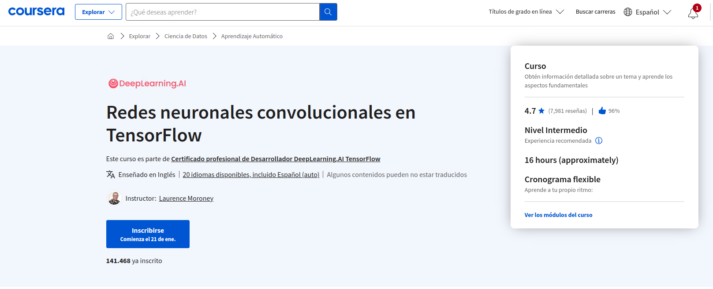

# Convolutional Neural Networks in TensorFlow



[curso](https://www.coursera.org/learn/convolutional-neural-networks-tensorflow)

En este curso, aprenderás:

- Manejar datos de imágenes del mundo real

- Pérdida de parcelas y precisión

- Explorar estrategias para evitar el sobreajuste, incluidos el aumento y el abandono

- Aprenda el aprendizaje por transferencia y cómo pueden extraerse de los modelos las características aprendidas

Si usted es un desarrollador de software que quiere construir algoritmos escalables impulsados por IA, necesita entender cómo utilizar las herramientas para construirlos. Este curso forma parte de la próxima Especialización en Aprendizaje Automático en Tensorflow y le enseñará las mejores prácticas para utilizar TensorFlow, un popular marco de trabajo de código abierto para el aprendizaje automático. En el Curso 2 de la Especialización en TensorFlow deeplearning.ai, aprenderá técnicas avanzadas para mejorar el modelo de visión por ordenador que construyó en el Curso 1. Explorará cómo trabajar con imágenes del mundo real de diferentes formas y tamaños, visualizará el recorrido de una imagen a través de convoluciones para entender cómo un ordenador "ve" la información, trazará la pérdida y la precisión, y explorará estrategias para evitar el sobreajuste, incluyendo el aumento y el abandono. Por último, el curso 2 le introducirá en el aprendizaje por transferencia y en cómo pueden extraerse de los modelos las características aprendidas. 

El curso de Aprendizaje Automático y la Especialización en Aprendizaje Profundo de Andrew Ng enseñan los principios más importantes y fundacionales del Aprendizaje Automático y el Aprendizaje Profundo. Esta nueva Especialización en TensorFlow de deeplearning.ai le enseña cómo utilizar TensorFlow para implementar esos principios, de modo que pueda empezar a construir y aplicar modelos escalables a problemas del mundo real. Para desarrollar una comprensión más profunda de cómo funcionan las redes neuronales, le recomendamos que realice la Especialización en Aprendizaje Profundo.

## INDEX 0

- [Larger Dataset](#larger-dataset)
- [Weekly Assignment - Attempt cats vs dogs kaggle challenge](#weekly-assignment---attempt-cats-vs-dogs-kaggle-challenge)
- [Augmentation](#augmentation)
- [Weekly Assignment - Full cats vs dogs using augmentation](#weekly-assignment---full-cats-vs-dogs-using-augmentation)
- [Transfer learning](#transfer-learning)
- [Weekly Assignment - Transfer Learning Horses vs Humans](#weekly-assignment---transfer-learning-horses-vs-humans)
- [Muliclass Classifications](#muliclass-classifications)
- [Weekly Assignment - Multiclass Classification](#weekly-assignment---multiclass-classification)


## Larger Dataset
[<- Return to INDEX 0](#index-0)

En el primer curso de esta especialización, usted tuvo una introducción a TensorFlow, y cómo, con sus APIs de alto nivel usted podría hacer clasificación básica de imágenes, y aprendió un poco sobre Redes Neuronales Convolucionales (ConvNets). En este curso profundizará en el uso de las ConvNets con datos del mundo real, y aprenderá las técnicas que puede utilizar para mejorar el rendimiento de sus ConvNet, especialmente cuando realice clasificación de imágenes¡ En la Semana 1, esta semana, comenzará examinando un conjunto de datos mucho mayor que el que ha estado utilizando hasta ahora: El conjunto de datos Gatos y Perros, ¡que había sido un Desafío Kaggle en clasificación de imágenes!

### Objetivos de aprendizaje

- Conozca las utilidades de Keras para el preprocesamiento de datos de imagen, en particular la clase ImageDataGenerator
- Desarrollar funciones de ayuda para mover archivos por el sistema de archivos de forma que puedan ser alimentados al ImageDataGenerator
- Aprenda a trazar las precisiones de entrenamiento y validación para evaluar el rendimiento del modelo
- Construir un clasificador utilizando redes neuronales convolucionales para realizar una clasificación de gatos frente a perros


### INDEX 1

- [Introduction, A conversation with Andrew Ng](#introduction-a-conversation-with-andrew-ng)
- [Where to find the notebooks for this course](#where-to-find-the-notebooks-for-this-course)
- [A conversation with Andrew Ng 1](#a-conversation-with-andrew-ng-1)
- [The cats vs dogs dataset](#the-cats-vs-dogs-dataset)
- [Training with the cats vs. dogs dataset](#training-with-the-cats-vs-dogs-dataset)
- [Looking at the notebook (Lab 1)](#looking-at-the-notebook-lab-1)
- [Have questions, issues or ideas? Join our Community!](#have-questions-issues-or-ideas-join-our-community)
- [Working through the notebook](#working-through-the-notebook)
- [What you'll see next](#what-youll-see-next)
- [Fixing through cropping](#fixing-through-cropping)
- [Visualizing the effect of the convolutions](#visualizing-the-effect-of-the-convolutions)
- [Looking at accuracy and loss](#looking-at-accuracy-and-loss)
- [What have we seen so far?](#what-have-we-seen-so-far)
- [Week 1 Quiz](#week-1-quiz)
- [Week 1 Wrap up](#week-1-wrap-up)
- [Lecture Notes Week 1](#lecture-notes-week-1)

### Introduction, A conversation with Andrew Ng
[<- Return to INDEX 1](#index-1)


GPT
En el segundo curso de TensorFlow, los estudiantes avanzan significativamente en su aprendizaje. La primera semana se centra en aplicar conocimientos previos a un conjunto de datos más amplio, específicamente 25,000 imágenes de gatos y perros de Kaggle. Esto contrasta con el módulo anterior que trabajaba con aproximadamente 1000 imágenes de caballos y humanos. La intención es entrenar con un conjunto de datos más grande para abordar el desafío del sobreajuste, que es menos probable en conjuntos de datos amplios.


En la segunda semana, se introduce el aumento de datos como método para tratar el sobreajuste. TensorFlow ofrece herramientas para modificar imágenes (como girar, voltear, mover) durante el entrenamiento sin alterar el conjunto de datos original. Esto se hace en memoria para no editar las imágenes directamente.

Otra estrategia importante que se discute es el aprendizaje por transferencia. Los estudiantes aprenden a utilizar redes neuronales preentrenadas en grandes conjuntos de datos para mejorar el rendimiento en tareas específicas, aprovechando características ya aprendidas. Esto es fundamental para quienes no disponen de grandes volúmenes de datos.


Finalmente, en la cuarta semana, el curso aborda el aprendizaje con múltiples clases. Se mueve más allá de clasificaciones binarias, como gatos contra perros, a clasificaciones con tres o más categorías, como en el caso de piedra, papel o tijera.
El curso es descrito como integral y adecuado tanto para principiantes como para expertos.

### Where to find the notebooks for this course
[<- Return to INDEX 1](#index-1)

Todos los cuadernos de este curso pueden ejecutarse en Google Colab o en Coursera Labs. **No necesita tener configurado un entorno local para seguir los ejercicios de codificación.** Puede simplemente hacer clic en la insignia Open in Colab en la parte superior de los laboratorios no calificados, mientras que para las tareas, se le llevará automáticamente a Coursera Labs. 

Sin embargo, si desea ejecutarlos en su máquina local, los laboratorios no calificados y las asignaciones para cada semana se pueden encontrar en este 
[repositorio de Github](https://github.com/https-deeplearning-ai/tensorflow-1-public)
 bajo la carpeta **C2**. Si ya tiene git instalado en su ordenador, puede clonarlo con este comando:

```bash
git clone https://github.com/https-deeplearning-ai/tensorflow-1-public
```

Si no, por favor siga las guías 
[aquí](https://git-scm.com/book/en/v2/Getting-Started-Installing-Git)
 para instalar git en su sistema operativo. Una vez que haya clonado el repositorio, puede hacer un **git pull** de vez en cuando para asegurarse de que recibe las últimas actualizaciones de los cuadernos.

Necesitará estos paquetes si va a ejecutar los cuadernos localmente:

```requirements
tensorflow==2.7.0
scikit-learn==1.0.1
pandas==1.1.5
matplotlib==3.2.2
seaborn==0.11.2
```

### A conversation with Andrew Ng 1
[<- Return to INDEX 1](#index-1)


El usuario se encuentra interesado en obtener un resumen de un contenido relacionado con la descarga de conjuntos de datos públicos de Internet, en particular de imágenes de gatos y perros, y cómo hacer que una red neuronal funcione con ellos. Se menciona que estos datos pueden ser confusos y contener sorpresas, como imágenes de personas con gatos o múltiples gatos en brazos. La solución propuesta implica el uso de TensorFlow y habilidades de programación en Python para filtrar y limpiar los datos. Se planea construir una red convolucional para detectar características específicas, como personas sosteniendo a los animales. 


Se destaca que se trabajará con un conjunto de datos claro de gatos y perros, pero se menciona la importancia de aprender habilidades que puedan aplicarse a conjuntos de datos menos limpios en el futuro. Además, se hace hincapié en que la realidad de la inteligencia artificial implica un trabajo significativo en la limpieza de datos y el uso de herramientas eficientes para ello. El objetivo final es entrenar una red neuronal para clasificar gatos y perros, y se anima al usuario a sumergirse en el contenido y practicar estas habilidades.

Para descargar un conjunto de datos públicos de Internet y hacer funcionar una red neuronal, especialmente en un contexto donde los datos pueden ser confusos o contener elementos inesperados, se requiere un enfoque estructurado y habilidades específicas. Este proceso incluye varios pasos clave:

1. **Adquisición de Datos:** Descargar el conjunto de datos de fuentes confiables. En el caso de imágenes de gatos y perros, se pueden encontrar numerosos conjuntos de datos públicos disponibles para fines de aprendizaje automático.

2. **Inspección y Limpieza de Datos:** Es crucial inspeccionar los datos para identificar y solucionar problemas comunes. Esto puede incluir archivos dañados o de longitud cero, imágenes irrelevantes o mal etiquetadas, y situaciones inusuales como personas sosteniendo a los animales. Se utilizan habilidades de programación, en este caso, con Python, para filtrar y limpiar el conjunto de datos.

3. **Preprocesamiento de Datos:** Adaptar las imágenes para que sean adecuadas para su uso en una red neuronal. Esto puede incluir redimensionar imágenes, normalizar valores de píxeles, y posiblemente aumentar los datos para mejorar la robustez del modelo.

4. **Construcción de la Red Neuronal:** Implementar una red neuronal convolucional (CNN) utilizando TensorFlow, una biblioteca popular para aprendizaje profundo. La CNN es adecuada para tareas de clasificación de imágenes debido a su capacidad para detectar características visuales complejas.

5. **Entrenamiento del Modelo:** Alimentar los datos limpios y preprocesados al modelo y ajustar los parámetros de la red neuronal. Este proceso implica definir la arquitectura de la red, seleccionar una función de pérdida, un optimizador, y entrenar el modelo con los datos de entrenamiento.

6. **Evaluación y Ajuste:** Evaluar el rendimiento del modelo utilizando un conjunto de datos de prueba. En función de los resultados, se pueden realizar ajustes en la arquitectura de la red, los parámetros de entrenamiento o el proceso de preprocesamiento.

7. **Aplicación Práctica:** Una vez entrenado y ajustado, el modelo se puede utilizar para clasificar nuevas imágenes de gatos y perros, o adaptarse a otros conjuntos de datos.

### The cats vs dogs dataset
[<- Return to INDEX 1](#index-1)

En el siguiente vídeo, verá el famoso 
[conjunto de datos de Kaggle Perros contra Gatos](https://www.kaggle.com/c/dogs-vs-cats)


Originalmente se trataba de un reto para construir un clasificador dirigido a los mejores profesionales del aprendizaje automático y la IA del mundo, pero la tecnología ha avanzado tan rápidamente que verá cómo puede hacerlo en tan sólo unos minutos con algo de programación sencilla de redes neuronales convolucionales.

También es un buen ejercicio para ver un conjunto de datos más grande, descargarlo y prepararlo para el entrenamiento, así como manejar algo de preprocesamiento de datos. Incluso datos como estos, que han sido cuidadosamente curados para usted, pueden tener errores -- ¡como notará con algunas imágenes corruptas!

Además, es posible que note algunas advertencias sobre datos EXIF faltantes o corruptos a medida que las imágenes se cargan en el modelo para el entrenamiento. No se preocupe por esto -- ¡no afectará a su modelo! :)


### Training with the cats vs. dogs dataset
[<- Return to INDEX 1](#index-1)


Hemos pasado del conjunto de datos de moda en el que las imágenes eran pequeñas y se centraban en el sujeto, a una nueva situación en la que teníamos imágenes de caballos y humanos y poses de acción. Usamos circunvoluciones para ayudarnos a identificar las características de la imagen, independientemente de su ubicación. Este es un buen manual para resolver algunos problemas comunes de ciencia de datos en lugares como Kaggle. 


A continuación analizaremos un antiguo concurso en el que os animaban a crear un clasificador para diferenciar gatos y perros. Si no estáis familiarizados con Kaggle, es donde suelen publicarse desafíos de aprendizaje automático con premios. Gatos contra perros fue uno de los temas más famosos de hace unos años. Las técnicas que acabas de aprender pueden aplicarse realmente a ese problema. Así que recapitulemos algunos de los conceptos. 


Una de las ventajas de TensorFlow y Keras es que si colocas tus imágenes en subdirectorios con nombre, una imagen generada las etiquetará automáticamente. Así que con el conjunto de datos de perros y gatos podrías hacerlo y ya tienes una enorme ventaja a la hora de crear el clasificador. 

Luego puedes subdividirlo en un conjunto de entrenamiento y un conjunto de validación. A continuación, puede utilizar los generadores de imágenes que se encuentran en esas carpetas. Para usar un generador de imágenes, debe crear una instancia de uno. 


 Si los datos aún no están normalizados, puede hacerlo con el parámetro de reescala. A continuación, llama al flujo desde el directorio para obtener un objeto generador. Para el conjunto de datos de entrenamiento, apuntará al directorio de entrenamiento y, a continuación, especificará el tamaño objetivo.

En este caso, las imágenes son de todas las formas y tamaños. Así que cambiaremos su tamaño a 150 por 150 sobre la marcha. Estableceremos el tamaño de los lotes en 20. Hay 2000 imágenes, por lo que utilizaremos 100 lotes de 20 cada uno. Como hay dos clases que queremos clasificar, siguen siendo un modo de clase binaria. 


Del mismo modo, para la validación, configuramos un generador y apuntamos al directorio de validación. 


Podemos explorar las convoluciones y las agrupaciones y el recorrido de la imagen a través de ellas. Es muy similar a lo que viste con 
los caballos y los humanos. Tiene tres series de convoluciones seguidas de una agrupación. Por supuesto, la imagen mide 150 por 150. 
Del mismo modo, hay una sola neurona con una activación sigmoidea en la salida. 


El resumen de las capas es muy similar al anterior, pero ten en cuenta que el tamaño cambia. Empezamos con 150 por 150. Así que la convolución reduce eso a 148 por 148. A partir de ahí, iremos hasta que terminemos con 17 x 17 que introduciremos en las capas densas. 


La compilación es como antes. Ahora recuerde que puede modificar la velocidad de aprendizaje ajustando el parámetro lr. 


Ahora, a entrenar, podemos llamar al generador de model.fit y pasarle el generador de entrenamiento y el generador de validación. Eso es todo. Como puedes ver, es muy similar a lo que construiste para caballos contra humanos. Así que veámoslo en acción.

### Looking at the notebook (Lab 1)
[<- Return to INDEX 1](#index-1)

Ahora que ya hemos hablado de lo que supone ampliar a datos del mundo real utilizando el conjunto de datos Gatos contra Perros, vamos a adentrarnos en un 
cuaderno [C2_W1_Lab_1_cats_vs_dogs.ipynb](notebooks%2FW1%2FC2_W1_Lab_1_cats_vs_dogs.ipynb)
 que muestra cómo realizar el reto por sí mismo. En el siguiente vídeo, verá un screencast de este cuaderno en acción. Entonces podrá probarlo usted mismo.

### Have questions, issues or ideas? Join our Community!
[<- Return to INDEX 1](#index-1)

¡Hola!

Hemos creado una comunidad para que usted pueda:

- Pedir ayuda sobre las tareas y otros contenidos del curso.

- Discutir temas del curso.

- Compartir sus conocimientos con otros alumnos.

- Crear su red de contactos.

- Enterarse de las novedades, eventos y concursos de DeepLearning.AI.

> Para acceder a la comunidad de este curso, marque la casilla que aparece a continuación para indicar que acepta utilizar la aplicación de forma responsable y, a continuación, haga clic en elbotón"Iniciar aplicación" .

Si es nuevo en la comunidad, haga clic en el botón "Iniciar aplicación"  para crear su cuenta y acceder a nuestra comunidad.

Hemos creado esta 
[Guía](https://community.deeplearning.ai/c/faq/391)
 del usuario 
[para usted](https://community.deeplearning.ai/c/faq/391)
. Asegúrese de consultar las directrices comunitarias 
[del Código de Conducta ](https://community.deeplearning.ai/c/faq/code-of-conduct/392)
. ¿Tiene problemas para acceder a nuestra comunidad después de pulsar el botón "Iniciar aplicación"? Rellene este
 [formulario](https://forms.gle/bQhd4kLS7xGBxz9U6)
 para explicar su problema y nos pondremos en contacto con usted.

¡Esperamos verle pronto en nuestra comunidad!

- El equipo de DeepLearning.AI

### Working through the notebook
[<- Return to INDEX 1](#index-1)

Lo primero que haremos es descargar el conjunto de imágenes. Se almacenan como un archivo zip que contiene 3.000 imágenes, 2.000 de las cuales usaremos para entrenamiento y 1.000 para pruebas. Una vez descargados, necesitará acceder al sistema operativo subyacente de la máquina virtual en la que se ejecuta este Colab. Esto está disponible en el espacio de nombres del sistema operativo. 

Este código descomprimirá los datos de perros y gatos que acabas de descargar en el directorio /tmp. Allí, los subdirectorios se volverán a crear, porque están almacenados que estaban en el archivo zip. 
```python
!wget --no-check-certificate https://storage.googleapis.com/mledu-datasets/cats_and_dogs_filtered.zip

import zipfile

# Unzip the archive
local_zip = './cats_and_dogs_filtered.zip'
zip_ref = zipfile.ZipFile(local_zip, 'r')
zip_ref.extractall()

zip_ref.close()
```
Lo siguiente es que establezcamos nuestros directorios como variables, para que podamos apuntar los generadores hacia ellos. Ahora, que tenemos los directorios como variables, podemos pasarlos al os.list aquí para tomar los archivos de esos directorios, y cargarlos en las listas de Python. 

```python
import os

base_dir = 'cats_and_dogs_filtered'

print("Contents of base directory:")
print(os.listdir(base_dir))

print("\nContents of train directory:")
print(os.listdir(f'{base_dir}/train'))

print("\nContents of validation directory:")
print(os.listdir(f'{base_dir}/validation'))
```
```commandline
Contents of base directory:
['train', 'validation', 'vectorize.py']

Contents of train directory:
['dogs', 'cats']

Contents of validation directory:
['dogs', 'cats']
```
Podemos ver que hay una lista de nombres de archivo como cat253.jpg, etc. En la pestaña de archivos, también podemos inspeccionar el sistema de archivos y en TMP, podemos ver nuestra carpeta gatos versus perros, dentro de la cual tenemos subdirectorios de entrenamiento y validación, que contienen gatos y perros directorios. Las imágenes, por supuesto, se almacenan allí. 

```python
import os

train_dir = os.path.join(base_dir, 'train')
validation_dir = os.path.join(base_dir, 'validation')

# Directory with training cat/dog pictures
train_cats_dir = os.path.join(train_dir, 'cats')
train_dogs_dir = os.path.join(train_dir, 'dogs')

# Directory with validation cat/dog pictures
validation_cats_dir = os.path.join(validation_dir, 'cats')
validation_dogs_dir = os.path.join(validation_dir, 'dogs')

train_cat_fnames = os.listdir( train_cats_dir )
train_dog_fnames = os.listdir( train_dogs_dir )

print(train_cat_fnames[:10])
print(train_dog_fnames[:10])
```
```commandline
['cat.163.jpg', 'cat.409.jpg', 'cat.864.jpg', 'cat.166.jpg', 'cat.578.jpg', 'cat.250.jpg', 'cat.328.jpg', 'cat.733.jpg', 'cat.262.jpg', 'cat.818.jpg']
['dog.802.jpg', 'dog.498.jpg', 'dog.234.jpg', 'dog.68.jpg', 'dog.947.jpg', 'dog.451.jpg', 'dog.265.jpg', 'dog.134.jpg', 'dog.455.jpg', 'dog.881.jpg']
```
Si contamos las imágenes en cada directorio, podemos estar seguros de que tenemos las cantidades correctas de imágenes. 
Como podemos ver, tenemos mil de cada animal en Entrenamiento y 500 de cada uno en Pruebas para un total de 3000. 
```python
print('total training cat images :', len(os.listdir(      train_cats_dir ) ))
print('total training dog images :', len(os.listdir(      train_dogs_dir ) ))

print('total validation cat images :', len(os.listdir( validation_cats_dir ) ))
print('total validation dog images :', len(os.listdir( validation_dogs_dir ) ))
```
```commandline
total training cat images : 1000
total training dog images : 1000
total validation cat images : 500
total validation dog images : 500
```
A continuación, podemos visualizar algunos de los datos, para que podamos ver lo diverso que es. Este código establecería un matplotlib que es una biblioteca de Python para dibujar gráficos. Este código recogerá algunos gatos y perros al azar y los dibujará en una cuadrícula. Una vez dibujado, podemos ver que hay mucha diversidad en estas imágenes. 
```python
%matplotlib inline

import matplotlib.image as mpimg
import matplotlib.pyplot as plt

# Parameters for our graph; we'll output images in a 4x4 configuration
nrows = 4
ncols = 4

pic_index = 0 # Index for iterating over images

# Set up matplotlib fig, and size it to fit 4x4 pics
fig = plt.gcf()
fig.set_size_inches(ncols*4, nrows*4)

pic_index+=8

next_cat_pix = [os.path.join(train_cats_dir, fname)
                for fname in train_cat_fnames[ pic_index-8:pic_index]
               ]

next_dog_pix = [os.path.join(train_dogs_dir, fname)
                for fname in train_dog_fnames[ pic_index-8:pic_index]
               ]

for i, img_path in enumerate(next_cat_pix+next_dog_pix):
  # Set up subplot; subplot indices start at 1
  sp = plt.subplot(nrows, ncols, i + 1)
  sp.axis('Off') # Don't show axes (or gridlines)

  img = mpimg.imread(img_path)
  plt.imshow(img)

plt.show()
```


Ahora, construyamos nuestra red neuronal. Importaremos TensorFlow, y luego definiremos nuestro modelo. Imprimiremos el resumen, y aquí puede ver la forma de salida de cómo la imagen pasó a través de las capas, y reducir gradualmente su tamaño a través de la convolución y agrupación. 
```python
import tensorflow as tf

model = tf.keras.models.Sequential([
    # Note the input shape is the desired size of the image 150x150 with 3 bytes color
    tf.keras.layers.Conv2D(16, (3,3), activation='relu', input_shape=(150, 150, 3)),
    tf.keras.layers.MaxPooling2D(2,2),
    tf.keras.layers.Conv2D(32, (3,3), activation='relu'),
    tf.keras.layers.MaxPooling2D(2,2),
    tf.keras.layers.Conv2D(64, (3,3), activation='relu'),
    tf.keras.layers.MaxPooling2D(2,2),
    # Flatten the results to feed into a DNN
    tf.keras.layers.Flatten(),
    # 512 neuron hidden layer
    tf.keras.layers.Dense(512, activation='relu'),
    # Only 1 output neuron. It will contain a value from 0-1 where 0 for 1 class ('cats') and 1 for the other ('dogs')
    tf.keras.layers.Dense(1, activation='sigmoid')
])
model.summary()
```

```commandline
Model: "sequential"
_________________________________________________________________
 Layer (type)                Output Shape              Param #   
=================================================================
 conv2d (Conv2D)             (None, 148, 148, 16)      448       
                                                                 
 max_pooling2d (MaxPooling2  (None, 74, 74, 16)        0         
 D)                                                              
                                                                 
 conv2d_1 (Conv2D)           (None, 72, 72, 32)        4640      
                                                                 
 max_pooling2d_1 (MaxPoolin  (None, 36, 36, 32)        0         
 g2D)                                                            
                                                                 
 conv2d_2 (Conv2D)           (None, 34, 34, 64)        18496     
                                                                 
 max_pooling2d_2 (MaxPoolin  (None, 17, 17, 64)        0         
 g2D)                                                            
                                                                 
 flatten (Flatten)           (None, 18496)             0         
                                                                 
 dense (Dense)               (None, 512)               9470464   
                                                                 
 dense_1 (Dense)             (None, 1)                 513       
                                                                 
=================================================================
Total params: 9494561 (36.22 MB)
Trainable params: 9494561 (36.22 MB)
Non-trainable params: 0 (0.00 Byte)
_________________________________________________________________

```
Aquí, es donde compilamos nuestro modelo, definiendo la función de pérdida y el optimizador. Aquí, es donde configuramos los dos generadores, señalándolos a los subdirectorios de capacitación y validación. Estos contienen subdirectorios propios, cada uno con gatos y perros. 
```python
from tensorflow.keras.optimizers import RMSprop

model.compile(optimizer=RMSprop(learning_rate=0.001),
              loss='binary_crossentropy',
              metrics = ['accuracy'])

from tensorflow.keras.preprocessing.image import ImageDataGenerator

# All images will be rescaled by 1./255.
train_datagen = ImageDataGenerator( rescale = 1.0/255. )
test_datagen  = ImageDataGenerator( rescale = 1.0/255. )

# --------------------
# Flow training images in batches of 20 using train_datagen generator
# --------------------
train_generator = train_datagen.flow_from_directory(train_dir,
                                                    batch_size=20,
                                                    class_mode='binary',
                                                    target_size=(150, 150))
# --------------------
# Flow validation images in batches of 20 using test_datagen generator
# --------------------
validation_generator =  test_datagen.flow_from_directory(validation_dir,
                                                         batch_size=20,
                                                         class_mode  = 'binary',
                                                         target_size = (150, 150))

```
Cuando lo ejecute, verás la copia impresa. Encontró 2.000 imágenes en dos clases, y ese es el entrenamiento, y 1.000 imágenes en dos clases, esa es la prueba.
```commandline
Found 2000 images belonging to 2 classes.
Found 1000 images belonging to 2 classes.
```
Ahora, podemos hacer el entrenamiento. Esta vez en lugar de usar model.fit, volveremos a usar model.fit generador porque nuestra fuente de datos son los generadores. Ahora, puedes ver que han pasado. 
```python
history = model.fit(
            train_generator,
            epochs=15,
            validation_data=validation_generator,
            verbose=2
            )
```
Ahora, comenzaremos el entrenamiento y lo veremos progresar. Debería tomar de 3 a 3,5 minutos. Cuando está hecho, se puede ver que la precisión es de aproximadamente 73% y no está mal. No es genial, pero no está mal. 
```commandline
Epoch 1/15
100/100 - 13s - loss: 0.7102 - accuracy: 0.5400 - val_loss: 0.6728 - val_accuracy: 0.5450 - 13s/epoch - 130ms/step
Epoch 2/15
100/100 - 6s - loss: 0.6608 - accuracy: 0.6130 - val_loss: 0.6164 - val_accuracy: 0.6970 - 6s/epoch - 59ms/step
...
100/100 - 5s - loss: 0.0704 - accuracy: 0.9915 - val_loss: 1.3483 - val_accuracy: 0.7500 - 5s/epoch - 49ms/step
Epoch 15/15
100/100 - 6s - loss: 0.0339 - accuracy: 0.9920 - val_loss: 1.4264 - val_accuracy: 0.7400 - 6s/epoch - 62ms/step
```

### What you'll see next
[<- Return to INDEX 1](#index-1)

En el último vídeo, vio un screencast del cuaderno que muestra cómo construir un clasificador para Gatos contra Perros. Vio cómo, en algunos casos, no clasificaba correctamente a un gato, y le pedimos que intentara averiguar cómo podría solucionarlo. En el siguiente vídeo, verá una solución a esto.

### Fixing through cropping
[<- Return to INDEX 1](#index-1)

> Contexto: en el último video subio una foto de un gatito y el modelo NO lo reconoció como tal, entonces nos propuso hallar una forma de que el modelo
> lo clasificara correctamente.


¿Encontraste una solución? Bueno, por supuesto que la tuya puede ser diferente a la mía pero déjame mostrarte lo que hice en el caso del gato que mi modelo pensaba era un perro. Así que volvamos al cuaderno, y ejecutaremos el código. Subiré esta imagen para ver cómo se clasifica. Es una cosecha de gatos, y he aquí, se clasifica como un gato. 


Vamos a abrirlo, y compararlo con la imagen original, y veremos que sólo recortando pude conseguir que cambiara su clasificación. 
Debe haber habido algo en la imagen sin recortar que coincida con las características de un perro. Pensé que era un experimento muy interesante, ¿no? 
Ahora, ¿qué crees que el impacto de los cultivos podría haber tenido en el entrenamiento? 

¿Habría entrenado el modelo para demostrar que este era un gato mejor que una imagen sin recortar. Eso es algo para pensar, y algo para explorar en la siguiente lección, pero primero volvamos al libro de trabajo.

### Visualizing the effect of the convolutions
[<- Return to INDEX 1](#index-1)


Vale, en el video anterior echaste un vistazo a un cuaderno que entrenaba una red neuronal convolucional que clasificaba gatos contra perros. Ahora echemos un vistazo a cómo funcionó eso.

Volvamos al cuaderno y echemos un vistazo al código que grafica las salidas de las circunvoluciones en capas de tracción máxima. La clave para esto es entender la API model.layers, que le permite encontrar las salidas e iterar a través de ellas, creando un modelo de visualización para cada una.

Luego podemos cargar una imagen aleatoria en una matriz y pasarla al método de predicción del modelo de visualización.

La variable a seguir es display_grid que se puede construir a partir de x que se lee como un mapa de características y se procesa un poco para la visibilidad en el bucle central.


````python
import numpy as np
import random
from tensorflow.keras.utils import img_to_array, load_img

# Define a new Model that will take an image as input, and will output
# intermediate representations for all layers in the previous model
successive_outputs = [layer.output for layer in model.layers]
visualization_model = tf.keras.models.Model(inputs = model.input, outputs = successive_outputs)

# Prepare a random input image from the training set.
cat_img_files = [os.path.join(train_cats_dir, f) for f in train_cat_fnames]
dog_img_files = [os.path.join(train_dogs_dir, f) for f in train_dog_fnames]
img_path = random.choice(cat_img_files + dog_img_files)
img = load_img(img_path, target_size=(150, 150))  # this is a PIL image
x   = img_to_array(img)                           # Numpy array with shape (150, 150, 3)
x   = x.reshape((1,) + x.shape)                   # Numpy array with shape (1, 150, 150, 3)

# Scale by 1/255
x /= 255.0

# Run the image through the network, thus obtaining all
# intermediate representations for this image.
successive_feature_maps = visualization_model.predict(x)

# These are the names of the layers, so you can have them as part of our plot
layer_names = [layer.name for layer in model.layers]

# Display the representations
for layer_name, feature_map in zip(layer_names, successive_feature_maps):

  if len(feature_map.shape) == 4:

    #-------------------------------------------
    # Just do this for the conv / maxpool layers, not the fully-connected layers
    #-------------------------------------------
    n_features = feature_map.shape[-1]  # number of features in the feature map
    size       = feature_map.shape[ 1]  # feature map shape (1, size, size, n_features)

    # Tile the images in this matrix
    display_grid = np.zeros((size, size * n_features))

    #-------------------------------------------------
    # Postprocess the feature to be visually palatable
    #-------------------------------------------------
    for i in range(n_features):
      x  = feature_map[0, :, :, i]
      x -= x.mean()
      x /= x.std ()
      x *=  64
      x += 128
      x  = np.clip(x, 0, 255).astype('uint8')
      display_grid[:, i * size : (i + 1) * size] = x # Tile each filter into a horizontal grid

    #-----------------
    # Display the grid
    #-----------------
    scale = 20. / n_features
    plt.figure( figsize=(scale * n_features, scale) )
    plt.title ( layer_name )
    plt.grid  ( False )
    plt.imshow( display_grid, aspect='auto', cmap='viridis' )
````
A continuación, renderizaremos cada una de las circunvoluciones de la imagen , además de su agrupación, luego otra convolución, etc.


### Looking at accuracy and loss
[<- Return to INDEX 1](#index-1)

Antes de irnos, echemos un vistazo rápido a trazar la historia de aprendizaje de este modelo. El objeto tiene valores de precisión y pérdida de entrenamiento , así como valores de exactitud de validación y pérdida de validación. 

Así que vamos a iterar sobre estos y trazar ellos. Ahora, si miras de cerca, no solo llamamos model.fit, dijimos que la historia es igual a model.fit. Así que ahora tenemos un objeto de historial que podemos consultar para los datos.
```python
history = model.fit(
            train_generator,
            epochs=15,
            validation_data=validation_generator,
            verbose=2
            )
```

Aquí puede ver que estoy usando el mismo objeto de historial, y estoy llamando a su propiedad de historial que pasa en ACC, lo que me da la precisión del modelo. Cuando lo ejecuto y grafico la precisión de entrenamiento y validación, podemos ver que mi entrenamiento fue hacia uno, mientras que mi validación se niveló en rango de 0.7 a 0.75. 

```python
#-----------------------------------------------------------
# Retrieve a list of list results on training and test data
# sets for each training epoch
#-----------------------------------------------------------
acc      = history.history[     'accuracy' ]
val_acc  = history.history[ 'val_accuracy' ]
loss     = history.history[    'loss' ]
val_loss = history.history['val_loss' ]

epochs   = range(len(acc)) # Get number of epochs

#------------------------------------------------
# Plot training and validation accuracy per epoch
#------------------------------------------------
plt.plot  ( epochs,     acc )
plt.plot  ( epochs, val_acc )
plt.title ('Training and validation accuracy')
plt.figure()

#------------------------------------------------
# Plot training and validation loss per epoch
#------------------------------------------------
plt.plot  ( epochs,     loss )
plt.plot  ( epochs, val_loss )
plt.title ('Training and validation loss'   )
```


Eso demuestra que mi modelo no es malo, pero realmente no gané nada después de dos épocas. Se ajusta muy bien a los datos de entrenamiento con los datos de validación necesarios.


Estos resultados se confirman en la pérdida donde podemos ver que después de dos épocas, mi pérdida de entrenamiento bajó muy bien, pero mi pérdida de validación subió. Así que, mi modelo es del 75 por ciento exacto después de dos épocas, y realmente no necesito entrenar más.


Recuerde también que acabamos de utilizar un subconjunto de los datos completos. El uso de todo el conjunto de datos probablemente arrojaría mejores resultados. Pero antes de hacerlo, veamos algunas otras opciones, y lo haremos en la siguiente lección.

### What have we seen so far?
[<- Return to INDEX 1](#index-1)

Al final del último vídeo, vio cómo explorar el historial de entrenamiento y descubrió un fenómeno interesante: Aunque la precisión del conjunto de datos de entrenamiento fue muy alta, vimos que después de sólo unas pocas épocas, el conjunto de validación se niveló. Esto es una clara señal de que estamos sobreajustando de nuevo. Utilizar más datos debería ayudar con esto, pero también hay otras técnicas que puede utilizar con conjuntos de datos más pequeños. ¡Y las veremos en la lección de la semana que viene!

### Week 1 Quiz
[<- Return to INDEX 1](#index-1)

1. What does flow_from_directory give you on the ImageDataGenerator?

   - [ ] The ability to easily load images for training
   - [ ] The ability to pick the size of training images
   - [ ] The ability to automatically label images based on their directory name
   - [X] All of the above

   > Correct
   > That's right! The flow_from_directory method takes the path to a directory & generates batches of augmented data.

2. If my Image is sized 150x150, and I pass a 3x3 Convolution over it, what size is the resulting image?

   - [ ] 450x450
   - [ ] 153x153
   - [ ] 150x150
   - [X] 148x148

   > Correct
   > Nailed it! Applying a 3x3 convolution would result in a 148x148 image.

3. If my data is sized 150x150, and I use Pooling of size 2x2, what size will the resulting image be?

   - [ ] 149x149
   - [ ] 300x300
   - [X] 75x75
   - [ ] 148x148

   > Correct
   > Nailed it! Applying 2x2 pooling would result in a 75x75 image.

4. If I want to view the history of my training, how can I access it?

   - [ ] Use a model.fit_generator
   - [X] Create a variable ‘history’ and assign it to the return of model.fit or model.fit_generator
   - [ ] Download the model and inspect it
   - [ ] Pass the parameter ‘history=true’ to the model.fit

   > Correct
   > Exactly! The History.history attribute is a record of training loss values and metrics values at successive epochs.

5. What’s the name of the API that allows you to inspect the impact of convolutions on the images?

   - [ ] The model.pools API
   - [ ] The model.convolutions API
   - [X] The model.layers API
   - [ ] The model.images API

   > Correct
   > The model.layers API allows you to access the individual layers of the model, where you can examine the convolutions applied to the images.

6. When exploring the graphs, the loss levelled out at about .75 after 2 epochs, but the accuracy climbed close to 1.0 after 15 epochs. What's the significance of this?

   - [ ] There was no point training after 2 epochs, as we overfit to the validation data
   - [X] There was no point training after 2 epochs, as we overfit to the training data
   - [ ] A bigger training set would give us better validation accuracy
   - [ ] A bigger validation set would give us better training accuracy

   > Correct
   > Those values indicate overfitting to the training data.

7. Why is the validation accuracy a better indicator of model performance than training accuracy?

   - [ ] It isn't, they're equally valuable
   - [ ] There's no relationship between them
   - [X] The validation accuracy is based on images that the model hasn't been trained with, and thus a better indicator of how the model will perform with new images.
   - [ ] The validation dataset is smaller, and thus less accurate at measuring accuracy, so its performance isn't as important

   > Correct
   > The validation set comprises data that the model has not seen during training, which helps evaluate the model’s ability to generalize to new, unseen data.

8. Why is overfitting more likely to occur on smaller datasets?

   - [ ] Because in a smaller dataset, your validation data is more likely to look like your training data
   - [ ] Because there isn't enough data to activate all the convolutions or neurons
   - [ ] Because with less data, the training will take place more quickly, and some features may be missed
   - [X] Because there's less likelihood of all possible features being encountered in the training process.

   > Correct
   > Undoubtedly! A smaller size decreases the likelihood that the model will recognize all possible features during training.

### Week 1 Wrap up
[<- Return to INDEX 1](#index-1)


Así que ya has llegado al final de la primera semana. Enhorabuena. Lo que me parece realmente inspirador de esta semana en particular es que lo 
que acabáis de hacer con los conjuntos de datos sobre gatos y perros como desafío científico de Kaggle, no hace mucho tiempo, 
solo estaba disponible para los mejores investigadores de las mejores universidades, desde arriba. 

Pero ahora, gracias a la explosión de la potencia de cálculo, a los conjuntos de datos abiertos como este y a cosas como TensorFlow, puedes hacerlo tú mismo, en el ordenador de tu casa. Eso me parece muy inspirador y muy emocionante. Así que gracias y prepárate para la segunda semana.

### Lecture Notes Week 1
[<- Return to INDEX 1](#index-1)

Los apuntes de las conferencias están disponibles en nuestra plataforma comunitaria. Si ya es miembro, inicie sesión en su cuenta y acceda a los apuntes de las conferencias 
aquí [C2_W1.pdf](notes%2FC2_W1.pdf)
.

## Weekly Assignment - Attempt cats vs dogs kaggle challenge
[<- Return to INDEX 0](#index-0)

### Assignment Troubleshooting Tips

He aquí algunas directrices generales antes de entregar sus tareas en este curso. Téngalas en cuenta no sólo para la tarea de esta semana, sino también para las siguientes:

1. Por favor, no modifique ningún código fuera de las etiquetasSTART CODE HERE yEND CODE HERE. Su solución sólo debe colocarse entre estos marcadores para garantizar una calificación correcta. Modificar los parámetros de las funciones y otras celdas de prueba probablemente romperá el calificador. Si desea experimentar con ellas, puede hacerlo después de haber superado con éxito la tarea.

2. Si tiene más preguntas, cree un tema en la comunidad Discourse en lugar de en los foros de discusión de Coursera. Puede unirse 
[siguiendo las instrucciones aquí](https://www.coursera.org/learn/convolutional-neural-networks-tensorflow/ungradedLti/XxU1e/have-questions-meet-us-on-discourse)
. Allí obtendrá ayuda más rápidamente porque varios mentores y sus compañeros de aprendizaje están supervisando los mensajes. Sólo asegúrese de crear el tema en la categoría correcta del curso.

### Programming Assignment: Cats vs Dogs

Esta semana, ha explorado una versión reducida del conjunto de datos Gatos contra Perros y la ha utilizado para entrenar una red neuronal convolucional. Vio que se sobreadaptaba muy rápidamente, a pesar de los grandes resultados obtenidos con el conjunto de entrenamiento. Una solución a la sobreadaptación es utilizar más datos tanto para el entrenamiento como para la validación, y ese es el ejercicio de esta semana: ¡construir un clasificador utilizando el conjunto de datos completo de Gatos contra Perros de 25.000 imágenes!

Tenga en cuenta de nuevo que, al cargar las imágenes, es posible que reciba advertencias sobre datos EXIF que faltan o están corruptos. No se preocupe por esto: faltan datos en las imágenes, pero no son datos visuales que vayan a afectar al entrenamiento.

Empecemos a construir un clasificador utilizando el conjunto de datos completo Gatos contra Perros de 25k imágenes.

Complete las tareas del cuaderno de 
[tareas](https://colab.research.google.com/github/https-deeplearning-ai/tensorflow-1-public/blob/main/C2/W1/assignment/C2W1_Assignment.ipynb)
 y suba aquí los archivos pertinentes para su calificación.

> La respuesta de esta tarea es: [C2W1_Assignment.ipynb](notebooks%2FW1%2FC2W1_Assignment.ipynb)

> Este cuaderno está alojado en Github, por lo que para guardar cualquier cambio deberá crear una copia del mismo dentro de su Drive. Puede hacerlo haciendo clic en la pestaña `Archivo` y luego en la opción `Guardar una copia en Drive`.

Deberá cargar dos archivos:

- El cuaderno (un archivo con extensión .ipynb ) que se utilizará para probar las siguientes funciones:

   - create_train_val_dirs
   
   - split_data
   
   - train_val_generators
   
   - create_model


. Duration: 2 minutos2 min
Tareas de programación: Gatos vs Perros
. Duration: 3 horas3 h
Semana 1
Gatos vs Perros
Tareas de programación: Gatos vs PerrosEstado: Traducido automáticamente
Traducido automáticamente
Este artículo tiene contenido sin traducir

Dado que este elemento tiene contenido que no está alojado en Coursera, no se traducirá al idioma que elegiste.
No has enviado tu trabajo. Debes obtener 80/100 puntos para aprobar.
Primera tarea de programación
Esta es tu primera tarea de programación correspondiente a curso.
Fecha Límite
Aprueba esta tarea antes del 28 de ene. 23:59 CST

Esta semana, ha explorado una versión reducida del conjunto de datos Gatos contra Perros y la ha utilizado para entrenar una red neuronal convolucional. Vio que se sobreadaptaba muy rápidamente, a pesar de los grandes resultados obtenidos con el conjunto de entrenamiento. Una solución a la sobreadaptación es utilizar más datos tanto para el entrenamiento como para la validación, y ese es el ejercicio de esta semana: ¡construir un clasificador utilizando el conjunto de datos completo de Gatos contra Perros de 25.000 imágenes!

Tenga en cuenta de nuevo que, al cargar las imágenes, es posible que reciba advertencias sobre datos EXIF que faltan o están corruptos. No se preocupe por esto: faltan datos en las imágenes, pero no son datos visuales que vayan a afectar al entrenamiento.

Empecemos a construir un clasificador utilizando el conjunto de datos completo Gatos contra Perros de 25k imágenes.


Complete las tareas del cuaderno de 
tareas
 y suba aquí los archivos pertinentes para su calificación.

Este cuaderno está alojado en Github, por lo que para guardar cualquier cambio deberá crear una copia del mismo dentro de su Drive. Puede hacerlo haciendo clic en la pestaña `Archivo` y luego en la opción `Guardar una copia en Drive`.

Deberá cargar dos archivos:

- El cuaderno (un archivo con extensión .ipynb ) que se utilizará para probar las siguientes funciones:

  * create_train_val_dirs

  * split_data

  * train_val_generators

  * create_model

- El historial de entrenamiento de su modelo (un archivo con extensión .p kl) que se utilizará para calificar la precisión de su modelo.

> IMPORTANTE PARA UNA CALIFICACIÓN CORRECTA:- No borre las celdas ya que incluyen metadatos importantes para la calificación- Rellene sus soluciones dentro de los espacios proporcionados. Puede añadir nuevas celdas pero éstas serán omitidas por el calificador.


## Augmentation
[<- Return to INDEX 0](#index-0)

Hasta este punto, habrá oído muchas veces el término sobreadaptación. La sobreadaptación es simplemente el concepto de estar demasiado especializado en el entrenamiento, es decir, que su modelo es muy bueno clasificando aquello para lo que ha sido entrenado, pero no tan bueno clasificando cosas que no ha visto. Para generalizar su modelo de forma más eficaz, necesitará por supuesto una mayor amplitud de muestras con las que entrenarlo. Eso no siempre es posible, pero un buen atajo potencial para ello es el Aumento de la imagen, con el que se ajusta el conjunto de entrenamiento para aumentar potencialmente la diversidad de temas que abarca. ¡Aprenderá todo sobre ello esta semana!

### Objetivos de aprendizaje

- Reconocer el impacto de añadir el aumento de imágenes al proceso de formación, especialmente en el tiempo
- Demuestre la sobreadaptación o la falta de ella trazando las precisiones de entrenamiento y validación
- Familiarizarse con los parámetros del ImageDataGenerator utilizados para llevar a cabo el aumento de imágenes
- Aprenda a mitigar el sobreajuste utilizando técnicas de aumento de datos

### INDEX 2

- [A conversation with Andrew Ng 2](#a-conversation-with-andrew-ng-2)
- [Image Augmentation](#image-augmentation)
- [Introducing augmentation](#introducing-augmentation)
- [Start Coding...](#start-coding)
- [Coding augmentation with ImageDataGenerator](#coding-augmentation-with-imagedatagenerator)
- [Looking at the notebook (Lab 1)](#looking-at-the-notebook-lab-1)
- [Demonstrating overfitting in cats vs dogs](#demonstrating-overfitting-in-cats-vs-dogs)
- [The impact of augmentation on Cats vs. Dogs](#the-impact-of-augmentation-on-cats-vs-dogs)
- [Adding augmentation to cats vs dogs](#adding-augmentation-to-cats-vs-dogs)
- [Image Augmentation with Horses vs Humans! (Lab 2)](#image-augmentation-with-horses-vs-humans-lab-2)
- [Exploring augmentation with horses vs humans](#exploring-augmentation-with-horses-vs-humans)
- [What have we seen so far? 2](#what-have-we-seen-so-far-2)
- [Week 2 Quiz](#week-2-quiz)
- [Week 2 Wrap up](#week-2-wrap-up)
- [Lecture Notes Week 2](#lecture-notes-week-2)

### A conversation with Andrew Ng 2
[<- Return to INDEX 2](#index-2)

### Image Augmentation
[<- Return to INDEX 2](#index-2)

### Introducing augmentation
[<- Return to INDEX 2](#index-2)

### Start Coding...
[<- Return to INDEX 2](#index-2)

### Coding augmentation with ImageDataGenerator
[<- Return to INDEX 2](#index-2)

### Looking at the notebook (Lab 1)
[<- Return to INDEX 2](#index-2)

### Demonstrating overfitting in cats vs dogs
[<- Return to INDEX 2](#index-2)

### The impact of augmentation on Cats vs. Dogs
[<- Return to INDEX 2](#index-2)

### Adding augmentation to cats vs dogs
[<- Return to INDEX 2](#index-2)

### Image Augmentation with Horses vs Humans! (Lab 2)
[<- Return to INDEX 2](#index-2)

### Exploring augmentation with horses vs humans
[<- Return to INDEX 2](#index-2)

### What have we seen so far? 2
[<- Return to INDEX 2](#index-2)

### Week 2 Quiz
[<- Return to INDEX 2](#index-2)

### Week 2 Wrap up
[<- Return to INDEX 2](#index-2)

### Lecture Notes Week 2
[<- Return to INDEX 2](#index-2)

## Weekly Assignment - Full cats vs dogs using augmentation
[<- Return to INDEX 0](#index-0)

### Cats vs Dogs with Data Augmentation

## Transfer learning
[<- Return to INDEX 0](#index-0)

Construir modelos para usted mismo está muy bien y puede ser muy potente. Pero, como ha visto, puede verse limitado por los datos que tenga a mano. No todo el mundo tiene acceso a conjuntos de datos masivos o a la potencia de cálculo necesaria para entrenarlos con eficacia. El aprendizaje por transferencia puede ayudar a resolver esto -- donde personas con modelos entrenados en grandes conjuntos de datos los entrenan, para que usted pueda utilizarlos directamente, o bien, puede utilizar las características que ellos han aprendido y aplicarlas a su escenario. Esto es el aprendizaje por transferencia, ¡y lo estudiará esta semana!

### Objetivos de aprendizaje

- Domine el tipo de capa keras conocido como dropout para evitar el sobreajuste
- Logre el aprendizaje por transferencia en código utilizando la API keras
- Codifique un modelo que implemente la API funcional de Keras en lugar del modelo secuencial comúnmente utilizado
- Aprenda a congelar capas de un modelo existente para aplicar con éxito el aprendizaje por transferencia
- Explore el concepto de aprendizaje por transferencia para utilizar las convoluciones aprendidas por un modelo diferente a partir de un conjunto de datos mayor

### INDEX 3

- [A conversation with Andrew Ng 3](#a-conversation-with-andrew-ng-3)
- [Understanding transfer learning: the concepts](#understanding-transfer-learning-the-concepts)
- [Coding transfer learning from the inception model](#coding-transfer-learning-from-the-inception-model)
- [Adding your DNN](#adding-your-dnn)
- [Coding your own model with transferred features](#coding-your-own-model-with-transferred-features)
- [Using dropout](#using-dropout)
- [Exploring dropouts](#exploring-dropouts)
- [Applying Transfer Learning to Cats v Dogs (Lab 1)](#applying-transfer-learning-to-cats-v-dogs-lab-1)
- [Exploring Transfer Learning with Inception](#exploring-transfer-learning-with-inception)
- [What have we seen so far? 3](#what-have-we-seen-so-far-3)
- [Week 3 Quiz](#week-3-quiz)
- [Week 3 Wrap up](#week-3-wrap-up)
- [Lecture Notes Week 3](#lecture-notes-week-3)

### A conversation with Andrew Ng 3
[<- Return to INDEX 3](#index-3)

### Understanding transfer learning: the concepts
[<- Return to INDEX 3](#index-3)

### Coding transfer learning from the inception model
[<- Return to INDEX 3](#index-3)

### Adding your DNN
[<- Return to INDEX 3](#index-3)

### Coding your own model with transferred features
[<- Return to INDEX 3](#index-3)

### Using dropout
[<- Return to INDEX 3](#index-3)

### Exploring dropouts
[<- Return to INDEX 3](#index-3)

### Applying Transfer Learning to Cats v Dogs (Lab 1)
[<- Return to INDEX 3](#index-3)

### Exploring Transfer Learning with Inception
[<- Return to INDEX 3](#index-3)

### What have we seen so far? 3
[<- Return to INDEX 3](#index-3)

### Week 3 Quiz
[<- Return to INDEX 3](#index-3)

### Week 3 Wrap up
[<- Return to INDEX 3](#index-3)

### Lecture Notes Week 3
[<- Return to INDEX 3](#index-3)

## Weekly Assignment - Transfer Learning Horses vs Humans
[<- Return to INDEX 0](#index-0)

### Transfer Learning - Horses vs Humans

## Muliclass Classifications
[<- Return to INDEX 0](#index-0)

Ha recorrido un largo camino, ¡enhorabuena! Queda una cosa por hacer antes de pasar de las ConvNets al siguiente módulo, y es ir más allá de la clasificación binaria. Cada uno de los ejemplos que ha hecho hasta ahora implicaba clasificar una cosa u otra: caballo o humano, gato o perro. Al pasar de la clasificación binaria a la categórica hay algunas consideraciones de codificación que debe tener en cuenta. ¡Las verá esta semana!

### Objetivos de aprendizaje

- Construir un clasificador multiclase para el conjunto de datos MNIST del lenguaje de signos
- Aprenda a configurar correctamente los parámetros del ImageDataGenerator y las funciones de definición del modelo para la clasificación multiclase
- Comprender la diferencia entre utilizar archivos de imagen reales frente a imágenes codificadas en otros formatos y cómo esto cambia los métodos disponibles al utilizar ImageDataGenerator
- Codifique una función de ayuda para analizar un archivo CSV sin procesar que contenga la información de los valores de píxel de las imágenes utilizadas

### INDEX 4

- [A conversation with Andrew Ng 4](#a-conversation-with-andrew-ng-4)
- [Moving from binary to multi-class classification](#moving-from-binary-to-multi-class-classification)
- [Introducing the Rock-Paper-Scissors dataset](#introducing-the-rock-paper-scissors-dataset)
- [Explore multi-class with Rock Paper Scissors dataset](#explore-multi-class-with-rock-paper-scissors-dataset)
- [Check out the code! (Lab 1)](#check-out-the-code-lab-1)
- [Train a classifier with Rock Paper Scissors](#train-a-classifier-with-rock-paper-scissors)
- [Try testing the classifier](#try-testing-the-classifier)
- [Test the Rock Paper Scissors classifier](#test-the-rock-paper-scissors-classifier)
- [What have we seen so far? 4](#what-have-we-seen-so-far-4)
- [Week 4 Quiz](#week-4-quiz)
- [Lecture Notes Week 4](#lecture-notes-week-4)
- [IMPORTANT Reminder about end of access to Lab Notebooks](#important-reminder-about-end-of-access-to-lab-notebooks)
- [Wrap up 4](#wrap-up-4)
- [A conversation with Andrew Ng 5](#a-conversation-with-andrew-ng-5)
- [Acknowledgments](#acknowledgments)

### A conversation with Andrew Ng 4
[<- Return to INDEX 4](#index-4)

### Moving from binary to multi-class classification
[<- Return to INDEX 4](#index-4)

### Introducing the Rock-Paper-Scissors dataset
[<- Return to INDEX 4](#index-4)

### Explore multi-class with Rock Paper Scissors dataset
[<- Return to INDEX 4](#index-4)

### Check out the code! (Lab 1)
[<- Return to INDEX 4](#index-4)

### Train a classifier with Rock Paper Scissors
[<- Return to INDEX 4](#index-4)

### Try testing the classifier
[<- Return to INDEX 4](#index-4)

### Test the Rock Paper Scissors classifier
[<- Return to INDEX 4](#index-4)

### What have we seen so far? 4
[<- Return to INDEX 4](#index-4)

### Week 4 Quiz
[<- Return to INDEX 4](#index-4)

### Lecture Notes Week 4
[<- Return to INDEX 4](#index-4)

### IMPORTANT Reminder about end of access to Lab Notebooks
[<- Return to INDEX 4](#index-4)

### Wrap up 4
[<- Return to INDEX 4](#index-4)

### A conversation with Andrew Ng 5
[<- Return to INDEX 4](#index-4)

### Acknowledgments
[<- Return to INDEX 4](#index-4)

## Weekly Assignment - Multiclass Classification
[<- Return to INDEX 0](#index-0)

### Classification: Beyond two classes

