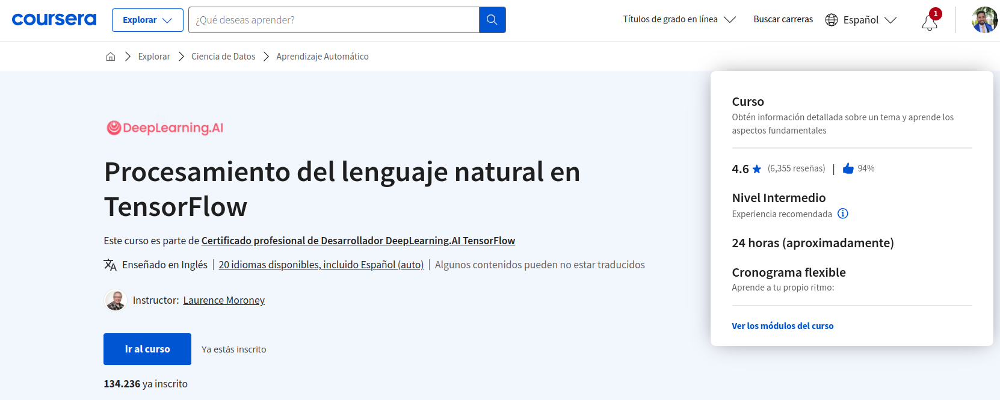
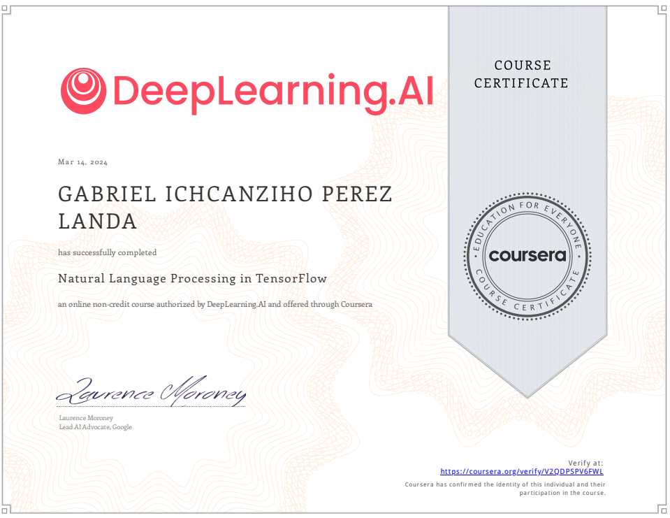

# Natural Language Processing in TensorFlow

[](https://www.coursera.org/learn/natural-language-processing-tensorflow?)

En este curso, aprenderás:

- Construir sistemas de procesamiento del lenguaje natural utilizando TensorFlow

- Procesar texto, incluyendo la tokenización y la representación de frases como vectores

- Aplicar RNNs, GRUs y LSTMs en TensorFlow

- Entrene LSTMs en texto existente para crear poesía original y más

Si usted es un desarrollador de software que quiere construir algoritmos escalables impulsados por IA, necesita entender cómo utilizar 
las herramientas para construirlos. Esta Specializations le enseñará las mejores prácticas para utilizar TensorFlow, un popular 
marco de trabajo de código abierto para el aprendizaje automático. 

[](https://www.coursera.org/account/accomplishments/verify/V2QDPSPV6FWL)


En el Curso 3 de la Specializations de deeplearning.ai TensorFlow, construirá sistemas de procesamiento de lenguaje natural utilizando TensorFlow. 
Aprenderá a procesar texto, incluyendo la tokenización y la representación de frases como vectores, para que puedan ser introducidos 
en una red neuronal. También aprenderá a aplicar RNNs, GRUs y LSTMs en TensorFlow. 

Por último, ¡llegará a entrenar una LSTM en un texto existente para crear poesía original! El curso de Aprendizaje Automático y 
la Especialización en Aprendizaje Profundo de Andrew Ng enseñan los principios más importantes y fundacionales del Aprendizaje 
Automático y el Aprendizaje Profundo. Esta nueva Especialización en TensorFlow de deeplearning.ai le enseña cómo utilizar 
TensorFlow para implementar esos principios de forma que pueda empezar a construir y aplicar modelos escalables a problemas del mundo real. 

Para desarrollar una comprensión más profunda de cómo funcionan las redes neuronales, le recomendamos que realice la Especialización en 
Aprendizaje Profundo.

## INDEX 0

- [Sentiment in text](#sentiment-in-text)
- [Weekly Assignment - Explore the BBC News Archive](#weekly-assignment---explore-the-bbc-news-archive)
- [Word Embeddings](#word-embeddings)
- [Weekly Assignment - More on the BBC News Archive](#weekly-assignment---more-on-the-bbc-news-archive)
- [Sequence Models](#sequence-models)
- [Weekly Assignment - Exploring overfitting in NLP](#weekly-assignment---exploring-overfitting-in-nlp)
- [Sequence models and literature](#sequence-models-and-literature)
- [Weekly Assignment - Generate Shakespeare-like text](#weekly-assignment---generate-shakespeare-like-text)

## Sentiment in text
[<- Return to INDEX 0](#index-0)

El primer paso para comprender el sentimiento en un texto, y en particular a la hora de entrenar una red neuronal para ello, es la tokenización de ese texto. Se trata del proceso de convertir el texto en valores numéricos, en el que un número representa una palabra o un carácter. Esta semana conocerá las API Tokenizer y pad_sequences de TensorFlow y cómo se pueden utilizar para preparar y codificar texto y frases con el fin de dejarlos listos para el entrenamiento de redes neuronales

### INDEX 1

- [A conversation with Andrew Ng 1](#a-conversation-with-andrew-ng-1)
- [Where to find the notebooks for this course](#where-to-find-the-notebooks-for-this-course)
- [Introduction](#introduction)
- [Word based encodings](#word-based-encodings)
- [Using APIs](#using-apis)
- [Have questions, issues or ideas?](#have-questions-issues-or-ideas)
- [Check out the code - Week 1 - (Lab 1)](#check-out-the-code---week-1---lab-1)
- [Notebook for lesson 1 - Week 1](#notebook-for-lesson-1---week-1)
- [Text to sequence](#text-to-sequence)
- [Looking more at the Tokenizer](#looking-more-at-the-tokenizer)
- [Padding](#padding)
- [Check out the code - Week 1 - (Lab 2)](#check-out-the-code---week-1---lab-2)
- [Notebook for lesson 2 - Week 1](#notebook-for-lesson-2---week-1)
- [Sarcasm, really?](#sarcasm-really)
- [Working with the Tokenizer](#working-with-the-tokenizer)
- [News Headlines dataset for sarcasm detection](#news-headlines-dataset-for-sarcasm-detection)
- [Check out the code - Week 1 - (Lab 3)](#check-out-the-code---week-1---lab-3)
- [Notebook for lesson 3 - Week 1](#notebook-for-lesson-3---week-1)
- [Week 1 Quiz](#week-1-quiz)
- [Week 1 Wrap up](#week-1-wrap-up)
- [Lecture Notes Week 1](#lecture-notes-week-1)

### A conversation with Andrew Ng 1
[<- Return to INDEX 1](#index-1)


En este curso, los estudiantes aprenderán a utilizar TensorFlow para el procesamiento de texto en el procesamiento de lenguaje natural. El instructor señala que el texto es más complejo que las imágenes, ya que puede contener frases largas o cortas, y se debe decidir si se procesan caracteres individuales o palabras. Se enfocarán en cómo convertir el texto en números comprensibles para las redes neuronales, abordando preguntas como "¿cómo representar la palabra 'gato' como números?" y "¿cómo manejar diferentes longitudes de frases?"


También se tratará la cuestión de los tokens de vocabulario. En la primera semana, se enseñará a cargar, preprocesar y configurar datos de texto para alimentarlos a una red neuronal. El instructor muestra entusiasmo por el curso y anima a los estudiantes a continuar al siguiente video para comenzar.

### Where to find the notebooks for this course
[<- Return to INDEX 1](#index-1)

Todos los cuadernos de este curso pueden ejecutarse en Google Colab o en Coursera Labs. **No necesita tener configurado un entorno local para seguir los ejercicios de codificación.** Puede simplemente hacer clic en la insignia Open in Colab en la parte superior de los laboratorios no calificados, mientras que para las tareas, se le llevará automáticamente a Coursera Labs. 

Sin embargo, si desea ejecutarlos en su máquina local, los laboratorios no calificados y las asignaciones para cada semana se pueden encontrar en este 
[repositorio de Github](https://github.com/https-deeplearning-ai/tensorflow-1-public)
 bajo la carpeta **C2**. Si ya tiene git instalado en su ordenador, puede clonarlo con este comando:

```bash
git clone https://github.com/https-deeplearning-ai/tensorflow-1-public
```

Si no, por favor siga las guías 
[aquí](https://git-scm.com/book/en/v2/Getting-Started-Installing-Git)
 para instalar git en su sistema operativo. Una vez que haya clonado el repositorio, puede hacer un **git pull** de vez en cuando para asegurarse de que recibe las últimas actualizaciones de los cuadernos.

Necesitará estos paquetes si va a ejecutar los cuadernos localmente:

```requirements
tensorflow==2.7.0
scikit-learn==1.0.1
pandas==1.1.5
matplotlib==3.2.2
seaborn==0.11.2
```


### Introduction
[<- Return to INDEX 1](#index-1)


En los cursos anteriores de esta especialización, obtuviste una introducción al aprendizaje automático y al aprendizaje profundo con un gran enfoque en los problemas de visión por ordenador. Aprendió acerca de las redes neuronales y cómo pueden igualar patrones para realizar clasificaciones. Y luego cómo puedes darles nuevos datos y hacer que predigan lo que podrían estar viendo. Aprendió a hacer que esto sea un poco más inteligente para las imágenes usando circunvoluciones para identificar las características de las imágenes y clasificarlas en función de esas en lugar de simplemente coincidir con píxeles sin formato. Esto le ayudó a clasificar las imágenes para más estilos del mundo real en lugar de utilizar un entorno muy controlado.


En este curso vamos a volver a construir modelos, pero nos centraremos en el texto y cómo construir el clasificador se basa en modelos de texto. Empezaremos por ver el sentimiento en el texto y aprenderemos a crear modelos que entiendan el texto que está entrenado en el texto etiquetado y, a continuación, podemos clasificar el texto nuevo en función de lo que hayan visto.

Cuando tratábamos con imágenes, era relativamente fácil para nosotros alimentarlas en una red neuronal, ya que los valores de píxel ya eran números. Y la red podría aprender parámetros de funciones que podrían usarse para ajustar clases a etiquetas. Pero, ¿qué pasa con el texto? ¿ Cómo podemos hacer eso con frases y palabras?

### Word based encodings
[<- Return to INDEX 1](#index-1)


Podríamos tomar codificaciones de caracteres para cada carácter de un conjunto. Por ejemplo, los valores ASCII. ¿ Pero eso nos ayudará a entender el significado de una palabra?


Así que, por ejemplo, considere la palabra 'ESCUCHAR' como se muestra aquí. Una codificación de caracteres simple común es ASCII, el código estándar americano para el intercambio de información con los valores como se muestra aquí. Así que podría pensar que podría tener una palabra como LISTEN codificada usando estos valores.


Pero el problema con esto, por supuesto, es que la semántica de la palabra no está codificada en las letras. Esto podría demostrarse usando la palabra «SILENT », que tiene un significado muy diferente y casi opuesto, pero con exactamente las mismas letras. Así que parece que entrenar una red neuronal con sólo las letras podría ser una tarea desalentadora. 


Entonces, ¿qué tal si tenemos en cuenta las palabras? ¿ Qué pasaría si pudiéramos dar un valor a las palabras y utilizar esos valores en la formación de una red? Ahora podríamos estar llegando a alguna parte. Así que, por ejemplo, considere esta frase, Amo a mi perro. 

¿ Qué tal darle un valor a cada palabra? Lo que sea ese valor no importa. Es solo que tenemos un valor por palabra, y el valor es el mismo para la misma palabra cada vez. Entonces, una codificación simple para la oración sería, por ejemplo, dar a la palabra 'I' el valor uno. A continuación, podríamos dar a las palabras «Amor », «mi» y «perro» los valores 2 , 3 y 4 respectivamente. 
Así que entonces la frase, Amo a mi perro sería codificado como 1, 2, 3, 4


Así que ahora, ¿y si tengo la frase, amo a mi gato? Bueno, ya hemos codificado las palabras 'Amo mi' como 1, 2, 3. Así que podemos reutilizarlos, y podemos crear un nuevo token para gato, que no hemos visto antes. Así que hagamos que sea el número 5. 


Ahora, si solo miramos los dos conjuntos de codificaciones, podemos comenzar a ver alguna similitud entre las oraciones. Me encanta mi perro es 1, 2, 3, 4 y amo a mi gato es 1, 2, 3, 5. Así que esto es al menos un comienzo y cómo podemos empezar a entrenar una red neuronal basada en palabras. Afortunadamente, TensorFlow y Care Ask nos dan algunas API que hacen que sea muy sencillo hacer esto. Los veremos a continuación.

### Using APIs
[<- Return to INDEX 1](#index-1)


Aquí está el código para codificar las dos frases de las que acabamos de hablar. Vamos a desempaquetarlo línea por línea. Tensorflow y keras nos dan varias maneras de codificar palabras, pero en la que me voy a centrar es el tokenizador. Esto manejará el trabajo pesado para nosotros, generando el diccionario de codificaciones de palabras y creando vectores fuera de las oraciones. 


- Pondré las oraciones en una matriz. Tenga en cuenta que ya he mayúsculas 'I' tal como está al principio de la oración. Luego creo una instancia del tokenizer. 
- Un parámetro pasivo num se dirige a él. En este caso, estoy usando 100, que es demasiado grande, ya que solo hay cinco palabras distintas en estos datos. Si estás creando un conjunto de entrenamiento basado en un montón de texto, normalmente no sabes cuántas palabras únicas hay en ese texto. Entonces, al establecer este hiperparámetro, lo que hará el tokenizador es tomar las 100 palabras principales por volumen y simplemente codificarlas. 
- El método de ajuste en los textos del tokenizador toma los datos y los codifica.
- El tokenizer proporciona una propiedad de índice de palabras que devuelve un diccionario que contiene pares de valores clave, donde la clave es la palabra, y el valor es el token de esa palabra, que puede inspeccionar simplemente imprimiéndola.


Puedes ver los resultados aquí. Recuerde cuando dijimos que la palabra que estaba en mayúsculas, tenga en cuenta que está en minúsculas aquí. 


Eso es otra cosa que el tokenizador hace por ti. Elimina la puntuación. Esto es realmente útil si considera este caso. Aquí, he añadido otra frase, «¡Amas a mi perro!» pero hay algo muy diferente en ello. He añadido una exclamación después de la palabra «¡perro!» Ahora, ¿debería tratarse esto como una palabra diferente a sólo perro? Bueno, por supuesto que no. Así que los resultados del código que vimos anteriormente con este nuevo corpus de datos, se verán así


Tenga en cuenta que todavía sólo tenemos 'perro' como llave. Que la exclamación no afectó a esto, y por supuesto, tenemos una nueva clave para la palabra 'usted' que fue detectada. Así que ha visto los comienzos del manejo de textos creando codificaciones basadas en palabras de ese texto, con un flujo intensivo de código muy simple y keras. En el siguiente video, vamos a echar un vistazo al código y ver cómo funciona.

### Have questions, issues or ideas?
[<- Return to INDEX 1](#index-1)

¡Hola!

Hemos creado una comunidad para que usted pueda:

- Pedir ayuda sobre las tareas y otros contenidos del curso.

- Discutir temas del curso.

- Compartir sus conocimientos con otros alumnos.

- Crear su red de contactos.

- Enterarse de las novedades, eventos y concursos de DeepLearning.AI.

> Para acceder a la comunidad de este curso, marque la casilla que aparece a continuación para indicar que acepta utilizar la aplicación de forma responsable y, a continuación, haga clic en elbotón"Iniciar aplicación" .

Si es nuevo en la comunidad, haga clic en el botón "Iniciar aplicación"  para crear su cuenta y acceder a nuestra comunidad.

Hemos creado esta 
[Guía](https://community.deeplearning.ai/c/faq/391)
 del usuario 
[para usted](https://community.deeplearning.ai/c/faq/391)
. Asegúrese de consultar las directrices comunitarias 
[del Código de Conducta ](https://community.deeplearning.ai/c/faq/code-of-conduct/392)
. ¿Tiene problemas para acceder a nuestra comunidad después de pulsar el botón "Iniciar aplicación"? Rellene este
 [formulario](https://forms.gle/bQhd4kLS7xGBxz9U6)
 para explicar su problema y nos pondremos en contacto con usted.

¡Esperamos verle pronto en nuestra comunidad!

- El equipo de DeepLearning.AI


### Check out the code - Week 1 - (Lab 1)
[<- Return to INDEX 1](#index-1)

En el próximo vídeo, Laurence hará un screencast del primer 
cuaderno de [C3_W1_Lab_1_tokenize_basic.ipynb](notebooks%2FW1%2FC3_W1_Lab_1_tokenize_basic.ipynb)
 esta semana. Puede tenerlo abierto para poder seguirlo mientras él lo recorre.

### Notebook for lesson 1 - Week 1
[<- Return to INDEX 1](#index-1)

Aquí puedes ver el código que vimos en la lección. En primer lugar, utilizarás la clase tokenizer y esta clase tokenizadora se encuentra en tensorflow.keras.preprocessing.text.

```python
from tensorflow.keras.preprocessing.text import Tokenizer
```

La clase tokenizadora se encargará de gestionar los tokens, convertir las frases en flujos de fichas y todo ese tipo de cosas. Así que echémosle un vistazo para empezar. Así que aquí tengo mi lista de oraciones que acabo de leer, amo a mi perro y amo a mi gato, tenga en cuenta que la I está en mayúscula. 

```python
# Define input sentences
sentences = [
    'i love my dog',
    'I, love my cat'
    ]
```

Y lo que va a hacer el tokenizador es que, cuando cree una instancia del mismo, le pase el número de palabras que quiero tener como máximo número de entradas en el diccionario. Así que en este caso solo hay 5 palabras diferentes, como puedes ver aquí, amo a mi perro y luego a mi gato. Así que adormecer las palabras por ser mayores de 5 es algo redundante. 

Pero como utilizas corpus de textos más grandes, si tienes miles de oraciones que quieres clasificar, es difícil que acabes intentando averiguar el número único de palabras que hay en todas ellas. Entonces, lo que puedes hacer es pasar este parámetro y decir: «Dime las 100 palabras más comunes de todo el corpus», dime las 1000 palabras más comunes o lo que sea. Así que lo estoy configurando por defecto en 100, aunque realmente no necesito más de 5.

```python
# Initialize the Tokenizer class
tokenizer = Tokenizer(num_words = 100)
```

Luego, cuando utilice el método de ajuste de textos del tokenizador y le pase esta lista, lo que va a hacer es una serie de cosas. Lo primero que veremos es que va a crear ese índice de palabras para nosotros, donde el índice de palabras es una lista de pares de valores clave. 

```python
# Generate indices for each word in the corpus
tokenizer.fit_on_texts(sentences)
```

Donde la clave es la palabra y el valor es el símbolo de esa palabra y podemos imprimirlo aquí. 

```python
# Get the indices and print it
word_index = tokenizer.word_index
print(word_index)
```

```commandline
{'i': 1, 'love': 2, 'my': 3, 'dog': 4, 'cat': 5}
```

Este es el primer paso que tendrá que dar para preparar los datos basados en texto para entrenar redes neuronales. Esto se usará más adelante con algo llamado incrustación. Pero antes de hacer eso, solo queremos convertir nuestras oraciones en listas basadas en fichas y hacer que todas esas listas tengan el mismo tamaño

### Text to sequence
[<- Return to INDEX 1](#index-1)


En el video anterior, usted vio cómo tokenizar las palabras y oraciones, construyendo un diccionario de todas las palabras para hacer un corpus. El siguiente paso será convertir sus oraciones en listas de valores basadas en estos tokens. Una vez que los tengas, es probable que también necesites manipular estas listas, no menos importante para hacer que cada frase tenga la misma longitud, de lo contrario, puede ser difícil entrenar una red neuronal con ellas.


Recuerde que cuando estábamos haciendo imágenes, definimos una capa de entrada con el tamaño de la imagen que estamos alimentando en la red neuronal. En los casos en que las imágenes tenían un tamaño diferente, las cambiaríamos para que se ajustaran. Bueno, vas a enfrentarte a lo mismo con el texto. Afortunadamente, TensorFlow incluye API para manejar estos problemas. Los veremos en este video. 

Comencemos con la creación de una lista de secuencias, las oraciones codificadas con los tokens que generamos y he actualizado el código en el que hemos estado trabajando a esto. En primer lugar, he añadido otra frase al final de la lista de oraciones. Tenga en cuenta que todas las oraciones anteriores tenían cuatro palabras en ellas. Así que este es un poco más largo. Usaremos eso para demostrar el relleno en un momento. 


La siguiente pieza de código es este, donde simplemente llamo al tokenizador para obtener textos a secuencias, y los convertirá en un conjunto de secuencias para mí. Entonces, si ejecuto este código, este será el resultado. 


En la parte superior está el nuevo diccionario. Con nuevos tokens para mis nuevas palabras como increíble, pensar, es, y hacer. En la parte inferior está mi lista de oraciones que han sido codificadas en listas enteras, con los tokens reemplazando las palabras. 


Así, por ejemplo, amo a mi perro se convierte en 4, 2, 1, 3. Una cosa muy útil sobre esto que usará más adelante es el hecho de que el texto a las secuencias llamadas puede tomar cualquier conjunto de oraciones, por lo que puede codificarlas en función del conjunto de palabras que aprendió del que se pasó en forma en los textos. 


Esto es muy significativo si piensas un poco más adelante. Si entrenas una red neuronal en un corpus de textos, y el texto tiene un índice de palabras generado a partir de ella, entonces cuando quieras hacer inferencia con el modelo de tren, tendrás que codificar el texto que quieres inferir con el mismo índice de palabras, de lo contrario no tendría sentido. 


Entonces, si considera este código, ¿cuál espera que sea el resultado? Hay algunas palabras familiares aquí, como el amor, mi, y el perro, pero también algunas anteriormente invisibles. 


Si ejecuto este código, esto es lo que obtendría. He añadido el diccionario debajo para mayor comodidad. Así que realmente amo a mi perro todavía estaría codificado como 4, 2, 1, 3, que es 'amo a mi perro' con 'realmente' perderse ya que la palabra no está en el índice de palabras,


 'mi perro ama a mi manatí' se codificaría en 1, 3, 1, que es sólo 'mi perro mi'.

### Looking more at the Tokenizer
[<- Return to INDEX 1](#index-1)


Entonces, ¿qué aprendemos de esto? En primer lugar, realmente necesitamos una gran cantidad de datos de entrenamiento para obtener un vocabulario amplio o podríamos terminar con frases como, mi perro, como acabamos de hacer. En segundo lugar, en muchos casos, es una buena idea, en lugar de ignorar palabras invisibles, poner un valor especial cuando se encuentra una palabra invisible. Puede hacer esto con una propiedad en el tokenizer. Echemos un vistazo.


Aquí está el código completo que muestra tanto las oraciones originales como los datos de prueba. Lo que he cambiado es agregar un token oov de propiedad al constructor tokenizer. Ahora puede ver que he especificado que quiero que el token oov para el vocabulario externo se use para palabras que no están en el índice de palabras. Puedes usar lo que quieras aquí, pero recuerda que debe ser algo único y distinto que no se confunda con una palabra real. 


Así que ahora, si ejecuto este código, conseguiré que mis secuencias de prueba se vean así. Pegé el índice de palabras debajo para que puedas buscarlo. La primera frase será, yo fuera de vocab, amo a mi perro. El segundo será, mi perro oov, mi oov Todavía no sintácticamente grande, pero lo está haciendo mejor. 


A medida que el corpus crece y más palabras están en el índice, es de esperar que las oraciones nunca vistas tengan una mejor cobertura. El siguiente es el relleno. Como mencionamos antes cuando estábamos construyendo redes neuronales para manejar imágenes. Cuando los alimentamos en la red para el entrenamiento, necesitábamos que fueran uniformes en tamaño.

A menudo, usamos los generadores para cambiar el tamaño de la imagen para que se ajuste, por ejemplo. Con los textos te enfrentarás a un requisito similar antes de poder entrenar con textos, necesitábamos tener algún nivel de uniformidad de tamaño, por lo que el relleno es tu amigo allí.

### Padding
[<- Return to INDEX 1](#index-1)


Así que he hecho algunos cambios en el código para manejar el relleno. Aquí está el listado completo y lo desglosaremos pieza por pieza. Primero, para usar las funciones de relleno, tendrá que importar secuencias de pad desde tensorflow.carastoppreprocessing.sequence.

Luego, una vez que el tokenizer ha creado las secuencias, estas secuencias se pueden pasar a secuencias de pad para tenerlas acolchadas así. El resultado es bastante sencillo. 


Ahora puede ver que la lista de oraciones se ha rellenado en una matriz y que cada fila de la matriz tiene la misma longitud. Esto se logró colocando el número apropiado de ceros antes de la oración. 


Entonces, en el caso de la oración 5.3.2.4, en realidad no hizo ninguna. 


En el caso de la oración más larga aquí, no tenía que hacer ninguna. A menudo verá ejemplos en los que el relleno está después de la oración y no antes como acabas de ver. 


Si usted, como yo, está más cómodo con eso, puede cambiar el código a esto, agregando el relleno de parámetros es igual a publicación. Es posible que haya notado que el ancho de la matriz era el mismo que la frase más larga.

Pero puede anular eso con el parámetro maxlen. Así, por ejemplo, si solo quieres que tus oraciones tengan un máximo de cinco palabras. Se puede decir que maxlen equivale a cinco como este. Esto, por supuesto, llevará a la pregunta. Si tengo oraciones más largas que la longitud máxima, entonces perderé información, pero de dónde. 


Al igual que con el relleno, el valor predeterminado es pre, lo que significa que perderás desde el principio de la oración. Si desea anular esto para que pierda desde el final en su lugar, puede hacerlo con el parámetro de truncamiento como este.

Así que ahora ha visto cómo codificar sus oraciones, cómo rellenarlas y cómo usar la indexación de Word para codificar oraciones previamente invisibles usando caracteres fuera de vocab. Pero lo has hecho con datos codificados muy simples. Echemos un vistazo a la acción codificada en un screencast y luego volveremos a ver cómo usar datos mucho más complejos.

### Check out the code - Week 1 - (Lab 2)
[<- Return to INDEX 1](#index-1)

Aquí tiene el segundo 
cuaderno de [C3_W1_Lab_2_sequences_basic.ipynb](notebooks%2FW1%2FC3_W1_Lab_2_sequences_basic.ipynb)
 esta semana y Laurence hablará de él en el próximo screencast.

### Notebook for lesson 2 - Week 1
[<- Return to INDEX 1](#index-1)

Echemos un vistazo a algunos de los procesos básicos de preprocesamiento de texto que hemos estado realizando. En primer lugar, vamos a usar un par de API en TensorFlow. Está el tokenizador y las secuencias de botones.

El tokenizador se encuentra en tensorflow.keras.preprocessing.text y las secuencias pad se encuentran en tensorflow.keras.preprocessing.sequence. 

```python
from tensorflow.keras.preprocessing.text import Tokenizer
from tensorflow.keras.preprocessing.sequence import pad_sequences
```

Nuestro corpus de trabajo inicial en el que basaremos nuestra tokenización se detalla aquí. Esta es mi lista de oraciones. Amo a mi perro, amo a mi gato. Amas a mi perro, ¿y crees que mi perro es increíble? 

```python
# Define your input texts
sentences = [
    'I love my dog',
    'I love my cat',
    'You love my dog!',
    'Do you think my dog is amazing?'
]
```

En el tokenizador, voy a crear una instancia de un nuevo tokenizador. Voy a decir que el número máximo de palabras en su corpus debe ser 100. Obviamente tenemos menos de 100 palabras aquí o 100 palabras diferentes, únicas y distintas aquí. También voy a especificarlas fuera del vocabulario. El token debería tener este aspecto. Solo voy a decir que es OOV. Puedo poner lo que quiera aquí. Pero siempre debe ser algo que no esperes ver en el cuerpo del texto, por eso pongo corchetes angulares y OOV de esta manera.

```python
# Initialize the Tokenizer class
tokenizer = Tokenizer(num_words = 100, oov_token="<OOV>")
```

A continuación, cuando diga frases de tokenizer.fit_on_text, lo que hará será generar un tokenizador mediante la creación de un conjunto único de valores clave para las palabras únicas que están aquí. 

```python
# Tokenize the input sentences
tokenizer.fit_on_texts(sentences)
```

Me convertiré en un amor clave o me convertiré en una clave, ese tipo de cosas. Creará un índice de palabras donde haya pares de valores clave, donde una palabra sea la clave y esa clave tenga un valor. Por ejemplo, el amor se convierte en una clave, yo se convierte en una clave, el perro se convierte en una clave. Ese tipo de cosas. Ese índice de palabras lo puedo extraer del tokenizador simplemente llamando a su propiedad de índice de palabras. 

```python
# Get the word index dictionary
word_index = tokenizer.word_index
```

Puedo obtener una variable de índice de palabras que podamos ver. Lo siguiente es poder usar secuencias en el tokenizador. 


```python
# Generate list of token sequences
sequences = tokenizer.texts_to_sequences(sentences)

# Print the result
print("\nWord Index = " , word_index)
print("\nSequences = " , sequences)
```

Luego convertirá las oraciones de texto que tiene en secuencias, reemplazando cada palabra de la oración con el valor de la clave para esa palabra en 
particular. Por ejemplo, si la palabra yo puede tener la clave 2 y el amor tiene la clave 3. 

En vez de decir «me encanta», tendría 2, 3 en una secuencia, ese tipo de cosas. Eso me dará las secuencias. 

```commandline
Word Index =  {'<OOV>': 1, 'my': 2, 'love': 3, 'dog': 4, 'i': 5, 'you': 6, 'cat': 7, 'do': 8, 'think': 9, 'is': 10, 'amazing': 11}

Sequences =  [[5, 3, 2, 4], [5, 3, 2, 7], [6, 3, 2, 4], [8, 6, 9, 2, 4, 10, 11]]
```

A continuación, utilizaré secuencias de almohadillas para hacer que todas estas secuencias tengan el mismo tamaño o el mismo ancho. 
Verás, algunas de estas oraciones tienen cuatro palabras. Algunas tienen más, creo que esta tiene siete palabras. 
Cuando entrenamos una red neuronal, queremos que todos los datos tengan el mismo tamaño. 


```python
# Pad the sequences to a uniform length
padded = pad_sequences(sequences, maxlen=5)

# Print the result
print("\nPadded Sequences:")
print(padded)
```

 En este caso, si el maxlen es cinco, cogeremos las cinco primeras palabras. ¿Crees que es mi perro y perderemos las dos últimas palabras? Si no tuviésemos la opción de truncar publicaciones iguales, el valor predeterminado sería pre o si lo configuramos así, entonces se usarán las últimas cinco palabras, es decir, piensa que mi perro es increíble, ese tipo de cosas.

```commandline
Padded Sequences:
[[ 0  5  3  2  4]
 [ 0  5  3  2  7]
 [ 0  6  3  2  4]
 [ 9  2  4 10 11]]
```

Cuando empezamos a ver frases que son diferentes a estas, por ejemplo, me encanta mucho mi perro. En vez de decir «amo a mi perro», nos daremos cuenta de que vamos a utilizar un carácter fuera de vocabulario para esto, porque este no lo hemos aprendido. Esto se vuelve muy importante más adelante , cuando entrenes redes neuronales con estos datos. Porque si lo vas a entrenar con los símbolos que hay aquí, va a ser más difícil clasificar frases como estas porque hay palabras que el tokenizador no ha visto antes y, por lo tanto, la red neuronal no se va a entrenar con ellas

```python
# Try with words that the tokenizer wasn't fit to
test_data = [
    'i really love my dog',
    'my dog loves my manatee'
]
```

Una vez más, es un caso clásico en el que cuantos más datos de entrenamiento tengas, mejor. Pero veamos cómo se comportará el tokenizador en este escenario de todos modos. En este caso, voy a crear una secuencia de prueba a partir de los datos de prueba en la que volveré a usar el tokenizador y pasaré los datos de prueba para generar algunas secuencias. Voy a imprimirlas y luego las rellenaré. 

```python
# Generate the sequences
test_seq = tokenizer.texts_to_sequences(test_data)

# Print the word index dictionary
print("\nWord Index = " , word_index)

# Print the sequences with OOV
print("\nTest Sequence = ", test_seq)

# Print the padded result
padded = pad_sequences(test_seq, maxlen=10)
print("\nPadded Test Sequence: ")
print(padded)
```

De nuevo, puede ver que los estoy rellenando, no estoy especificando ningún comportamiento aquí. La longitud máxima será la longitud de la oración más larga. El relleno será previo y el truncamiento será previo. Si lo ejecuto y les echamos un vistazo. Ahora podemos ver que las secuencias de mis pruebas se vuelven bastante interesantes porque dije que realmente quería a mi perro. Mi secuencia de prueba es 5, 1, 3, 2, 4. 

Cinco soy yo, uno, por supuesto, es el símbolo de falta de vocabulario, y luego 3,2,4 son love my dog. En blanco, amo a mi perro es lo que realmente se ve en la secuencia de la prueba. Esta frase dice: «Mi perro ama a mi manatí». La palabra ama es diferente de la palabra amor, así que no hay ningún símbolo para ello y, por supuesto, no hay ningún símbolo para el manatí. Pero ya hemos visto a mi perro y a mí antes. Así que terminamos con 2,4,1,2,1.

Dos, por supuesto, son míos, cuatro son perros, uno está fuera de vocabulario, dos es mío y uno está fuera de vocabulario. Hago que mi perro quede en blanco, mi espacio en blanco. Luego, cuando rellene las secuencias con este código, las 5,3,1,4 permanecerán iguales. Las frases 2,4,1,2,1 permanecerán iguales porque las frases tienen la misma longitud, por lo que no es necesario rellenarlas y truncarlas.

```commandline
Word Index =  {'<OOV>': 1, 'my': 2, 'love': 3, 'dog': 4, 'i': 5, 'you': 6, 'cat': 7, 'do': 8, 'think': 9, 'is': 10, 'amazing': 11}

Test Sequence =  [[5, 1, 3, 2, 4], [2, 4, 1, 2, 1]]

Padded Test Sequence: 
[[0 0 0 0 0 5 1 3 2 4]
 [0 0 0 0 0 2 4 1 2 1]]
```

Por supuesto, si hubiera dicho aquí algo como maxlen igual a 10, y luego lo ejecutara. Tendremos mucho relleno y, dado que la experiencia de relleno predeterminada es previa, se rellenará de antemano. Esta es una visión básica de cómo usar el tokenizador y cómo usar las secuencias de teclado para preprocesar el texto. En el siguiente vídeo, analizaremos cómo cargar conjuntos de datos mucho más grandes en lugar de estos simples conjuntos de datos codificados de forma rígida, y veremos qué tipo de tokenizador y relleno haremos con ellos


### Sarcasm, really?
[<- Return to INDEX 1](#index-1)


En lo que va de la semana, has estado mirando los textos, y cómo tokenizar el texto, y luego convertir oraciones en secuencias usando las herramientas disponibles en TensorFlow. Lo hiciste usando algunas frases codificadas muy simples. Pero, por supuesto, cuando se trata de hacer problemas del mundo real, estarás usando muchos más datos que solo estas simples frases. Así que en esta lección, vamos a echar un vistazo a algunos conjuntos de datos públicos y cómo puede procesarlos para prepararlos para entrenar una red neuronal.


Comenzaremos con esta publicada por Rishabh Misra con detalles sobre Kaggle en este enlace. Es un conjunto de datos de dominio público CC0 realmente divertido en torno a la detección de sarcasmo. ¿ En serio? Sí, en serio. 


Este conjunto de datos es muy sencillo y sencillo, por no mencionar muy fácil de trabajar. Tiene tres elementos en él. La primera es sarcástica, es nuestra etiqueta. Es uno si el disco se considera sarcástico de lo contrario es cero. El segundo es un titular, que es sólo texto sin formato y el tercero es el enlace al artículo que describe el titular. Analizar el contenido de HTML, eliminar scripts, estilos, etc., está un poco más allá del alcance de este curso. Así que nos vamos a centrar en los titulares. 


Si descargas los datos de ese sitio de Kaggle, verás algo como esto. Como puede ver, es un conjunto de entradas de lista con pares nombre-valor donde el nombre es enlace del artículo, título e is_sarcástico y los valores son como se muestra. 


Para que sea mucho más fácil cargar estos datos en Python, hice un pequeño ajuste a los datos para que se vean así, lo cual puede sentirse libre de hacer o puede descargar mi conjunto de datos modificado desde el enlace en el co-laboratorio para esta parte del curso. Una vez que tenga los datos como estos, entonces es realmente fácil cargarlos en Python. 


Echemos un vistazo al código. Entonces primero debes importar JSON. Esto le permite cargar datos en formato JSON y crear automáticamente una estructura de datos de Python a partir de ella. Para ello, simplemente abra el archivo y páselo a json.load y obtendrá una lista con listas de los tres tipos de datos: titulares , URL y etiquetas is_sarcásticas. 


Porque quiero que las oraciones como una lista propia pasen al tokenizer, puedo crear una lista de oraciones y más tarde, si quiero que las etiquetas para crear una red neuronal, también puedo crear una lista de ellas. Mientras estoy en ello, también puedo hacer URL aunque no voy a usarlas aquí, pero es posible que quieras. 

Ahora puedo iterar a través de la lista que se creó con un elemento for en el bucle del almacén de datos. Para cada elemento, puedo copiar el titular a mis oraciones, el is_sarcastic a mis etiquetas y el article_link a mis URL. Ahora tengo algo con lo que puedo trabajar en el tokenizador, así que veamos eso a continuación.

### Working with the Tokenizer
[<- Return to INDEX 1](#index-1)


Este código es muy similar a lo que viste en los videos anteriores, pero veamos línea por línea. Acabamos de crear frases menos de los titulares, en el conjunto de datos del sarcasmo. Entonces, al llamar a tokenizer.fit en textos, generará el índice de palabras e inicializaremos el tokenizer.


Podemos ver el índice de la palabra como antes llamando a la propiedad de índice de la palabra. Tenga en cuenta que esto devuelve todas las palabras que el tokenizer vio al tokenizar las oraciones. Si especifica palabras num para obtener el top 1000 o lo que sea, puede estar confundido al ver algo mayor que eso aquí. Es un error fácil de cometer, pero lo clave a recordar, es que cuando toma el top 1000 o lo que haya especificado, lo hace en el texto para secuenciar este proceso. Nuestro índice de palabras es mucho más grande que con el ejemplo anterior. Así que veremos una mayor variedad de palabras en él. 


Aquí hay unos pocos. Ahora crearemos las secuencias a partir del texto, así como rellenarlas. 


Aquí está el código para hacer eso. Es muy similar a lo que hiciste antes, y aquí está la salida. Primero, tomé el primer titular en el conjunto de datos y mostré su salida. Podemos ver que ha sido codificado con los valores de las claves que son la palabra correspondiente en la frase. 


Este es el tamaño de la matriz acolchada. Teníamos 26.709 frases, y estaban codificadas con relleno, para conseguir hasta 40 palabras de largo que era la longitud de la palabra más larga. Podrías truncar esto si quieres, pero lo mantendré en 40. Eso es todo para procesar el conjunto de datos del sarcasmo. Echemos un vistazo a eso en acción en un reparto de pantalla.

### News Headlines dataset for sarcasm detection
[<- Return to INDEX 1](#index-1)

A continuación se presenta el conjunto de datos de dominio público basado en el sarcasmo, tal y como se muestra en el vídeo anterior. 

El enlace se proporciona aquí para su comodidad:

[Sarcasmo en los titulares de las noticias Dataset by Rishabh Misra](https://www.kaggle.com/rmisra/news-headlines-dataset-for-sarcasm-detection/home)


### Check out the code - Week 1 - (Lab 3)
[<- Return to INDEX 1](#index-1)

Este es el 
cuaderno [C3_W1_Lab_3_sarcasm.ipynb](notebooks%2FW1%2FC3_W1_Lab_3_sarcasm.ipynb)
 que se mostrará en el próximo screencast.

### Notebook for lesson 3 - Week 1
[<- Return to INDEX 1](#index-1)

Así que lo primero que voy a hacer es descargar el conjunto de datos modificado. Así que modifiqué el conjunto de datos de Kaggle, tal como lo mostré en el vídeo, para crear este sarcasm.json. Esto nos facilita un poco la carga en Python.

A continuación, importo JSON y, al importar JSON, tengo acceso a este objeto al que puedo llamar json.load y me facilita mucho la vida, ya que he descargado 
mi archivo y lo he almacenado en slash TMP slash sarcasm.json. Y luego puedo decir que si lo abro como F. 

```python
# Download the dataset
!wget https://storage.googleapis.com/tensorflow-1-public/course3/sarcasm.json

import json

# Load the JSON file
with open("./sarcasm.json", 'r') as f:
    datastore = json.load(f)
```

Puedo crear esta lista llamada almacén de datos diciendo json dot load F. Y ahora se me han cargado todos los datos.

 Para la tokenización, quiero separar los titulares en dos frases y, más adelante, cuando usemos una red neuronal para clasificarlos, crearé etiquetas a partir de las puntuaciones del conjunto de datos

hora que tengo mis frases, veamos qué se necesita para convertirlas en un token y el código para ello ya debería resultarme muy familiar.
```python
# Initialize lists
sentences = []
labels = []
urls = []

# Append elements in the dictionaries into each list
for item in datastore:
    sentences.append(item['headline'])
    labels.append(item['is_sarcastic'])
    urls.append(item['article_link'])
```

Voy a importar secuencias de pad de tensorflow keras antes de procesar la secuencia de puntos. Voy a especificar mi símbolo de falta de vocabulario y luego simplemente voy a incluir las oraciones en los textos. Así que ahora las frases son todo el corpus de titulares.

```python
from tensorflow.keras.preprocessing.text import Tokenizer
from tensorflow.keras.preprocessing.sequence import pad_sequences

# Initialize the Tokenizer class
tokenizer = Tokenizer(oov_token="<OOV>")

# Generate the word index dictionary
tokenizer.fit_on_texts(sentences)
```

Puedo echar un vistazo a mi índice de palabras e imprimiré la longitud de ese índice de palabras y aquí hay algo muy importante que podemos discutir. Y luego imprimiré el índice de palabras en sí

```python
# Print the length of the word index
word_index = tokenizer.word_index
print(f'number of words in word_index: {len(word_index)}')

# Print the word index
print(f'word_index: {word_index}')
print()
```

Finalmente, voy a crear un conjunto de secuencias para codificar las palabras de estas oraciones en los valores en los que la palabra es esa clave en particular. Y luego voy a rellenarlo. Voy a mantener esto por defecto, excepto por el hecho de que voy a rellenar el post. Así que en las oraciones más cortas quiero tener ceros al final y luego imprimirlas. Así que ejecutemos esto y veamos qué pasa.

```python
# Generate and pad the sequences
sequences = tokenizer.texts_to_sequences(sentences)
padded = pad_sequences(sequences, padding='post')

# Print a sample headline
index = 2
print(f'sample headline: {sentences[index]}')
print(f'padded sequence: {padded[index]}')
print()

# Print dimensions of padded sequences
print(f'shape of padded sequences: {padded.shape}')
```
Así que podemos ver que ha descargado mi sarcasm.json. En este caso, está impreso 29657 con la longitud del índice de palabras que vemos aquí. Así que había 29657 palabras únicas en este corpus. Y luego imprimí mi palabra y, a continuación, podemos ver que mi vocabulario agotado era 12 es 2 oficina 3, hay 4, ese tipo de cosas. 

```commandline
number of words in word_index: 29657
word_index: {'<OOV>': 1, 'to': 2, 'of': 3, 'the': 4, 'in': 5 }
```
Y luego echo un vistazo a mis secuencias, generaré mi secuencia, generaré mi relleno y luego imprimo el relleno de la primera oración para que podamos verla. 
Podemos ver que la primera oración solo tenía unas pocas palabras y estaba rellenada con muchos ceros. Y luego veremos el tamaño de mi 
matriz acolchada que está saliendo. Así que son 26,709 oraciones que han sido codificadas en un porcentaje de 40 enteros. 

Eso me sugiere que la oración más larga del corpus tenía 40 palabras. Y, por ejemplo, esta en la que es un poco más corta. Está acolchado con ceros adicionales. Si hubiera querido truncarlo, podría haberlo hecho en las secuencias del pad. 
```commandline
sample headline: mom starting to fear son's web series closest thing she will have to grandchild
padded sequence: [  145   838     2   907  1749  2093   582  4719   221   143    39    46
     2 10736     0     0     0     0     0     0     0     0     0     0
     0     0     0     0     0     0     0     0     0     0     0     0
     0     0     0     0]

shape of padded sequences: (26709, 40)
```

hora, una cosa importante es este índice de palabras. Así que muchas veces decimos que cuando estás creando la palabra cuando estás creando el tokenizador y 
lo colocas en el texto. Puedes especificar el número máximo de palabras que deseas. Este índice de palabras siempre será el mismo, independientemente 
del número que hayas establecido como máximo. 

Así, por ejemplo, si hubiera establecido un máximo de 100 palabras, el índice de palabras seguiría teniendo 29657. Solo tendría en cuenta las 100 cuando 
realmente esté creando las secuencias. Y luego tomará mis 100 palabras principales y las palabras que no estén entre esas 100 mejores, y 
las reemplazará con las palabras que no están en el vocabulario. 

Así que hay una cosa importante y no la voy a tratar aquí. Pero una cosa importante si vas a hacer esto de verdad más adelante es que verás que hay muchas palabras aquí, 
como ir y bajar y entrar y para las que van a estar entre tus 100 mejores. 

Así que si vas a truncar hasta el número más alto de palabras, tal vez quieras deshacerte de muchas palabras sin sentido como estas y luego centrarte en las palabras más importantes, las que tienen una semántica para ti. Y, de hecho, creo que la forma más sencilla de hacerlo sería eliminarlas de las propias oraciones antes de incluirlas en los textos. 


### Week 1 Quiz
[<- Return to INDEX 1](#index-1)

1. What is the name of the object used to tokenize sentences?

   - [X] Tokenizer
   - [ ] WordTokenizer
   - [ ] CharacterTokenizer
   - [ ] TextTokenizer

   > Correct
   > That's right! The Tokenizer object is used to tokenize the sentences.

2. What is the name of the method used to tokenize a list of sentences?

   - [ ] tokenize_on_text(sentences)
   - [ ] tokenize(sentences)
   - [X] fit_on_texts(sentences)
   - [ ] fit_to_text(sentences)

   > Correct
   > Correct! The method fit_on_texts is used for tokenizing a list of sentences.

3. Once you have the corpus tokenized, what’s the method used to encode a list of sentences to use those tokens?

   - [X] texts_to_sequences(sentences)
   - [ ] text_to_sequences(sentences)
   - [ ] texts_to_tokens(sentences)
   - [ ] text_to_tokens(sentences)

   > Correct
   > Correct! texts_to_sequences is the method used to encode a list of sentences with the tokens.

4. When initializing the tokenizer, how do you specify a token to use for unknown words?

   - [ ] out_of_vocab=<Token>
   - [X] oov_token=<Token>
   - [ ] unknown_word=<Token>
   - [ ] unknown_token=<Token>

   > Correct
   > That's right! oov_token is used to specify a token for unknown words.

5. If you don’t use a token for out of vocabulary words, what happens at encoding?

   - [ ] The word is replaced by the most common token
   - [X] The word isn’t encoded, and is skipped in the sequence
   - [ ] The word isn’t encoded, and the sequencing ends
   - [ ] The word isn’t encoded, and is replaced by a zero in the sequence

   > Correct
   > Correct! Without a specific out of vocabulary token, words that are not in the index are skipped.

6. If you have a number of sequences of different lengths, how do you ensure that they are understood when fed into a neural network?

   - [ ] Specify the input layer of the Neural Network to expect different sizes with dynamic_length
   - [X] Use the pad_sequences function from the tensorflow.keras.preprocessing.sequence namespace
   - [ ] Process them on the input layer of the Neural Network using the pad_sequences property
   - [ ] Make sure that they are all the same length using the pad_sequences method of the tokenizer

   > Correct
   > That's right! The pad_sequences function is used to make all the sequences the same length.

7. If you have a number of sequences of different length, and call pad_sequences on them, what’s the default result?

   - [ ] They’ll get cropped to the length of the shortest sequence
   - [X] They’ll get padded to the length of the longest sequence by adding zeros to the beginning of shorter ones
   - [ ] Nothing, they’ll remain unchanged
   - [ ] They’ll get padded to the length of the longest sequence by adding zeros to the end of shorter ones

   > Correct
   > Correct! By default, sequences are padded to the length of the longest sequence by adding zeros at the beginning.

8. When padding sequences, if you want the padding to be at the end of the sequence, how do you do it?

   - [ ] Call the padding method of the pad_sequences object, passing it ‘after’
   - [ ] Pass padding=’after’ to pad_sequences when initializing it
   - [X] Pass padding=’post’ to pad_sequences when initializing it
   - [ ] Call the padding method of the pad_sequences object, passing it ‘post’

   > Correct
   > That's right! The padding is added to the end of the sequences by passing padding='post' to pad_sequences.

### Week 1 Wrap up
[<- Return to INDEX 1](#index-1)


Esta semana, has visto cómo tokenizar palabras, convertirlas en números, y usar un diccionario para buscar qué palabra va con qué número. La próxima semana, lo llevarás al siguiente paso usando algo llamado Embeddings, que toma estos números y comienza a establecer sentimientos desde ellos, para que puedas empezar a clasificar y luego predecir los textos.

### Lecture Notes Week 1
[<- Return to INDEX 1](#index-1)

Los apuntes de las conferencias están disponibles en nuestra plataforma comunitaria. Si ya es miembro, inicie sesión en su cuenta y acceda a los apuntes de las conferencias 
aquí [C3_W1.pdf](notes%2FC3_W1.pdf)
.

## Weekly Assignment - Explore the BBC News Archive
[<- Return to INDEX 0](#index-0)

### Assignment Troubleshooting Tips

He aquí algunas directrices generales antes de entregar sus tareas en este curso. Téngalas en cuenta no sólo para la tarea de esta semana, sino también para las siguientes:

1. Para las tareas que utilicen Coursera Labs en lugar de Google Colab: Asegúrese de guardar su trabajo antes de hacer clic en el botón Submit. De lo contrario, podría recibir un mensaje de error como el de la celda de código que aparece a continuación. Recuerde que todo lo que tiene que rellenar dentro de las funciones calificadas se inicializa en None.
    ```commandline
      Failed test case: x has incorrect type.
      Expected:
      some.Type,
      but got:
      <class 'NoneType'>.
    ```

2. Para las tareas que utilizan Coursera Labs en lugar de Google Colab: Por favor, no cambie el nombre del cuaderno. El calificador buscará el nombre de archivo original y sus metadatos asociados, por lo que debe trabajar en el archivo que se abre automáticamente al hacer clic en el botón Launch Notebook. Si intenta enviar un cuaderno renombrado, es probable que también obtenga un error como el que se muestra arriba.

3. Por favor, no modifique ningún código fuera de las etiquetasSTART CODE HERE yEND CODE HERE. Su solución sólo debe colocarse entre estos marcadores para garantizar una calificación correcta. Modificar los parámetros de las funciones y otras celdas de prueba probablemente romperá el calificador. Si desea experimentar con ellas, puede hacerlo después de haber superado con éxito la tarea.

4. Después de seguir los consejos anteriores y el calificador le sigue dando 0/100, es posible que los metadatos necesarios para la calificación estén dañados. Por favor, obtenga un nuevo cuaderno de laboratorio refrescando su espacio de trabajo
([instrucciones aquí](https://www.coursera.org/learn/natural-language-processing-tensorflow/supplement/4Um1d/optional-downloading-your-notebook-and-refreshing-your-workspace)
). A continuación, copie sus soluciones en el nuevo cuaderno. Asegúrese de que todas las celdas siguen funcionando como se espera y, a continuación, vuelva a enviarlas.

5. Si tiene más preguntas, por favor cree un tema en la comunidad Discourse en lugar de los foros de discusión de Coursera. Puede unirse 
[siguiendo las instrucciones aquí](https://www.coursera.org/learn/natural-language-processing-tensorflow/ungradedLti/jF6xb/important-have-questions-issues-or-ideas-join-our-community-on-discourse)
. Obtendrá ayuda allí más rápidamente porque varios mentores y sus compañeros de aprendizaje están supervisando los mensajes. Sólo asegúrese de crear el tema en la categoría correcta del curso.

### Downloading your Notebook and refreshing your workspace

La mayoría de las tareas de este curso utilizan Coursera Labs para proporcionar un entorno de cuaderno y calificar su trabajo. Puede haber algunos casos en los que desee descargar sus cuadernos o actualizar su espacio de trabajo para empezar desde cero. Este elemento de lectura describe los pasos para hacerlo.

#### Descarga de su cuaderno

En caso de que necesite descargar su cuaderno para solucionar problemas o para ejecutarlo en su entorno local, puede seguir estos sencillos pasos:

1. En la barra de menús del cuaderno en el que esté trabajando, haga clic en **File → Save and Checkpoint** para guardar primero su progreso.

2. Haga clic en **File → Download as → Notebook (.ipynb)**. Esto debería iniciar la descarga del archivo en su máquina local.

#### Actualizar su espacio de trabajo

Esto le resultará útil siempre que necesite empezar de cero, buscar la última versión de la tarea o encontrarse con un error 404.

1. Abra el cuaderno desde el aula.

2. Una vez abierto el cuaderno, haga clic en **File → Open**

3. Cuando se abra su espacio de trabajo, marque la casilla situada delante del archivo del cuaderno. Una vez seleccionado, pulse **Shutdown**. El icono junto al nombre del archivo debería pasar de verde a gris.

4. Marque de nuevo la casilla de verificación y esta vez elija **Rename** e introduzca cualquier nombre de archivo que no sea el original. 
Por ejemplo, **C4W1_Assignment.ipynb** (original) → **C4W1_Assignment_v2.ipynb**

5. (Opcional) Marque la casilla de cualquier otro archivo del que desee obtener una copia nueva (por ejemplo, archivos de conjuntos de datos 
que pueda haber manipulado de forma irreversible). A continuación, haga clic en **Delete**. También puede optar por **Rename** o **Download** cada archivo individualmente en caso de que desee conservarlos antes de borrarlos.

6. Haga clic en el botón **Help** situado en la parte superior derecha de la página.

7. Haga clic en el botón **Get latest version**.

8. Haga clic en el botón **Update Lab**. La página se actualizará y ahora debería ver la última versión del cuaderno.

### Explore the BBC news archive

Para este ejercicio obtendrá el 
archivo de texto de la BBC [C3W1_Assignment.ipynb](notebooks%2FW1%2FC3W1_Assignment.ipynb)
. Su trabajo consistirá en tokenizar el conjunto de datos, eliminando las stopwords comunes. 

> IMPORTANTE PARA UNA CALIFICACIÓN CORRECTA:- ¡No olvide guardar su cuaderno antes de enviarlo!- No borre las celdas, ya que incluyen metadatos importantes para la calificación- Rellene sus soluciones dentro de los espacios proporcionados. Puede añadir nuevas celdas pero éstas serán omitidas por el calificador.

Si tiene alguna duda sobre las tareas de este curso, solicite ayuda en nuestra comunidad. Si aún no lo ha hecho
[por favor, ¡haga clic aquí y siga las instrucciones para poder unirse!](https://www.coursera.org/learn/natural-language-processing-tensorflow/ungradedLti/jF6xb/important-have-questions-issues-or-ideas-join-our-community-on-discourse)

## Word Embeddings
[<- Return to INDEX 0](#index-0)

La semana pasada vio cómo utilizar el Tokenizer para preparar su texto para ser utilizado por una red neuronal convirtiendo las palabras en tokens numéricos, y secuenciando frases a partir de estos tokens. Esta semana aprenderá sobre Embeddings, donde estos tokens se mapean como vectores en un espacio de alta dimensión. Con Embeddings y ejemplos etiquetados, estos vectores pueden ajustarse para que las palabras con un significado similar tengan una dirección parecida en el espacio vectorial. Esto iniciará el proceso de entrenamiento de una red neuronal para comprender el sentimiento en el texto -- y comenzará observando críticas de películas, entrenando una red neuronal en textos etiquetados como "positivos" o "negativos" y determinando qué palabras de una frase impulsan esos significados.

### INDEX 2

- [A conversation with Andrew Ng 2](#a-conversation-with-andrew-ng-2)
- [Introduction Week 2](#introduction-week-2)
- [The IMDB dataset](#the-imdb-dataset)
- [IMDB reviews dataset](#imdb-reviews-dataset)
- [Looking into the details](#looking-into-the-details)
- [How can we use vectors?](#how-can-we-use-vectors)
- [More into the details](#more-into-the-details)
- [Checkout the code - week 2 - (Lab 1)](#checkout-the-code---week-2---lab-1)
- [Notebook for lesson 1 - week 2](#notebook-for-lesson-1---week-2)
- [Remember the sarcasm dataset?](#remember-the-sarcasm-dataset)
- [Building a classifier for the sarcasm dataset](#building-a-classifier-for-the-sarcasm-dataset)
- [Let's talk about the loss](#lets-talk-about-the-loss)
- [Checkout the code - week 2 - (Lab 2)](#checkout-the-code---week-2---lab-2)
- [Pre-tokenized datasets](#pre-tokenized-datasets)
- [TensorFlow - Datasets](#tensorflow---datasets)
- [Diving into the code (part 1) - week 2](#diving-into-the-code-part-1---week-2)
- [Subwords text encoder](#subwords-text-encoder)
- [Diving into the code (part 2) - week 2](#diving-into-the-code-part-2---week-2)
- [Checkout the code - week 2 - (Lab 3)](#checkout-the-code---week-2---lab-3)
- [Week 2 Quiz](#week-2-quiz)
- [Week 2 Wrap Up](#week-2-wrap-up)
- [Lecture Notes Week 2](#lecture-notes-week-2)

### A conversation with Andrew Ng 2
[<- Return to INDEX 2](#index-2)

En esta semana de aprendizaje, nos centraremos en el uso de la capa Keras en TensorFlow para implementar incrustaciones de palabras, una idea crucial en el Procesamiento de Lenguaje Natural (PNL). En lugar de representar las palabras con números del 1 al tamaño total del vocabulario, exploraremos cómo podemos representarlas de manera más efectiva mediante vectores en un espacio n-dimensional. Esto nos permite capturar la semántica de las palabras de una manera más significativa.


- **Concepto de incrustaciones de palabras:** Aprenderemos cómo representar palabras como vectores en un espacio n-dimensional, lo que nos permite capturar relaciones semánticas entre palabras.
  
- **Entrenamiento de redes neuronales para clasificación de textos:** Utilizaremos incrustaciones de palabras en el contexto de entrenamiento de redes neuronales para clasificar textos. Exploraremos ejemplos prácticos, como la clasificación de críticas de películas en IMDB.

- **Visualización y comprensión de la semántica:** Veremos cómo las incrustaciones de palabras nos ayudan a visualizar la semántica de las palabras al representarlas en gráficos tridimensionales, lo que facilita la comprensión de las relaciones entre ellas.


- **Uso de incrustaciones preentrenadas:** Se discutirá la posibilidad de utilizar incrustaciones de palabras preentrenadas, lo que puede proporcionar pistas sobre el significado de palabras nuevas para el modelo de aprendizaje, mejorando así su rendimiento.

- **Importancia en PNL aplicada:** Las incrustaciones de palabras se han demostrado como una de las ideas más poderosas y útiles en la PNL aplicada, contribuyendo significativamente al rendimiento de los modelos.


¡Prepárate para profundizar en el fascinante mundo de las incrustaciones de palabras y su aplicación en TensorFlow para mejorar tus modelos de PNL!


### Introduction Week 2
[<- Return to INDEX 2](#index-2)

La semana pasada, miraste el texto de tokenización. Donde convertir texto en secuencias de números con un número era el valor de un par de valores 
clave con la clave siendo la palabra. Así, por ejemplo, podría representar la palabra TensorFlow con el valor nueve y, a continuación, 
reemplazar cada instancia de la palabra con un nueve en una secuencia. Usando herramientas y TensorFlow, usted es capaz de procesar cadenas 
para obtener índices de todas las palabras en un corpus de cadenas y luego convertir las cadenas en matrices de números. 

Este es el comienzo de sacar el sentimiento de tus oraciones. Pero ahora mismo, sigue siendo sólo una cadena de números que representan palabras. Así que a partir de ahí, ¿cómo se sentiría uno realmente? Bueno, eso es algo que se puede aprender de un corpus de palabras de la misma manera que las características fueron extraídas de las imágenes.


Este proceso se denomina incrustación, con la idea de que las palabras y las palabras asociadas se agrupan como vectores en un espacio multidimensional. Aquí, estoy mostrando un proyector incrustado con clasificaciones de críticas de películas. Esta semana, aprenderás a construir eso. Las revisiones se dividen en dos categorías principales: positivas y negativas.


Así, junto con las etiquetas, TensorFlow fue capaz de construir estas incrustaciones mostrando una clara agrupación de palabras que son distintas a ambos tipos de revisión. En realidad, puedo buscar palabras para ver cuáles coinciden con una clasificación. Así, por ejemplo, si busco aburrido, podemos ver que se ilumina en uno de los grupos y que las palabras asociadas eran claramente negativas, como inobservables.


Del mismo modo, si busco una palabra negativa como molesta, la encontraré junto con molesto en el clúster que es claramente las críticas negativas. O si busco diversión, encontraré que la diversión y la diversión son positivas, fundamental es neutral, y sin gracia es, por supuesto, negativo.


Esta semana, aprenderá cómo usar incrustaciones y cómo crear un clasificador que le dio esa visualización. Ya eres la mayor parte del camino con el trabajo que has estado haciendo con la tokenización de cadenas. Volveremos a eso más adelante, pero primero veamos cómo construir la clasificación IMDB que acaba de visualizar.

### The IMDB dataset
[<- Return to INDEX 2](#index-2)

Parte de la visión de TensorFlow para que el aprendizaje automático y el aprendizaje profundo sean más fáciles de aprender y de usar, es el concepto de tener conjuntos de datos integrados. Has visto el poco de una vista previa del camino de regreso en el primer curso, cuando las MNE de moda estaban disponibles para usted sin necesidad de descargar y dividir los datos en la formación de un conjunto de pruebas.


Expandiendo esto, hay una biblioteca llamada TensorFlow Data Services o TFDS para abreviar, y que contiene muchos conjuntos de datos y muchas categorías diferentes. Aquí hay algunos ejemplos; y aunque podemos ver que hay muchos conjuntos de datos diferentes para diferentes tipos, particularmente basados en imágenes, también hay algunos para el texto, y vamos a usar el conjunto de datos de revisiones IMDB a continuación.


Este conjunto de datos es ideal porque contiene un gran cuerpo de textos, 50.000 reseñas de películas que se clasifican como positivas o negativas. Fue escrito por Andrew Mass et al en Stanford, y usted puede aprender más sobre él en este enlace.


### IMDB reviews dataset
[<- Return to INDEX 2](#index-2)

[Aquí](http://ai.stanford.edu/~amaas/data/sentiment/)
 encontrará el enlace al conjunto de datos de críticas de IMDB.

Aquí encontrará 50.000 críticas de películas clasificadas como positivas o negativas. 

### Looking into the details
[<- Return to INDEX 2](#index-2)

Así que empecemos a mirarlo. Hay un par de cosas que debe tener en cuenta antes de comenzar a trabajar con el código de esta semana en TensorFlow. 
La primera es la versión de TensorFlow que estás usando. Use este código para determinarlo. Además, tenga en cuenta que todo el código 
que estoy usando aquí está en Python 3. Hay algunas diferencias si usa Python 2. Por lo tanto, si está utilizando un Colab, 
puede establecer el entorno en tres. Si está haciendo esto en su propio entorno, puede que necesite realizar algunos cambios. 

Si el código anterior le dio TensorFlow 1.x, necesitará esta línea de código antes de poder ir más lejos. Si te dio 2.x, entonces no necesitarás nada porque la ejecución ansiosa está habilitada por defecto en TensorFlow 2.0. Si está utilizando Google Colab, debería tener ya instalados los conjuntos de datos de TensorFlow. 


 Si no los tiene, se instalan fácilmente con esta línea de código. Ahora, puede importar datasets de TensorFlow, y en este caso los llamo tfds. Con las revisiones imdb, ahora puedo llamar a tfds.load, pasarle las revisiones de cadena imdb, y devolverá los datos de imdb y los metadatos al respecto con este código. 


Los datos se dividen en 25.000 muestras para capacitación y 25.000 muestras para pruebas. Puedo dividirlos así. Cada uno de estos son iterables que contienen las 25.000 frases respectivas y etiquetas como tensores. 


Hasta este punto, hemos estado usando los tokenizers y las herramientas de relleno de Cara en matrices de oraciones, así que tenemos que hacer un 
poco de conversión. Lo haremos así. En primer lugar, definamos las listas que contienen las frases y etiquetas para los datos de entrenamiento y 
pruebas. Ahora, puedo iterar sobre los datos de entrenamiento extrayendo las oraciones y las etiquetas. 

Los valores para S y yo son tensores, así que al llamar a su método NumPy, realmente extraeré su valor. Entonces haré lo mismo para el set de pruebas. 


Aquí hay un ejemplo de una revisión. Lo trunqué para encajar en esta diapositiva, pero puedes ver cómo se almacena como un tf.tensor. 


Del mismo modo, aquí hay un montón de etiquetas también almacenadas como tensores. El valor 1 indica una revisión positiva y cero una negativa.


Al entrenar, se espera que mis etiquetas sean matrices NumPy. Así que convertiré la lista de etiquetas que acabo de crear en matrices NumPy con este código. 


A continuación, vamos a tokenizar nuestras oraciones. Aquí está el código. He puesto los hiperparámetros en la parte superior de esta manera por la razón de que hace que sea más fácil cambiarlos y editarlos, en lugar de phishing a través de secuencias de funciones para los literales y luego cambiarlos. Ahora, como antes, importamos el tokenizador y las secuencias de pad. 

Vamos a crear una instancia de tokenizer, dándole nuestro tamaño vocab y el token deseado fuera de vocabulario. Ahora encajaremos el tokenizador en nuestro conjunto de datos de entrenamiento. Una vez que tengamos nuestro índice de palabras, ahora podemos reemplazar las cadenas que contienen las palabras con el valor de token que creamos para ellas.

Esta será la lista llamada secuencias. Como antes, las oraciones tendrán una longitud de variante. Así que rellenaremos o truncaremos las oraciones secuenciadas hasta que tengan la misma longitud, determinada por el parámetro maxlength. Entonces haremos lo mismo con las secuencias de prueba. Tenga en cuenta que el índice de palabras son palabras que se derivan del conjunto de entrenamiento, por lo que debería esperar ver mucho más de los tokens de vocabulario en el examen de prueba.


Ahora es el momento de definir nuestra red neuronal. Esto debería parecer muy familiar a estas alturas, excepto tal vez esta línea, la incrustación. Esta es la clave para el análisis de sentimientos de texto en TensorFlow, y aquí es donde realmente sucede la magia.


### How can we use vectors?
[<- Return to INDEX 2](#index-2)

El alcance completo de cómo funcionan las incrustaciones está más allá del ámbito de este curso. Pero piénsalo así. Usted tiene palabras en una oración y, a menudo, palabras que tienen significados similares están cerca unas de otras. Así que en una crítica de película, podría decir que la película era aburrida y aburrida, o podría decir que fue divertida y emocionante.

Entonces, ¿qué pasaría si pudieras elegir un vector en un espacio de dimensiones superiores decir 16 dimensiones, y las palabras que se encuentran juntas reciben vectores similares. Luego, con el tiempo, las palabras pueden comenzar a agruparse. El significado de las palabras puede provenir del etiquetado del conjunto de datos. 


Así que en este caso, decimos una crítica negativa y las palabras aburridas y aburridas aparecen mucho en la revisión negativa para que 
tengan sentimientos similares, y estén cerca el uno del otro en la oración. Por lo tanto, sus vectores serán similares. 
A medida que la red neuronal se entrena, puede aprender estos vectores asociándolos con las etiquetas para crear lo que se llama una `incrustación`, 
es decir, los vectores de cada palabra con su sentimiento asociado. 


Los resultados de la incrustación serán una matriz 2D con la longitud de la frase y la dimensión de incrustación, 
por ejemplo 16 como su tamaño. Así que necesitamos aplanarlo de la misma manera que necesitábamos para aplanar nuestras imágenes. 
Luego alimentamos eso en una red neuronal densa para hacer la clasificación. 


A menudo, en el procesamiento de lenguaje natural, se utiliza un tipo de capa diferente al de un aplanado, y este es un promedio global de agrupación 1D. La razón de esto es el tamaño del vector de salida que se alimenta en la danza. 

Entonces, por ejemplo, si muestro el resumen del modelo con el aplanamiento que acabamos de ver, se verá así. 


O alternativamente, puede usar una 1D de agrupación media global como esta, que promedia a través del vector para aplanarlo.


Su resumen de modelo debería verse así, que es más simple y debería ser un poco más rápido. Pruébalo usted mismo en colab y verifique los resultados.


Pruébalo usted mismo en colab y verifique los resultados. Más de 10 épocas con la agrupación media global, obtuve una precisión de 
**0.9664 en el entrenamiento y 0.8187 en la prueba**, tomando alrededor de 6.2 segundos por época. Con aplanar, 
mi precisión fue **1.0 y mi validación de aproximadamente 0.83** tomando alrededor de 6.5 segundos por época. 
Así que fue un poco más lento, pero un poco más preciso. Pruébalos a ambos, y experimenta donde los resultados por ti mismo.


### More into the details
[<- Return to INDEX 2](#index-2)

Puede compilar su modelo como antes e imprimir el resumen con este código. 


Ahora el entrenamiento es el paso más simple acolchado y sus etiquetas de entrenamiento final como su conjunto de entrenamiento, especificando el número de épocas, y pasando las etiquetas de prueba acolchadas y de prueba finales como su conjunto de pruebas. 


Aquí están los resultados del entrenamiento, con el conjunto de entrenamiento que nos da una precisión de 1.00 y la validación establecida en 0.8259. Así que hay una buena posibilidad de que estemos sobreajustando. Vamos a ver algunas estrategias para evitar esto más adelante, pero usted debe esperar resultados un poco como este.


Está bien. Ahora tenemos que hablar y demostrar las incrustaciones, para que pueda visualizarlas como lo hizo al principio 
de esta lección. Comenzaremos por obtener los resultados de la capa de incrustaciones, que es la capa cero. 

Podemos conseguir los pesos, e imprimir su forma así. Podemos ver que esta es una matriz de 10.000 por 16, tenemos 10.000 
palabras en nuestro corpus, y estamos trabajando en una matriz de 16 dimensiones, por lo que nuestra incrustación tendrá esa forma. 


Para poder trazarlo, necesitamos una función de ayuda para revertir nuestro índice de palabras. Tal como está actualmente, 
nuestro índice de palabras tiene la clave siendo la palabra, y el valor es el token de la palabra. 

Tendremos que voltear esto, mirar a través de la lista acolchada para decodificar los tokens de nuevo en las palabras, así que hemos escrito esta función de ayuda.


Ahora es el momento de escribir los vectores y sus archivos automáticos de metadatos. El proyector TensorFlow lee este tipo de archivo y lo utiliza para trazar los vectores en el espacio 3D para que podamos visualizarlos. Para el archivo vectores, simplemente escribimos el valor de cada uno de los elementos en la matriz de incrustaciones, es decir, el coeficiente de cada dimensión en el vector para esta palabra. Para la matriz de metadatos, solo escribimos las palabras. 


Si estás trabajando en Colab, este código descargará los dos archivos. Para renderizar los resultados, vaya al proyector de incrustación de TensorFlow en projector.tensorflow.org, pulse el botón «Cargar datos» a la izquierda. Verá un cuadro de diálogo en el que se le pedirá que cargue datos desde el equipo


Use Vector.tsv para el primero y Meta.tsv para el segundo. Una vez cargados, deberías ver algo como esto. Haga clic en esta casilla de verificación «Sphhereize data» en la parte superior izquierda, y verá el agrupamiento binario de los datos. 


Experimente buscando palabras o haciendo clic en los puntos azules del gráfico que representan palabras. Sobre todo, diviértete con él. A continuación, pasaremos por un screencast de lo que acabas de ver, para que puedas explorarlo en acción. Después de eso, verá cómo TFTS ha incorporado tokenizers que le impiden escribir mucho del código de tokenización que acabamos de usar.


### Checkout the code - week 2 - (Lab 1)
[<- Return to INDEX 2](#index-2)

He aquí el primer 
cuaderno [C3_W2_Lab_1_imdb.ipynb](notebooks%2FW2%2FC3_W2_Lab_1_imdb.ipynb)
 que Laurence recorrerá esta semana.

### Notebook for lesson 1 - week 2
[<- Return to INDEX 2](#index-2)

Bien, entonces echemos un vistazo al código que vamos a usar en este entorno. Asegúrate de usar un entorno de Python tres y como acelerador, un GPU para acelerar las cosas. Si importas TensorFlow como tf e imprimes la versión tf, verás la versión de TensorFlow. Si es 2.0, no necesitas habilitar la ejecución ansiosa, pero debido a su 1.13, vamos a activar la ejecución ansiosa. Además, si no tienes instalados conjuntos de datos de TensorFlow, esta línea instalará los conjuntos de datos para ti.

```python
import tensorflow_datasets as tfds
import tensorflow as tf

# Asegúrate de que sea Python tres con acelerador de GPU
print(tf.__version__)

# Habilita la ejecución ansiosa para TensorFlow version < 2.0
if tf.__version__.startswith('1.'):
  tf.enable_eager_execution()

# Load the IMDB Reviews dataset
imdb, info = tfds.load("imdb_reviews", with_info=True, as_supervised=True)
```

Después de cargar el conjunto de datos, dividimos en datos de entrenamiento y prueba y preparamos nuestras listas de frases y etiquetas.

```python
import numpy as np

# Get the train and test sets
train_data, test_data = imdb['train'], imdb['test']

# Initialize sentences and labels lists
training_sentences = []
training_labels = []

testing_sentences = []
testing_labels = []

# Loop over all training examples and save the sentences and labels
for s,l in train_data:
  training_sentences.append(s.numpy().decode('utf8'))
  training_labels.append(l.numpy())

# Loop over all test examples and save the sentences and labels
for s,l in test_data:
  testing_sentences.append(s.numpy().decode('utf8'))
  testing_labels.append(l.numpy())

# Convert labels lists to numpy array
training_labels_final = np.array(training_labels)
testing_labels_final = np.array(testing_labels)
```

Especificamos el tamaño del vocabulario, la longitud máxima, las dimensiones de incrustación y configuramos el tokenizador con estas especificaciones.

```python
vocab_size = 10000
max_length = 120
embedding_dim = 16
trunc_type='post'
oov_tok = "<OOV>"

from tensorflow.keras.preprocessing.text import Tokenizer
from tensorflow.keras.preprocessing.sequence import pad_sequences

# Initialize the Tokenizer class
tokenizer = Tokenizer(num_words = vocab_size, oov_token=oov_tok)

# Generate the word index dictionary for the training sentences
tokenizer.fit_on_texts(training_sentences)
word_index = tokenizer.word_index

# Generate and pad the training sequences
sequences = tokenizer.texts_to_sequences(training_sentences)
padded = pad_sequences(sequences,maxlen=max_length, truncating=trunc_type)

# Generate and pad the test sequences
testing_sequences = tokenizer.texts_to_sequences(testing_sentences)
testing_padded = pad_sequences(testing_sequences,maxlen=max_length, truncating=trunc_type)
```

Creamos el modelo, lo configuramos, lo compilamos y observamos su resumen antes de entrenarlo con los datos preparados.

```python
# Build the model
model = tf.keras.Sequential([
    tf.keras.layers.Embedding(vocab_size, embedding_dim, input_length=max_length),
    tf.keras.layers.Flatten(),
    tf.keras.layers.Dense(6, activation='relu'),
    tf.keras.layers.Dense(1, activation='sigmoid')
])

# Setup the training parameters
model.compile(loss='binary_crossentropy',optimizer='adam',metrics=['accuracy'])

# Print the model summary
model.summary()
```

```commandline
Model: "sequential"
_________________________________________________________________
 Layer (type)                Output Shape              Param #   
=================================================================
 embedding (Embedding)       (None, 120, 16)           160000    
                                                                 
 flatten (Flatten)           (None, 1920)              0         
                                                                 
 dense (Dense)               (None, 6)                 11526     
                                                                 
 dense_1 (Dense)             (None, 1)                 7         
                                                                 
=================================================================
Total params: 171533
Trainable params: 171533
Non-trainable params: 0
_________________________________________________________________
```

```python
num_epochs = 10

# Train the model
model.fit(padded, training_labels_final, epochs=num_epochs, 
          validation_data=(testing_padded, testing_labels_final))
```

Después de entrenar el modelo, obtenemos la capa de incrustación y extraemos los pesos.

```python
# Get the embedding layer from the model (i.e. first layer)
embedding_layer = model.layers[0]

# Get the weights of the embedding layer
embedding_weights = embedding_layer.get_weights()[0]

# Print the shape. Expected is (vocab_size, embedding_dim)
print(embedding_weights.shape)
```

Finalmente, preparamos y descargamos archivos `vecs.tsv` y `meta.tsv` para visualizar las incrustaciones de palabras en el Proyector de incrustación.

```python
# Get the index-word dictionary
reverse_word_index = tokenizer.index_word

import io

# Open writeable files
out_v = io.open('vecs.tsv', 'w', encoding='utf-8')
out_m = io.open('meta.tsv', 'w', encoding='utf-8')

# Loop through words in the vocabulary
for word_num in range(1, vocab_size):
  word_name = reverse_word_index[word_num]
  word_embedding = embedding_weights[word_num]
  out_m.write(word_name + "\n")
  out_v.write('\t'.join([str(x) for x in word_embedding]) + "\n")

out_v.close()
out_m.close()

# Use Colab's file download feature or adjust for your environment
try:
  from google.colab import files
except ImportError:
  pass
else:
  files.download('vecs.tsv')
  files.download('meta.tsv')
```


Este segmento final demuestra cómo se visualizan los vectores de palabras en el Proyector de incrustación de TensorFlow y se examina cómo las palabras similarmente sentidas se agrupan cerca unas de otras, utilizando casos de estudio como "aburrido" y "excitante". Esto nos ayuda a entender cómo nuestra red neuronal ha aprendido a asociar palabras y su sentimiento en un espacio vectorial.

### Remember the sarcasm dataset?
[<- Return to INDEX 2](#index-2)

Así que ese fue un ejemplo usando el conjunto de datos IMDB, donde los datos le son proporcionados por la API de TFDS, que espero que le resulte útil. Ahora me gustaría volver al conjunto de datos sarcasmo de la semana pasada, y veamos la construcción de un clasificador para eso.


Comenzaremos con la importación de tensorflow y json, así como las secuencias de tokenizer y pad del pre-procesamiento.


Ahora vamos a configurar nuestros hiperparámetros; el tamaño del vocabulario, las dimensiones de incrustación, la longitud máxima de las oraciones y otras cosas como el tamaño de entrenamiento. Este conjunto de datos tiene alrededor de 27.000 registros. Así que entrenemos en 20.000 y validemos el resto. 


Los datos del sarcasmo se almacenan en esta URL, por lo que puede descargarlos a /tmp/sarcasm.json con este código.


Ahora que tiene el conjunto de datos, puede abrirlo y cargarlo como iterable con este código. Puede crear una matriz para oraciones y otra para etiquetas y, a continuación, iterar a través del almacén de datos, cargando cada título como una oración, y cada campo is_sarcástico, como su etiqueta.


### Building a classifier for the sarcasm dataset
[<- Return to INDEX 2](#index-2)

Para dividir el corpus en conjuntos de entrenamiento y validación, usaremos este código. Para obtener el conjunto de entrenamiento, 
toma elementos de matriz de cero al tamaño de entrenamiento, y para obtener el conjunto de pruebas, puede pasar del tamaño de entrenamiento 
al final de la matriz con código como este. 

Para obtener el entrenamiento y las etiquetas de prueba, usará códigos similares para cortar la matriz de etiquetas. 


Ahora que tenemos entrenamientos y pruebas de secuencias y etiquetas, es hora de secuenciarlos. Para rellenar esas secuencias, lo harás con este código. 

Comienza con un tokenizador, pasándole el número de palabras que desea tokenizar y el deseado fuera del token de vocabulario. Luego encaja eso en el conjunto de entrenamiento llamando a ajuste en los textos, pasándolo la matriz de oraciones de entrenamiento. 

A continuación, puede utilizar el texto a las secuencias para crear la secuencia de entrenamiento, reemplazando las palabras con sus tokens. A continuación, puede rellenar las secuencias de entrenamiento a la longitud deseada o truncar si son demasiado largas. 
A continuación, hará lo mismo, pero con un conjunto de pruebas.


Ahora, podemos crear nuestra red neuronal de la manera habitual. Lo compilaremos con entropía cruzada binaria, ya que estamos clasificando a diferentes clases.


Cuando llamamos al resumen de un modelo, veremos que se ve así, casi como esperábamos. Es bastante simple e incrustar alimentaciones en una agrupación promedio, que luego alimenta nuestro ADN.


Para entrenar durante 30 épocas, pasa los datos y etiquetas acolchados. Si desea validar, le dará las pruebas acolchadas y etiquetas a.


Después de entrenar por poco tiempo, puede trazar los resultados. Aquí está el código para la trama simple.


Podemos ver que la precisión aumenta muy bien a medida que entrenamos y la precisión de validación estaba bien, pero no muy buena. Lo interesante es que los valores de pérdida de la derecha, la pérdida de entrenamiento caen, pero la pérdida de validación aumentó. Bueno, ¿por qué podría ser eso?


### Let's talk about the loss
[<- Return to INDEX 2](#index-2)

Piense en la pérdida en este contexto, como una confianza en la predicción. Así que mientras que el número de predicciones precisas aumentó con el tiempo, lo interesante fue que la confianza por predicción disminuyó efectivamente. Puede que esto ocurra mucho con los datos de texto. Así que es muy importante vigilarlo. Una forma de hacerlo es explorar las diferencias a medida que modifica los hiperparámetros. 


Así, por ejemplo, si considera estos cambios, una disminución en el tamaño del vocabulario, y tomar oraciones más cortas, reducir la probabilidad de relleno, y luego volver a ejecutar, es posible que vea resultados como este.


Aquí, se puede ver que la pérdida se ha aplanado lo que se ve bien, pero por supuesto, su precisión no es tan alta.


Otro retoque. También se intentó cambiar el número de dimensiones utilizando la incrustación.


Aquí, podemos ver que eso tenía muy poca diferencia.  Poner los hiperparámetros como variables separadas como este es un ejercicio de programación útil, por lo que es mucho más fácil para usted ajustar y explorar su impacto en el entrenamiento. 


Siga trabajando en ellos y vea si puede encontrar alguna combinación que le dé un 90 por ciento más precisión de entrenamiento sin que el costo de la función perdida aumente bruscamente. En el siguiente video, también veremos el impacto de dividir nuestras palabras en sub-tokens y cómo esto podría afectar a tu entrenamiento.


### Checkout the code - week 2 - (Lab 2)
[<- Return to INDEX 2](#index-2)

Echemos un vistazo al segundo 
cuaderno de [W2_Lab_2_sarcasm_classifier.ipynb](notebooks%2FW2%2FW2_Lab_2_sarcasm_classifier.ipynb)
 esta semana. 


### Pre-tokenized datasets
[<- Return to INDEX 2](#index-2)

A principios de esta semana, analizamos el uso de TensorFlow Data Services o TFDS para cargar las revisiones del conjunto de datos IMDb y realizar la clasificación en ellas. En ese video, cargó el texto sin procesar para las reseñas, y las tokenizó usted mismo. Sin embargo, a menudo con conjuntos de datos preempaquetados como estos, algunos científicos de datos ya han hecho el trabajo por usted, y el dataset IMDb no es una excepción. 


En este video, vamos a echar un vistazo a una versión del conjunto de datos IMDb que ha sido pre-tokenizado para usted, pero la tokenización se realiza en palabras secundarias. Lo usaremos para demostrar cómo la clasificación de textos puede tener algunos problemas únicos, a saber, que la secuencia de palabras puede ser tan importante como su existencia.

### TensorFlow - Datasets
[<- Return to INDEX 2](#index-2)

Por favor, encuentre 
[aquí](https://github.com/tensorflow/datasets/tree/master/docs/catalog)
 la url GitHub de los conjuntos de datos.

Para más información, consulte la 
[documentación de los conjuntos de datos de TensorFlow](https://www.tensorflow.org/datasets/catalog/overview)
. 

### Diving into the code (part 1) - week 2
[<- Return to INDEX 2](#index-2)


Así que vamos a empezar por mirar los conjuntos de datos de TensorFlow, puede encontrarlos en esta URL. Si miras el conjunto de datos de IMDB revisa, verás que hay un montón de versiones que puedes usar. 


Estos incluyen, "plain_text» que usamos en el último video, 


"bytes», donde el texto está codificado a nivel de byte,


y la codificación de sub-palabras que veremos en este video. 


Una cosa a tener en cuenta es que deberías usar TensorFlow 2.0 para el código que compartiré aquí. 
Hay algunas inconsistencias con la versión 1.x. Por lo tanto, si está usando el colab, primero debe imprimir la versión TF. Si es 1.x, 
debe instalar TensorFlow 2 así. Tenga en cuenta que con el tiempo el 0 de alfa cambiará a versiones posteriores. 

Por lo tanto, le recomiendo que busque la última guía de instalación para TensorFlow 2.0 si tiene algún problema. Recomendaría ejecutar este código nuevamente para asegurarme de que está en la versión 2 antes de ir más lejos, especialmente si está usando un bloc de notas Colab o Júpiter. Una vez que esté en TensorFlow 2, ahora puede comenzar a usar el conjunto de datos de las subpalabras imdb. Usaremos la versión 8k.


Obtener acceso a sus datos de entrenamiento y pruebas es tan fácil como esto. 


A continuación, si desea acceder a las palabras secundarias tokenizer, puede hacerlo con este código. Puede aprender todo sobre el codificador de textos de sub-palabras en esta URL.


### Subwords text encoder
[<- Return to INDEX 2](#index-2)

La documentación del codificador de texto de subpalabras puede encontrarse 
[aquí](https://www.tensorflow.org/datasets/api_docs/python/tfds/deprecated/text/SubwordTextEncoder)
.


### Diving into the code (part 2) - week 2
[<- Return to INDEX 2](#index-2)

Ahora tenemos un tokenizador de subpalabras previamente entrenado, por lo que podemos inspeccionar su vocabulario observando su propiedad de subpalabras. 


Si queremos ver cómo codifica o decodifica cadenas, podemos hacerlo con este código. Así que podemos codificar simplemente llamando al método de codificación pasándole la cadena. Del mismo modo, decodifique llamando al método de decodificación. 


Podemos ver los resultados de la tokenización cuando imprimimos las cadenas codificadas y decodificadas. Si queremos ver los tokens en sí, podemos tomar cada elemento y decodificarlo, mostrando el valor del token. Ten en cuenta que se distingue entre mayúsculas y minúsculas y que la puntuación se mantiene a diferencia del tokenizador que vimos en el último vídeo. 


Todavía no necesitas hacer nada con ellas, solo quería mostrarte cómo funciona la tokenización de subpalabras. Así que ahora, echemos un vistazo a cómo clasificar IMDB con él. ¿Cuáles van a ser los resultados?


Este es el modelo. Una vez más, debería resultar muy familiar en este momento. Sin embargo, una cosa a tener en cuenta es la forma de los vectores que provienen del tokenizador a través de la incrustación, y no se aplanan fácilmente. Así que, en su lugar, utilizaremos el agrupamiento medio global 1D.


Este es el resultado del resumen del modelo. 


Puedes compilar y entrenar el modelo de esta manera, es bastante estándar. 


Puedes graficar los resultados con este código,


y tus gráficos probablemente tendrán un aspecto parecido a este.


Los significados de las subpalabras suelen carecer de sentido y solo cuando los juntamos en secuencias tienen una semántica significativa. Por lo tanto, aprender de las secuencias sería una buena forma de avanzar, y eso es exactamente lo que haréis la semana que viene con las redes neuronales recurrentes


### Checkout the code - week 2 - (Lab 3)
[<- Return to INDEX 2](#index-2)

Echemos un vistazo al tercer 
cuaderno de [C3_W2_Lab_3_imdb_subwords.ipynb](notebooks%2FW2%2FC3_W2_Lab_3_imdb_subwords.ipynb)
 esta semana. 

### Week 2 Quiz
[<- Return to INDEX 2](#index-2)

1. **Question 1**
What is the name of the TensorFlow library containing common data that you can use to train and test neural networks?

   - [x] TensorFlow Datasets
   - [ ] There is no library of common data sets, you have to use your own
   - [ ] TensorFlow Data Libraries
   - [ ] TensorFlow Data

   > **Correct!** TensorFlow Datasets is the go-to library for a variety of datasets that are ready to be used for training and evaluating machine learning models.

2. **Question 2**
How many reviews are there in the IMDB dataset, and how are they split?

   - [ ] 60,000 records, 80/20 train/test split
   - [ ] 50,000 records, 80/20 train/test split
   - [ ] 60,000 records, 50/50 train/test split
   - [x] 50,000 records, 50/50 train/test split

   > **That's right!** The IMDB dataset contains 50,000 movie reviews split 50/50 between training and test sets.
   
3. **Question 3**
How are the labels for the IMDB dataset encoded?

   - [ ] Reviews encoded as a number 1-10
   - [x] Reviews encoded as a number 0-1
   - [ ] Reviews encoded as a boolean true/false
   - [ ] Reviews encoded as a number 1-5

   > **Correct!** Each label in the IMDB dataset is encoded as a number between 0 and 1, representing negative and positive sentiments, respectively.

4. **Question 4**
What is the purpose of the embedding dimension?

   - [x] It is the number of dimensions for the vector representing the word encoding
   - [ ] It is the number of letters in the word, denoting the size of the encoding
   - [ ] It is the number of words to encode in the embedding
   - [ ] It is the number of dimensions required to encode every word in the corpus

   > **That's right!** The embedding dimension represents the size of the vector space in which words will be embedded. It determines the richness of the word representations.
   
5. **Question 5**
When tokenizing a corpus, what does the num_words=n parameter do?

   - [ ] It specifies the maximum number of words to be tokenized, and stops tokenizing when it reaches n
   - [ ] It specifies the maximum number of words to be tokenized, and picks the first ‘n’ words that were tokenized
   - [x] It specifies the maximum number of words to be tokenized, and picks the most common ‘n-1’ words
   - [ ] It errors out if there are more than n distinct words in the corpus

   > **Correct!** The num_words=n parameter selects the most common ‘n-1’ words in the dataset to be included in the tokenizer's dictionary.

6. **Question 6**
To use word embeddings in TensorFlow, in a sequential layer, what is the name of the class?

   - [x] tf.keras.layers.Embedding
   - [ ] tf.keras.layers.WordEmbedding
   - [ ] tf.keras.layers.Embed
   - [ ] tf.keras.layers.Word2Vector

   > **That's right!** tf.keras.layers.Embedding is the class used for implementing word embeddings in a TensorFlow sequential model.

7. **Question 7**
IMDB Reviews are either positive or negative. What type of loss function should be used in this scenario?

   - [ ] Adam
   - [ ] Categorical crossentropy
   - [ ] Binary Gradient descent
   - [x] Binary crossentropy

   > **Correct!** In a binary classification problem like distinguishing between positive and negative IMDB reviews, binary crossentropy is the appropriate loss function.

8. **Question 8**
When using IMDB Sub Words dataset, our results in classification were poor. Why?

   - [x] Sequence becomes much more important when dealing with subwords, but we’re ignoring word positions
   - [ ] We didn’t train long enough
   - [ ] Our neural network didn’t have enough layers
   - [ ] The sub words make no sense, so can’t be classified

   > **That's right!** The importance of sequence and order is amplified with subwords, a factor that needs to be effectively addressed for successful classification.

### Week 2 Wrap Up
[<- Return to INDEX 2](#index-2)

**Éstos son los puntos clave de esta semana:**

- Ha visto cómo tomar sus palabras tokenizadas y pasarlas a una capa Embedding.

- Las incrustaciones mapean su vocabulario a vectores en un espacio de mayor dimensión. 

- La semántica de las palabras se aprendió cuando esas palabras se etiquetaron con significados similares. Por ejemplo, al examinar las críticas de cine, las películas con un sentimiento positivo tenían la dimensionalidad de sus palabras apuntando en una dirección determinada, y las que tenían un sentimiento negativo, en una dirección diferente. A partir de ellas, las palabras de futuras reseñas podrían tener su dirección establecida y su modelo podría inferir el sentimiento a partir de ella. 

- A continuación, analizará la tokenización de subpalabras y verá que no sólo importan los significados de las palabras, sino también la secuencia en la que se encuentran. 


**La semana que viene**

- Observará otras arquitecturas de red que puede utilizar al construir modelos de PNL. 

- Utilizará redes neuronales recurrentes para tomar nota de la secuencia de sus tokens.

- Utilizará una capa convolucional para extraer características de su modelo.

- Compare el rendimiento de diferentes arquitecturas en la construcción de clasificadores binarios.


¡Nos vemos allí!

### Lecture Notes Week 2
[<- Return to INDEX 2](#index-2)

Puedes leer las notas de esta semana en: [C3_W2.pdf](notes%2FC3_W2.pdf)

## Weekly Assignment - More on the BBC News Archive
[<- Return to INDEX 0](#index-0)

Respuesta a la tarea: [C3W2_Assignment.ipynb](notebooks%2FW2%2Fassignment%2FC3W2_Assignment.ipynb)

### Diving deeper into the BBC News Archive

## Sequence Models
[<- Return to INDEX 0](#index-0)

En las dos últimas semanas, primero analizó la tokenización de palabras para obtener valores numéricos de ellas y, después, el uso de embeddings para agrupar palabras de significado similar en función de cómo estuvieran etiquetadas. Esto le proporcionó un buen análisis del sentimiento, aunque aproximado: palabras como "divertido" y "entretenido" pueden aparecer en una crítica de cine positiva, y "aburrido" y "soso", en una negativa. Pero el sentimiento también puede determinarse por la secuencia en la que aparecen las palabras. Por ejemplo, podría tener 'no divertido', que por supuesto es lo contrario de 'divertido'. Esta semana empezará a profundizar en diversos formatos de modelos que se utilizan en el entrenamiento de modelos para comprender el contexto en secuencia

### INDEX 3

- [A conversation with Andrew Ng 3](#a-conversation-with-andrew-ng-3)
- [Introduction week 3](#introduction-week-3)
- [Link to Andrew's sequence modeling course](#link-to-andrews-sequence-modeling-course)
- [LSTMs](#lstms)
- [More info on LSTMs](#more-info-on-lstms)
- [Implementing LSTMs in code](#implementing-lstms-in-code)
- [Check out the code - week 3 - (Lab 1 and Lab 2)](#check-out-the-code---week-3---lab-1-and-lab-2)
- [Accuracy and loss](#accuracy-and-loss)
- [A word from Laurence](#a-word-from-laurence)
- [Looking into the code](#looking-into-the-code)
- [Using a convolutional network](#using-a-convolutional-network)
- [Check out the code - week 3 - (Lab 3)](#check-out-the-code---week-3---lab-3)
- [Going back to the IMDB dataset](#going-back-to-the-imdb-dataset)
- [Check out the code - week 3 - (Lab 4)](#check-out-the-code---week-3---lab-4)
- [Tips from Laurence](#tips-from-laurence)
- [Exploring different sequence models (Lab 5 and Lab 6)](#exploring-different-sequence-models-lab-5-and-lab-6)
- [Week 3 Quiz](#week-3-quiz)
- [Week 3 Wrap up](#week-3-wrap-up)
- [Lecture Notes Week 3](#lecture-notes-week-3)

### A conversation with Andrew Ng 3
[<- Return to INDEX 3](#index-3)

En este video se aborda la implementación de modelos de secuencia en TensorFlow, centrándose en redes neuronales recurrentes (RNN) y su importancia para entender el orden de las palabras en una oración.


- Las palabras y su orden relativo son cruciales para el significado de una oración.
- Se destaca la diferencia de significado al cambiar el orden de las palabras en una frase.
- Se menciona la utilidad de las incrustaciones de palabras para la clasificación basada en el significado de palabras similares.
- Se introducen arquitecturas especializadas de redes neuronales como RNN, GRU y LSTM para procesamiento de lenguaje natural.
- Se enfatiza la capacidad de LSTM para mantener el contexto a lo largo de secuencias más largas mediante su estado de celda.
- Se destaca la importancia de mantener el contexto en secuencias largas mediante el ejemplo de una frase compleja.
- Se finaliza el video anticipando el contenido del próximo video.


El video proporciona una comprensión básica de cómo implementar y utilizar modelos de secuencia en TensorFlow, destacando la importancia del orden de las palabras para el procesamiento de lenguaje natural.

### Introduction week 3
[<- Return to INDEX 3](#index-3)

La semana pasada, analizamos hacer la clasificación usando textos y tratando de entrenar y entender el sentimiento positivo y negativo en las críticas de películas. Terminamos mirando el efecto de tokenizar palabras, y vimos que nuestro clasificador no pudo obtener ningún resultado significativo. 

La razón principal de esto fue que el contexto de las palabras era difícil de seguir cuando las palabras se dividieron en sub-palabras y la secuencia en la que aparecen los tokens para las sub-palabras se vuelve muy importante para entender su significado. 


Echemos un vistazo a eso ahora. La red neuronal es como una función que cuando la alimentas en datos y etiquetas, deduce las reglas de estas, y luego puedes usar esas reglas. 


Así que podría verse como una función un poco como esta, tomas los datos y tomas las etiquetas, y obtienes las reglas.


Pero esto no tiene en cuenta ningún tipo de secuencia. Para entender por qué las secuencias pueden ser importantes, considere este conjunto de números. Si nunca los has visto antes, se llaman la secuencia de Fibonacci. Así que vamos a reemplazar los valores reales con variables como n_0, n_1 y n_2, etc., para denotarlos.

Entonces la secuencia en sí se puede derivar donde un número es la suma de los dos números antes de él. Así que 3 es 2 más 1, 5 es 2 más 3, 8 es 3 más 5, etc. Nuestro n_x es igual a n_x menos 1, más n_x menos 2, donde x es la posición en la secuencia. 


Visualizado, también podría verse así, uno y dos se alimentan en la primera función y tres salen. Dos se transporta a la siguiente, donde se alimenta junto con los tres para darnos un cinco. Los tres se llevan a la siguiente donde se alimenta en la función junto con los cinco para obtener un ocho y así sucesivamente. 


Esto es similar a la idea básica de una red neuronal recurrente o RNN, que a menudo se dibuja un poco así. Tiene su x como en la entrada y su y como salida. Pero también hay un elemento que se alimenta en la función de una función anterior. 


Eso se vuelve un poco más claro cuando los encadenas juntos de esta manera, x_0 se alimenta en la función devolviendo y_0. Una salida de la función se alimenta a la siguiente función, que se alimenta en la función junto con x_2 para obtener y_2, produciendo una salida y continuando la secuencia. 


Como puede ver, hay un elemento de x_0 alimentado todo el camino a través de la red, similar a x_1 y x_2, etc. Esto forma la base de la red neuronal recurrente o RNN. No voy a entrar en detalles y cómo funcionan, pero usted puede aprender mucho más sobre ellos en este curso de Andrew.


### Link to Andrew's sequence modeling course
[<- Return to INDEX 3](#index-3)

Aquí tiene el 
[enlace](https://www.coursera.org/lecture/nlp-sequence-models/deep-rnns-ehs0S)
 al curso de Andrew sobre modelado de secuencias.


### LSTMs
[<- Return to INDEX 3](#index-3)

Puede haber una limitación al abordar la clasificación de texto de esta manera. Considere lo siguiente. Aquí hay una frase. 
Hoy tiene un hermoso azul. ¿ Qué crees que vendría después? Probablemente cielo. ¿ Verdad? Hoy tiene un hermoso cielo azul. 

¿ Por qué dirías eso? Bueno, hay una gran pista en la palabra azul. En un contexto como este, es muy probable que cuando estamos hablando de un hermoso algo azul, nos referimos a un hermoso cielo azul.
Por lo tanto, la palabra de contexto que nos ayuda a entender la siguiente palabra está muy cerca de la palabra que nos interesa. 


 Pero, ¿qué tal una frase como esta ? Vivía en Irlanda así que en la escuela me hicieron aprender a hablar algo. ¿ Cómo terminarías esa frase? Bueno, podrías decir irlandés pero serías mucho más exacto si dijeras que viví en Irlanda así que en la escuela me hicieron aprender a hablar gaélico. 

En primer lugar, por supuesto, es la cuestión sintáctica. El irlandés describe a la gente, el gaélico describe el idioma. Pero lo más importante en el contexto ML es la palabra clave que nos da los detalles sobre el idioma. Esa es la palabra Irlanda, que aparece mucho antes en la frase. Así que, si estamos viendo una secuencia de palabras podríamos perder ese contexto. 


Teniendo esto presente una actualización de RNN se denomina LSTM, se ha creado una memoria a largo plazo a corto plazo. Además del contexto que se está paased tal como está en RNN, los LSTM tienen una canalización adicional de contextos llamados estado de celda. 


 Esto puede pasar a través de la red para impactarla. Esto ayuda a mantener el contexto de la relevancia de los tokens anteriores en los posteriores para que se puedan evitar problemas como el que acabamos de discutir. Los estados de celda también pueden ser bidireccionales. Por lo tanto, los contextos posteriores pueden afectar a los anteriores como veremos cuando veamos el código. 


El detalle sobre LSTM está fuera del alcance de este curso, pero puedes aprender más sobre ellos en este video de Andrew.


### More info on LSTMs
[<- Return to INDEX 3](#index-3)

Aquí encontrará un 
[enlace](https://www.coursera.org/lecture/nlp-sequence-models/long-short-term-memory-lstm-KXoay)
 con más información sobre las LSTM (células de memoria a largo plazo) de Andrew.


### Implementing LSTMs in code
[<- Return to INDEX 3](#index-3)

Así que ahora echemos un vistazo a cómo implementar LSTM en el código. Aquí está mi modelo donde agregué la segunda capa como un LSTM. Utilizo el tf.keras.layers.lstm para hacerlo. El parámetro pasado es el número de salidas que deseo de esa capa, en este caso es 64. Si lo envuelvo con tf.keras.layers.bidireccional, hará que mi estado celular vaya en ambas direcciones. 


 Verá esto cuando explore el resumen del modelo, que tiene este aspecto. Tenemos nuestra incrustación y nuestra bidireccional que contiene el LSTM, seguido de las dos capas densas. Si usted nota que la salida de la bidireccional es ahora un 128, a pesar de que le dijimos a nuestro LSTM que queríamos 64, el bidireccional duplica esto hasta un 128.


También puede apilar LSTM como cualquier otra capa keras usando código como este. Pero cuando alimenta un LSTM en otro, tiene que poner las secuencias de retorno igual parámetro verdadero en el primero. Esto asegura que las salidas del LSTM coincidan con las entradas deseadas de la siguiente.


El resumen del modelo se verá así. Veamos el impacto de usar un LSTM en el modelo que vimos en el último módulo, donde teníamos tokens de subpalabra.


### Check out the code - week 3 - (Lab 1 and Lab 2)
[<- Return to INDEX 3](#index-3)


Hemos creado una serie de cuadernos para que explore los distintos tipos de modelos de secuencias. 

Dedique algún tiempo a repasarlos para ver cómo funcionan y qué impacto tienen los distintos tipos de capas en el entrenamiento para la clasificación.

IMDB Subwords 8K con LSTM de una capa [C3_W3_Lab_1_single_layer_LSTM.ipynb](notebooks%2FW3%2FC3_W3_Lab_1_single_layer_LSTM.ipynb)

IMDB Subwords 8K con LSTM multicapa [C3_W3_Lab_2_multiple_layer_LSTM.ipynb](notebooks%2FW3%2FC3_W3_Lab_2_multiple_layer_LSTM.ipynb)


### Accuracy and loss
[<- Return to INDEX 3](#index-3)

Aquí está la comparación de las precisiones entre el LSTM de una capa y la de dos capas una en 10 épocas. No hay mucha diferencia 
excepto la precisión del conjunto de validación cae. Pero observe cómo la curva de entrenamiento es más suave. 

Descubrí por las redes de entrenamiento que la irregularidad puede ser una indicación de que su modelo necesita mejora, y el único LSTM que puede ver aquí no es el más suave. 


Si nos fijamos en la pérdida, en las primeras 10 épocas, podemos ver resultados similares. 


Pero mira lo que sucede cuando aumentamos a 50 épocas de entrenamiento. Nuestro LSTM de una capa, mientras sube con precisión, también es propenso a algunas salsas bastante agudas. El resultado final podría ser bueno, pero esas caídas me hacen sospechar sobre la precisión general del modelo. 

Nuestras dos capas uno se ve mucho más suave, y como tal me hace mucho más seguro en sus resultados. Tenga en cuenta también la precisión de la validación. Teniendo en cuenta que los niveles se sitúan en alrededor del 80 por ciento, no está mal dado que el conjunto de entrenamiento y el conjunto de pruebas fueron 25.000 revisiones.

Pero estamos usando 8.000 sub-palabras tomadas sólo del conjunto de entrenamiento. Así que habría muchos tokens en los conjuntos de pruebas que estarían fuera de vocabulario. Sin embargo, a pesar de eso, todavía estamos en cerca del 80 por ciento de precisión. 


Nuestros resultados de pérdida son similares con las dos capas que tienen una curva mucho más suave. La pérdida está aumentando época por época. Así que vale la pena monitorear para ver si se aplana en épocas posteriores como se desearía. Espero que haya sido una buena introducción sobre cómo los RNN y los LSTM pueden ayudarle con la clasificación de texto.


Su secuenciación inherente es ideal para predecir texto invisible si desea generar algunos, y veremos que la próxima semana. Pero primero, me gustaría explorar otros tipos de RNN, y los verás en el siguiente video.

### A word from Laurence
[<- Return to INDEX 3](#index-3)

En el último video vimos LSTM y cómo funcionan con el estado celular para ayudar a mantener el contexto de una manera que ayude a entender el lenguaje. Bueno, las palabras que no son vecinos inmediatos pueden afectar el contexto del otro.


En este video, verá algunas otras opciones de RNN incluyendo convoluciones, unidades recurrentes cerradas también llamadas GRU, 
y más sobre cómo escribir el código para ellos. Investigarás el impacto que tienen en el entrenamiento. No voy a profundizar 
en cómo funcionan, y esa información está disponible en la especialización de aprendizaje profundo de Andrew. Así que revisa ahí fuera.


### Looking into the code
[<- Return to INDEX 3](#index-3)

Así que empecemos con esta red neuronal básica. Tiene una incrustación que toma mi tamaño vocab , dimensiones de incrustación y longitud de entrada como de costumbre. La salida de la incrustación se aplana, promedió y luego se alimenta a una red neuronal densa.


Pero podemos experimentar con las capas que unen la incrustación y la densa eliminando el aplanamiento y pulsando desde aquí, y reemplazándolas con un LSTM como este. 


Para un aprendiz que usa el conjunto de datos de sarcasmo con estos, cuando solo uso la agrupación y el aplanamiento, rápidamente obtuve cerca del 85% de precisión y luego se aplanó. El conjunto de validación era un poco menos preciso, pero las curvas estamos bastante sincronizados. 

Por otro lado, al usar LSTM, alcancé una precisión del 85 por ciento muy rápidamente y continué subiendo hacia un 97,5 por ciento de precisión dentro de 50 épocas. El conjunto de validación cayó lentamente, pero todavía estaba cerca del mismo valor que la versión no LSTM. Aún así, la caída indica que hay algo de sobreajuste pasando aquí. Así que un poco de ajuste al LSTM debería ayudar a solucionarlo.


Del mismo modo, los valores de pérdida de mi no LSTM uno llegaron a estado saludable con bastante rapidez y luego aplanado. Mientras que con el LSTM, la pérdida de entrenamiento disminuye muy bien, pero la validación aumentó a medida que continúo entrenando. 


Una vez más, esto muestra algunos ajustes excesivos en la red LSTM. Mientras que la precisión de la predicción aumentó, la confianza en ella disminuyó. Por lo tanto, debe tener cuidado de ajustar sus parámetros de entrenamiento cuando use diferentes tipos de red, no es solo una entrega directa como lo hice aquí.

### Using a convolutional network
[<- Return to INDEX 3](#index-3)

Otro tipo de capa que puedes usar es una convolución, de una manera muy similar a la que hiciste con las imágenes. El código para usar una convolucional en la red está aquí. Es muy similar a lo que tenías antes. Especifique el número de circunvoluciones que desea aprender, su tamaño y su función de activación.

El efecto de esto será entonces el mismo. Ahora las palabras se agruparán en el tamaño del filtro en este caso 5. Y las convoluciones aprenderán que pueden asignar la clasificación de palabras a la salida deseada. 


Si entrenamos con las convoluciones ahora, veremos que nuestra precisión funciona incluso mejor que antes con cerca del 100% en 
entrenamiento y alrededor del 80% en validación. Pero como antes, nuestra pérdida aumenta en el conjunto de validación, 
lo que indica un posible sobreajuste. 


Como tengo una red súper simple aquí, no es sorprendente, y tomará algo de experimentación con diferentes combinaciones de capas conversacionales para mejorar esto. Si volvemos al modelo y exploramos los parámetros, veremos que tenemos 128 filtros cada uno para 5 palabras. 


 Y una exploración del modelo mostrará estas dimensiones. Como el tamaño de la entrada fue de 120 palabras, y un filtro que es de 5 palabras de largo afeitará 2 palabras de la parte delantera y trasera, dejándonos con 116. Los 128 filtros que especificamos aparecerán aquí como parte de la capa convolucional.


### Check out the code - week 3 - (Lab 3)
[<- Return to INDEX 3](#index-3)

Dedique algún tiempo a revisar este cuaderno para ver cómo funciona.

Subpalabras IMDB 8K con capa convolucional 1D [C3_W3_Lab_3_Conv1D.ipynb](notebooks%2FW3%2FC3_W3_Lab_3_Conv1D.ipynb)

### Going back to the IMDB dataset
[<- Return to INDEX 3](#index-3)

Así que ahora que hemos visto estos, volvamos al conjunto de datos IMDB que usamos anteriormente en este curso. Aquí, voy a usar una incrustación que aplané antes de que entre en la densa. Mi modelo se verá así, con unos 171,533 parámetros, y el rendimiento será así. Es una buena precisión, pero claro sobreajuste, pero solo toma unos cinco segundos por época para entrenar. 


Si cambio esto para usar un LSTM, ahora tendré solo 30.129 parámetros, pero tomará unos 43 segundos por época. La precisión es mejor, pero todavía hay algo de sobreajuste.


Si pruebo una capa GRU en su lugar, con un GRU siendo un tipo diferente de RNN, y lo hago bidireccional, mi red tendrá unos parámetros de 169,997. Mi tiempo de entrenamiento caerá a 20 segundos por época, y mi precisión es otra vez muy buena en el entrenamiento, y no muy mal en la validación, pero de nuevo, mostrando algo de sobreajuste.


Con una red convolucional, tendré unos 171.149 parámetros y solo toma unos seis segundos por época para acercarme al 100% de precisión en el entrenamiento, y alrededor del 83 por ciento en la validación, pero de nuevo con sobreajuste.


### Check out the code - week 3 - (Lab 4)
[<- Return to INDEX 3](#index-3)

Dedique algún tiempo a revisar este cuaderno para ver cómo funciona y qué impacto tienen los distintos tipos de capas en el entrenamiento para la clasificación.

Clasificaciones de IMDB con LSTM, GRU y Conv1D [C3_W3_Lab_4_imdb_reviews_with_GRU_LSTM_Conv1D.ipynb](notebooks%2FW3%2FC3_W3_Lab_4_imdb_reviews_with_GRU_LSTM_Conv1D.ipynb)


### Tips from Laurence
[<- Return to INDEX 3](#index-3)

Antes de ir a la siguiente unidad, he creado algunos CO-LABS con cada una de estas opciones. Pruébalos usted mismo, compruebe el tiempo, verifique los resultados y vea qué técnicas puede averiguar para evitar algunos de los sobreajustes. Recuerde que con el texto, probablemente obtendrá un poco más de sobreajuste de lo que habría hecho con las imágenes. No menos importante porque casi siempre tendrás palabras sin vocabulario en el conjunto de datos de validación. 


Esas son palabras en el conjunto de datos de validación que no estaban presentes en el entrenamiento, lo que naturalmente conduce a un sobreajuste. Estas palabras no se pueden clasificar y, por supuesto, vas a tener estos problemas de sobreajuste, pero mira lo que puedes hacer para evitarlos.

### Exploring different sequence models (Lab 5 and Lab 6)
[<- Return to INDEX 3](#index-3)

Hemos creado un par de cuadernos para que explore los distintos tipos de modelos de secuencia para la detección del sarcasmo.

Dedique algún tiempo a revisarlos para ver cómo funcionan y qué impacto tienen los distintos tipos de capas en el entrenamiento para la clasificación.

Sarcasmo con LSTM bidireccional [C3_W3_Lab_5_sarcasm_with_bi_LSTM.ipynb](notebooks%2FW3%2FC3_W3_Lab_5_sarcasm_with_bi_LSTM.ipynb)

Sarcasmo con capa convolucional 1D  [C3_W3_Lab_6_sarcasm_with_1D_convolutional.ipynb](notebooks%2FW3%2FC3_W3_Lab_6_sarcasm_with_1D_convolutional.ipynb)

### Week 3 Quiz
[<- Return to INDEX 3](#index-3)

1. **Question 1**
Why does sequence make a large difference when determining semantics of language?

   - [ ] It doesn’t
   - [x] Because the order in which words appear dictate their meaning
   - [ ] Because the order of words doesn’t matter
   - [ ] Because the order in which words appear dictate their impact on the meaning of the sentence

   > **Correct!** The sequence in which words are placed in a sentence crucially determines its semantics, as the arrangement can change the intended message or emphasis.

2. **Question 2**
How do Recurrent Neural Networks help you understand the impact of sequence on meaning?

   - [ ] They shuffle the words evenly
   - [x] They carry meaning from one cell to the next
   - [ ] They look at the whole sentence at a time
   - [ ] They don’t

   > **That's right!** RNNs are designed to understand and recall previous inputs thanks to their internal state, aiding in grasping sequences and their consequential meanings.

3. **Question 3**
How does an LSTM help understand meaning when words that qualify each other aren’t necessarily beside each other in a sentence?

   - [ ] They load all words into a cell state
   - [ ] They shuffle the words randomly
   - [x] Values from earlier words can be carried to later ones via a cell state
   - [ ] They don’t

   > **Correct!** LSTMs are capable of retaining information over long sequences, allowing the network to remember and utilize distant word relationships within a sentence.

4. **Question 4**
What keras layer type allows LSTMs to look forward and backward in a sentence?

   - [ ] Bilateral
   - [ ] Unilateral
   - [x] Bidirectional
   - [ ] Bothdirection

   > **Correct!** A Bidirectional layer wraps around an LSTM, allowing it to access both past (backward) and future (forward) context of the sequence at every point.

5. **Question 5**
What’s the output shape of a bidirectional LSTM layer with 64 units?

   - [ ] (None, 64)
   - [ ] (128,None)
   - [x] (None, 128)
   - [ ] (128,1)

   > **That's right!** A bidirectional LSTM layer doubles the output units because it concatenates the outputs from both forward and backward passes, resulting in 128 units.

6. **Question 6**
When stacking LSTMs, how do you instruct an LSTM to feed the next one in the sequence?

   - [x] Ensure that return_sequences is set to True only on units that feed to another LSTM
   - [ ] Ensure that they have the same number of units
   - [ ] Do nothing, TensorFlow handles this automatically
   - [ ] Ensure that return_sequences is set to True on all units

   > **Correct!** Setting `return_sequences` to True is crucial for stacking LSTMs, as it allows the output of one LSTM layer to be sequenced into the next.

7. **Question 7**
If a sentence has 120 tokens in it, and a Conv1D with 128 filters and a Kernel size of 5 is passed over it, what’s the output shape?

   - [ ] (None, 120, 124)
   - [ ] (None, 120, 128)
   - [ ] (None, 116, 124)
   - [x] (None, 116, 128)

   > **That's right!** The Conv1D operation reduces the sequence length (120 - 5 + 1 = 116), and the number of filters determines the last dimension (128).

8. **Question 8**
What’s the best way to avoid overfitting in NLP datasets?

   - [ ] Use LSTMs
   - [ ] Use GRUs
   - [ ] Use Conv1D
   - [x] None of the above

   > **Correct!** Avoiding overfitting often requires a combination of techniques such as dropout, regularization, and sometimes data augmentation, rather than the use of a specific model type.

### Week 3 Wrap up
[<- Return to INDEX 3](#index-3)

Ha estado experimentando con la NLP para la clasificación de texto durante las últimas semanas. La semana que viene, 
cambiará de marcha y echará un vistazo al uso de las herramientas que ha aprendido para predecir texto, lo que en última 
instancia significa que puede crear texto. 

Al aprender secuencias de palabras, puede predecir la palabra más común que viene a continuación en la secuencia. Así, 
al partir de una nueva secuencia de palabras, puede crear un modelo que se base en ellas. Tomará diferentes conjuntos de 
entrenamiento, como canciones tradicionales irlandesas o poesía de Shakespeare, y aprenderá a crear nuevos conjuntos de 
palabras utilizando sus incrustaciones

### Lecture Notes Week 3
[<- Return to INDEX 3](#index-3)

> ## Notas de esta semana: [C3_W3.pdf](notes%2FC3_W3.pdf)

## Weekly Assignment - Exploring overfitting in NLP
[<- Return to INDEX 0](#index-0)

> ## Respuseta de esta tarea en: [C3W3_Assignment.ipynb](notebooks%2FW3%2Fassignment%2FC3W3_Assignment.ipynb)


### Exploring overfitting in NLP

## Sequence models and literature
[<- Return to INDEX 0](#index-0)

Tomando todo lo que ha aprendido en el entrenamiento de una red neuronal basada en la PNL, pensamos que podría ser un poco divertido darle la vuelta a la tortilla y alejarse de la clasificación y utilizar sus conocimientos para la predicción. Dado un conjunto de palabras, podría concebir predecir la palabra con más probabilidades de seguir a una palabra o frase determinada, y una vez que lo haya hecho, volver a hacerlo una y otra vez. Con eso en mente, esta semana construirá un generador de poesía. Está entrenado con las letras de las canciones tradicionales irlandesas, ¡y puede utilizarse para producir por sí mismo versos de bella sonoridad!

### INDEX 4

- [A conversation with Andrew Ng 4](#a-conversation-with-andrew-ng-4)
- [Introduction Week 4](#introduction-week-4)
- [Looking into the code 1 week 4](#looking-into-the-code-1-week-4)
- [Preparing the training data](#preparing-the-training-data)
- [More on the training data](#more-on-the-training-data)
- [Finding what the next word should be](#finding-what-the-next-word-should-be)
- [Example](#example)
- [Predicting a word](#predicting-a-word)
- [Check out the code - week 4 - (Lab 1)](#check-out-the-code---week-4---lab-1)
- [Notebook for lesson 1 - week 4](#notebook-for-lesson-1---week-4)
- [Poetry](#poetry)
- [Link to the dataset](#link-to-the-dataset)
- [Looking into the code 2 week 4](#looking-into-the-code-2-week-4)
- [Laurence the poet](#laurence-the-poet)
- [Check out the code - week 4 - (Lab 2)](#check-out-the-code---week-4---lab-2)
- [Your next task](#your-next-task)
- [Link to generative text using a character-based RNN](#link-to-generative-text-using-a-character-based-rnn)
- [Week 4 quiz](#week-4-quiz)
- [Lecture Notes Week 4](#lecture-notes-week-4)
- [Reminder about the end of access to Lab Notebooks](#reminder-about-the-end-of-access-to-lab-notebooks)
- [Wrap up week 4](#wrap-up-week-4)
- [A conversation with Andre Ng Final](#a-conversation-with-andrew-ng-final)
- [Acknowledgments](#acknowledgments)

### A conversation with Andrew Ng 4
[<- Return to INDEX 4](#index-4)

Bienvenida de nuevo. Una de las aplicaciones más divertidas de los modelos de secuencia, es que pueden leer el cuerpo del texto, por lo que entrenar en el cierto cuerpo de texto, y luego generar o sintetizar nuevos textos, que suena como si hubiera sido escrito por autor similar o conjunto de autores. 

Es como, una de las cosas que vamos a hacer esta semana. En los cursos, vamos a tomar un cuerpo de trabajo de Shakespeare, y Shakespeare como autor medieval inglés, y por eso escribió en un estilo de inglés diferente al que estamos acostumbrados a leer, y eso hace que sea un ejercicio realmente interesante en la generación de textos, 

porque si No estoy familiarizado con el lenguaje Shakespeare y cómo se hace, entonces el lenguaje es realmente generado por la red neuronal, probablemente se verá mucho como el original, probablemente, si usted vivió en el 1600 cuando Shakespeare estaba alrededor, usted sería capaz de identificar como siendo generado por una red neuronal, pero para nosotros ahora con esta versión ligeramente diferente de Inglaterra, en realidad hace que sea un escenario realmente divertido. 


Hay una aplicación muy divertida en la red neuronal, y uno de mis profesores favoritos en la secundaria, en realidad fue mi profesor de inglés que me hizo memorizar mucho Shakespeare. Realmente me pregunto qué pensaría ella de esto. Sí, yo tenía exactamente lo mismo. Jugué a Henry el cuarto en la secundaria. Así que incluso, los conozco a todos y bien un tiempo sostengo este humor desligado de su ídolo Ray, incluso recuerdo. No puedo hablar de eso. Así que para hacer todas estas cosas divertidas tú mismo, vamos a ver los videos de esta semana.

### Introduction Week 4
[<- Return to INDEX 4](#index-4)

Hemos visto la clasificación del texto en las últimas lecciones. Pero ¿qué pasa si queremos generar nuevo texto? Ahora bien, esto puede sonar como un nuevo terreno ininterrumpido, pero cuando lo piensas, realmente has cubierto todo lo que necesitas para hacer esto ya. En lugar de generar nuevo texto, ¿qué tal pensar en él como un problema de predicción? 

Recuerde, por ejemplo, cuando tenía un montón de píxeles para una imagen, y entrenó a una red neuronal para clasificar cuáles eran esos píxeles, y predijo el contenido de la imagen, como tal vez un artículo de moda, o un trozo de escritura a mano. Bueno, la predicción de texto es muy similar. 


Podemos obtener un cuerpo de textos, extraer el vocabulario completo de él, y luego crear conjuntos de datos a partir de eso, donde hacemos que la frase X y la siguiente palabra en esa frase sea Ys. Por ejemplo, considere la frase, Brillo, Brillo, Pequeño, Estrella. 

¿Qué pasaría si creáramos datos de entrenamiento donde los Xs son Twinkle, Twinkle, Little, y la Y es estrella? Entonces, siempre que la red neuronal vea las palabras Brillo, Brillo, Little, la siguiente palabra pronosticada sería estrella. 


Por lo tanto, dadas suficientes palabras en un corpus con una red neuronal entrenada en cada una de las frases en ese corpus, y la siguiente palabra pronosticada, podemos llegar a una generación de texto bastante sofisticada y esta semana, veremos codificarlo.

### Looking into the code 1 week 4
[<- Return to INDEX 4](#index-4)

Así que empecemos con un ejemplo simple. He tomado una canción irlandesa tradicional y aquí están las primeras palabras de ella, y aquí está el comienzo del código para procesarla. 


En este caso, para mantener las cosas simples, puse toda la canción en una sola cadena. Puedes ver esa cadena aquí y he indicado saltos de línea con\ n. Luego, llamando a la función de división en\ n, puedo crear una lista de oraciones de Python a partir de los datos y convertiré todo eso a minúsculas. Usando el tokenizer, entonces puedo llamar fit_on_texts a este corpus de trabajo y creará el diccionario de palabras y el corpus general. 


Este es un par de valores clave con la clave siendo la palabra y el valor es el token de esa palabra. Podemos encontrar el número total de palabras en el corpus, obteniendo la longitud de su índice de palabras. Vamos a añadir uno a esto, para considerar palabras de vocabulario externo.

### Preparing the training data
[<- Return to INDEX 4](#index-4)

Así que ahora, veamos el código para tomar este corpus y convertirlo en datos de entrenamiento. Aquí está el comienzo, desempaquetaré esta línea por línea. En primer lugar, nuestras x de entrenamiento se llamarán secuencias de entrada, y esta será una lista de Python. 


Luego, para cada línea en el corpus, generaremos una lista de tokens usando los tokenizers, textos al método de secuencias. Esto convertirá una línea de texto como, «En la ciudad de Athy un Jeremy Lanigan», en una lista de los tokens que representan las palabras. 


Luego vamos a iterar sobre esta lista de tokens y crear un número de secuencias de n-gramos, es decir, las dos primeras 
palabras de la oración o una secuencia, luego las tres primeras son otra secuencia, etc. 


El resultado de esto será, para 
la primera línea de la oración, la siguiente entrada secuencias que se generarán.

El mismo proceso sucederá para cada línea, pero como puede ver, las secuencias de entrada son simplemente las oraciones que se dividen en frases, las dos primeras palabras, las tres primeras palabras, etc.


Luego necesitamos encontrar la longitud de la frase más larga en el corpus. Para hacer esto, iteraremos sobre todas las secuencias y encontraremos la más larga con código como este. 


Una vez que tengamos nuestra longitud de secuencia más larga, lo siguiente que hacer es rellenar todas las secuencias para que tengan la misma longitud. Vamos a pre-pad con ceros para que sea más fácil extraer la etiqueta, lo verás en unos momentos. 


Así que ahora, nuestra línea estará representada por un conjunto de secuencias de entrada acolchadas que se ven así. 
Ahora, que tenemos nuestras secuencias, lo siguiente que tenemos que hacer es convertirlas en x e y, nuestros valores de entrada 
y sus etiquetas. 

Cuando lo piensas, ahora que las oraciones están representadas de esta manera, todo lo que tenemos que hacer es tomar todo menos el último carácter como la x y luego usar el último carácter como la y en nuestra etiqueta.


Hacemos eso así, donde para la primera secuencia, todo hasta los cuatro es nuestra entrada y los dos son nuestra etiqueta. Del mismo modo, aquí para la segunda secuencia donde la entrada es de dos palabras y la etiqueta es la tercera palabra, tokenizada a 66.

Aquí, la entrada es de tres palabras y la etiqueta es ocho, que fue la cuarta palabra de la oración. En este punto, debería quedar claro por qué hicimos pre-relleno, porque nos hace mucho más fácil obtener la etiqueta simplemente agarrando el último token.


### More on the training data
[<- Return to INDEX 4](#index-4)

Así que ahora, tenemos que dividir nuestras secuencias en nuestras X y nuestras Y. Para hacer esto, vamos a tomar los primeros n tokens, y hacerlos nuestras x. Luego obtendremos el último token y lo convertiremos en nuestra etiqueta. Antes de que la etiqueta se convierta en y, hay un paso más, y lo verás en breve.

Python hace que esto sea realmente fácil de hacer con su menos sintaxis. Entonces, para obtener mis x, simplemente obtengo todas las secuencias de entrada cortadas para eliminar el último token. Para obtener las etiquetas, obtengo toda la secuencia de entrada cortada para mantener el último token. 


 Ahora, debería codificar mis etiquetas, ya que esto realmente es un problema de clasificación. Cuando se le dé una secuencia de palabras, puedo clasificar desde el corpus, cuál sería la siguiente palabra. Entonces, para codificar uno-hot, puedo usar la utilidad de contraste para convertir una lista a una categórica. Simplemente le doy la lista de etiquetas y el número de clases que es mi número de palabras, y creará una codificación unificada de las etiquetas.


Así, por ejemplo, si consideramos esta lista de tokens como una frase, entonces la x es la lista hasta el último valor, y la etiqueta es el último valor que en este caso es 70. 

La y es una matriz codificada de una sola vez si la longitud es el tamaño del corpus de palabras y el valor que se establece en uno es el que está en el índice de la etiqueta que en este caso es el elemento 70.


Está bien. Ahora tiene todos los datos listos para entrenar una red para la predicción. Con suerte, esto fue útil para ti. Verás la red neuronal en el siguiente vídeo. Pero primero, veamos su pantalla de procesamiento de los datos, utilizando los métodos que vio en esta lección.


### Finding what the next word should be
[<- Return to INDEX 4](#index-4)

En el video anterior miramos los datos, una cadena que contiene una sola canción, y vimos cómo prepararlos para generar nuevo texto. Vimos cómo tokenizar los datos y luego crear engramas de sub-oración que fueron etiquetados con la siguiente palabra en la oración. 

Luego codificamos las etiquetas para ponernos en una posición donde podamos construir una red neuronal que pueda, dada una frase, predecir la siguiente palabra. Ahora que tenemos nuestros datos como xs y ys, es relativamente simple para nosotros crear una red neuronal para clasificar cuál debería ser la siguiente palabra, dado un conjunto de palabras. Aquí está el código.


Empezaremos con una capa de incrustación. Vamos a querer que maneje todas nuestras palabras, así que lo establecemos en el 
primer parámetro. El segundo parámetro es el número de dimensiones que se van a utilizar para trazar el vector de una palabra. 
Siéntase libre de modificar esto para ver cuál sería su impacto en los resultados, pero voy a mantenerlo en 64 por ahora. 

Finalmente, el tamaño de las dimensiones de entrada será alimentado, y esta es la longitud de la secuencia más larga menos 1. Restamos uno porque recortamos la última palabra de cada secuencia para obtener la etiqueta, por lo que nuestras secuencias serán una menor que la longitud máxima de secuencia.

A continuación agregaremos un LSTM. Como vimos con los LSTM anteriormente en el curso, su estado celular significa que llevan contexto junto con ellos, por lo que no son solo palabras vecinas las que tienen un impacto. Voy a especificar 20 unidades aquí, pero de nuevo, deberías sentirte libre de experimentar.

Finalmente hay una capa densa de tamaño como el total de palabras, que es el mismo tamaño que usamos para la codificación uno-hot. Así, esta capa tendrá una neurona, por palabra y esa neurona debería iluminarse cuando predecimos una palabra dada. 

Estamos haciendo una clasificación categórica, así que estableceremos las leyes como entropía cruzada categórica. Y usaremos el 
optimizador Adam, que parece funcionar particularmente bien para tareas como esta.


Finalmente, vamos a entrenar para una gran cantidad de épocas, digamos alrededor de 500, ya que un modelo como este tarda un tiempo en converger, sobre todo porque tiene muy pocos datos. Entonces, si entrenamos el modelo para 500 épocas, se verá así.


### Example
[<- Return to INDEX 4](#index-4)

Aquí hay algunas frases que se generaron cuando le di a la red neuronal la frase Lawrence fue a Dublín, y le pedí que predijera las siguientes 10 palabras. Veremos el código para eso en un momento, pero observe que hay muchas repeticiones de palabras. En esta frase, tres de las últimas cinco palabras son pared, y aquí tres de las cuatro últimas son bola, e incluso en ésta la palabra relaciones se repite. Esto se debe a que nuestro LSTM solo llevaba el contexto hacia adelante. 


Echemos un vistazo a lo que sucede si cambiamos el código para que sea bidireccional. Al agregar esta línea simplemente definir el LSTM es bidireccional, y luego volver a entrenar


puede ver que converje un poco más rápido como verá en este gráfico. 


Después de entrenar y probar, ahora recibo estas frases. Tienen un poco más de sentido, pero todavía hay algo de repetición. Dicho esto, recuerden que esta es una canción donde las palabras riman como bola, todo y pared, etcétera, y como tales muchas de ellas van a aparecer.


### Predicting a word
[<- Return to INDEX 4](#index-4)


Así que ahora, echemos un vistazo a cómo obtener una predicción para una palabra y cómo generar nuevo texto basado en esas predicciones. Así que empecemos con una sola frase. Por ejemplo, «Lawrence fue a Dublín». Estoy llamando a esta frase la semilla.


Si quiero predecir las siguientes 10 palabras en la oración para seguir esto, entonces este código tokenizer eso para mí usando el método de texto a secuencias en el tokenizer.


Como no tenemos una palabra de vocabulario externa, ignorará 'Lawrence, 'que no está en el corpus y obtendrá la siguiente secuencia. 


Este código rellenará la secuencia para que coincida con los del conjunto de entrenamiento. 


Así que terminamos con algo como esto que podemos pasar al modelo para obtener una predicción de vuelta. 


Esto nos dará el símbolo de la palabra más probable que sea la siguiente en la secuencia.


Así que ahora, podemos hacer una búsqueda inversa en los elementos del índice de palabras para convertir el token de nuevo en una palabra y agregar eso a nuestros textos iniciales, y eso es todo.


Aquí está el código completo para hacerlo 10 veces y puedes ajustarlo por más. Pero, ¿sabes que cuantas más palabras predigas, más probable es que te pongas galimatías? Porque cada palabra se predice, por lo que no es 100% segura, y luego la siguiente es menos segura, y la siguiente, etc


Así que, por ejemplo, si intentas la misma semilla y predices 100 palabras, terminarás con algo como esto. Usando un corpus más grande vamos a ayudar, y luego el siguiente video, usted verá el impacto de eso, así como algunos ajustes que una red neuronal que le ayudará a crear poesía.


### Check out the code - week 4 - (Lab 1)
[<- Return to INDEX 4](#index-4)

Aquí tiene el primer 
cuaderno de [C3_W4_Lab_1.ipynb](notebooks%2FW4%2FC3_W4_Lab_1.ipynb)
 esta semana.

### Notebook for lesson 1 - week 4
[<- Return to INDEX 4](#index-4)

Primero, importamos todas las bibliotecas necesarias:

```python

import tensorflow as tf
import numpy as np
from tensorflow.keras.layers import Embedding, LSTM, Dense, Bidirectional
from tensorflow.keras.models import Sequential
from tensorflow.keras.preprocessing.text import Tokenizer
from tensorflow.keras.preprocessing.sequence import pad_sequences
```

Los datos consisten en la letra de una canción, la cual se procesa para ser utilizada por el modelo. La letra se divide en líneas y se convierte a minúsculas:

```python
# Define the lyrics of the song
data="In the town of Athy one Jeremy Lanigan \n Battered away til he hadnt a pound. \nHis father died and made him a man again \n Left him a farm and ten acres of ground. \nHe gave a grand party for friends and relations \nWho didnt forget him when come to the wall, \nAnd if youll but listen Ill make your eyes glisten \nOf the rows and the ructions of Lanigans Ball. \nMyself to be sure got free invitation, \nFor all the nice girls and boys I might ask, \nAnd just in a minute both friends and relations \nWere dancing round merry as bees round a cask. \nJudy ODaly, that nice little milliner, \nShe tipped me a wink for to give her a call, \nAnd I soon arrived with Peggy McGilligan \nJust in time for Lanigans Ball. \nThere were lashings of punch and wine for the ladies, \nPotatoes and cakes; there was bacon and tea, \nThere were the Nolans, Dolans, OGradys \nCourting the girls and dancing away. \nSongs they went round as plenty as water, \nThe harp that once sounded in Taras old hall,\nSweet Nelly Gray and The Rat Catchers Daughter,\nAll singing together at Lanigans Ball. \nThey were doing all kinds of nonsensical polkas \nAll round the room in a whirligig. \nJulia and I, we banished their nonsense \nAnd tipped them the twist of a reel and a jig. \nAch mavrone, how the girls got all mad at me \nDanced til youd think the ceiling would fall. \nFor I spent three weeks at Brooks Academy \nLearning new steps for Lanigans Ball. \nThree long weeks I spent up in Dublin, \nThree long weeks to learn nothing at all,\n Three long weeks I spent up in Dublin, \nLearning new steps for Lanigans Ball. \nShe stepped out and I stepped in again, \nI stepped out and she stepped in again, \nShe stepped out and I stepped in again, \nLearning new steps for Lanigans Ball. \nBoys were all merry and the girls they were hearty \nAnd danced all around in couples and groups, \nTil an accident happened, young Terrance McCarthy \nPut his right leg through miss Finnertys hoops. \nPoor creature fainted and cried Meelia murther, \nCalled for her brothers and gathered them all. \nCarmody swore that hed go no further \nTil he had satisfaction at Lanigans Ball. \nIn the midst of the row miss Kerrigan fainted, \nHer cheeks at the same time as red as a rose. \nSome of the lads declared she was painted, \nShe took a small drop too much, I suppose. \nHer sweetheart, Ned Morgan, so powerful and able, \nWhen he saw his fair colleen stretched out by the wall, \nTore the left leg from under the table \nAnd smashed all the Chaneys at Lanigans Ball. \nBoys, oh boys, twas then there were runctions. \nMyself got a lick from big Phelim McHugh. \nI soon replied to his introduction \nAnd kicked up a terrible hullabaloo. \nOld Casey, the piper, was near being strangled. \nThey squeezed up his pipes, bellows, chanters and all. \nThe girls, in their ribbons, they got all entangled \nAnd that put an end to Lanigans Ball."

# Split the long string per line and put in a list
corpus = data.lower().split("\n")

# Preview the result
print(corpus)
```

```commandline
['in the town of athy one jeremy lanigan ', ' battered away til he hadnt a pound. ', 'his father died and made him a man again ', ' left him a farm and ten acres of ground. ', 'he gave a grand party for friends and relations ', 'who didnt forget him when come to the wall, ', 'and if youll but listen ill make your eyes glisten ', 'of the rows and the ructions of lanigans ball. ', 'myself to be sure got free invitation, ', 'for all the nice girls and boys i might ask, ', 'and just in a minute both friends and relations ', 'were dancing round merry as bees round a cask. ', 'judy odaly, that nice little milliner, ', 'she tipped me a wink for to give her a call, ', 'and i soon arrived with peggy mcgilligan ', 'just in time for lanigans ball. ', 'there were lashings of punch and wine for the ladies, ', 'potatoes and cakes; there was bacon and tea, ', 'there were the nolans, dolans, ogradys ', 'courting the girls and dancing away. ', 'songs they went round as plenty as water, ', 'the harp that once sounded in taras old hall,', 'sweet nelly gray and the rat catchers daughter,', 'all singing together at lanigans ball. ', 'they were doing all kinds of nonsensical polkas ', 'all round the room in a whirligig. ', 'julia and i, we banished their nonsense ', 'and tipped them the twist of a reel and a jig. ', 'ach mavrone, how the girls got all mad at me ', 'danced til youd think the ceiling would fall. ', 'for i spent three weeks at brooks academy ', 'learning new steps for lanigans ball. ', 'three long weeks i spent up in dublin, ', 'three long weeks to learn nothing at all,', ' three long weeks i spent up in dublin, ', 'learning new steps for lanigans ball. ', 'she stepped out and i stepped in again, ', 'i stepped out and she stepped in again, ', 'she stepped out and i stepped in again, ', 'learning new steps for lanigans ball. ', 'boys were all merry and the girls they were hearty ', 'and danced all around in couples and groups, ', 'til an accident happened, young terrance mccarthy ', 'put his right leg through miss finnertys hoops. ', 'poor creature fainted and cried meelia murther, ', 'called for her brothers and gathered them all. ', 'carmody swore that hed go no further ', 'til he had satisfaction at lanigans ball. ', 'in the midst of the row miss kerrigan fainted, ', 'her cheeks at the same time as red as a rose. ', 'some of the lads declared she was painted, ', 'she took a small drop too much, i suppose. ', 'her sweetheart, ned morgan, so powerful and able, ', 'when he saw his fair colleen stretched out by the wall, ', 'tore the left leg from under the table ', 'and smashed all the chaneys at lanigans ball. ', 'boys, oh boys, twas then there were runctions. ', 'myself got a lick from big phelim mchugh. ', 'i soon replied to his introduction ', 'and kicked up a terrible hullabaloo. ', 'old casey, the piper, was near being strangled. ', 'they squeezed up his pipes, bellows, chanters and all. ', 'the girls, in their ribbons, they got all entangled ', 'and that put an end to lanigans ball.']
```
La tokenización convierte las palabras en índices en un diccionario:


```python
# Initialize the Tokenizer class
tokenizer = Tokenizer()

# Generate the word index dictionary
tokenizer.fit_on_texts(corpus)

# Define the total words. You add 1 for the index `0` which is just the padding token.
total_words = len(tokenizer.word_index) + 1

print(f'word index dictionary: {tokenizer.word_index}')
print(f'total words: {total_words}')
```

```commandline
word index dictionary: {'and': 1, 'the': 2, 'a': 3, 'in': 4, 'all': 5, 'i': 6, 'for': 7, 'of': 8, 'lanigans': 9, 'ball': 10, 'were': 11, 'at': 12, 'to': 13, 'she': 14, 'stepped': 15, 'his': 16, 'girls': 17, 'as': 18, 'they': 19, 'til': 20, 'he': 21, 'again': 22, 'got': 23, 'boys': 24, 'round': 25, 'that': 26, 'her': 27, 'there': 28, 'three': 29, 'weeks': 30, 'up': 31, 'out': 32, 'him': 33, 'was': 34, 'spent': 35, 'learning': 36, 'new': 37, 'steps': 38, 'long': 39, 'away': 40, 'left': 41, 'friends': 42, 'relations': 43, 'when': 44, 'wall': 45, 'myself': 46, 'nice': 47, 'just': 48, 'dancing': 49, 'merry': 50, 'tipped': 51, 'me': 52, 'soon': 53, 'time': 54, 'old': 55, 'their': 56, 'them': 57, 'danced': 58, 'dublin': 59, 'an': 60, 'put': 61, 'leg': 62, 'miss': 63, 'fainted': 64, 'from': 65, 'town': 66, 'athy': 67, 'one': 68, 'jeremy': 69, 'lanigan': 70, 'battered': 71, 'hadnt': 72, 'pound': 73, 'father': 74, 'died': 75, 'made': 76, 'man': 77, 'farm': 78, 'ten': 79, 'acres': 80, 'ground': 81, 'gave': 82, 'grand': 83, 'party': 84, 'who': 85, 'didnt': 86, 'forget': 87, 'come': 88, 'if': 89, 'youll': 90, 'but': 91, 'listen': 92, 'ill': 93, 'make': 94, 'your': 95, 'eyes': 96, 'glisten': 97, 'rows': 98, 'ructions': 99, 'be': 100, 'sure': 101, 'free': 102, 'invitation': 103, 'might': 104, 'ask': 105, 'minute': 106, 'both': 107, 'bees': 108, 'cask': 109, 'judy': 110, 'odaly': 111, 'little': 112, 'milliner': 113, 'wink': 114, 'give': 115, 'call': 116, 'arrived': 117, 'with': 118, 'peggy': 119, 'mcgilligan': 120, 'lashings': 121, 'punch': 122, 'wine': 123, 'ladies': 124, 'potatoes': 125, 'cakes': 126, 'bacon': 127, 'tea': 128, 'nolans': 129, 'dolans': 130, 'ogradys': 131, 'courting': 132, 'songs': 133, 'went': 134, 'plenty': 135, 'water': 136, 'harp': 137, 'once': 138, 'sounded': 139, 'taras': 140, 'hall': 141, 'sweet': 142, 'nelly': 143, 'gray': 144, 'rat': 145, 'catchers': 146, 'daughter': 147, 'singing': 148, 'together': 149, 'doing': 150, 'kinds': 151, 'nonsensical': 152, 'polkas': 153, 'room': 154, 'whirligig': 155, 'julia': 156, 'we': 157, 'banished': 158, 'nonsense': 159, 'twist': 160, 'reel': 161, 'jig': 162, 'ach': 163, 'mavrone': 164, 'how': 165, 'mad': 166, 'youd': 167, 'think': 168, 'ceiling': 169, 'would': 170, 'fall': 171, 'brooks': 172, 'academy': 173, 'learn': 174, 'nothing': 175, 'hearty': 176, 'around': 177, 'couples': 178, 'groups': 179, 'accident': 180, 'happened': 181, 'young': 182, 'terrance': 183, 'mccarthy': 184, 'right': 185, 'through': 186, 'finnertys': 187, 'hoops': 188, 'poor': 189, 'creature': 190, 'cried': 191, 'meelia': 192, 'murther': 193, 'called': 194, 'brothers': 195, 'gathered': 196, 'carmody': 197, 'swore': 198, 'hed': 199, 'go': 200, 'no': 201, 'further': 202, 'had': 203, 'satisfaction': 204, 'midst': 205, 'row': 206, 'kerrigan': 207, 'cheeks': 208, 'same': 209, 'red': 210, 'rose': 211, 'some': 212, 'lads': 213, 'declared': 214, 'painted': 215, 'took': 216, 'small': 217, 'drop': 218, 'too': 219, 'much': 220, 'suppose': 221, 'sweetheart': 222, 'ned': 223, 'morgan': 224, 'so': 225, 'powerful': 226, 'able': 227, 'saw': 228, 'fair': 229, 'colleen': 230, 'stretched': 231, 'by': 232, 'tore': 233, 'under': 234, 'table': 235, 'smashed': 236, 'chaneys': 237, 'oh': 238, 'twas': 239, 'then': 240, 'runctions': 241, 'lick': 242, 'big': 243, 'phelim': 244, 'mchugh': 245, 'replied': 246, 'introduction': 247, 'kicked': 248, 'terrible': 249, 'hullabaloo': 250, 'casey': 251, 'piper': 252, 'near': 253, 'being': 254, 'strangled': 255, 'squeezed': 256, 'pipes': 257, 'bellows': 258, 'chanters': 259, 'ribbons': 260, 'entangled': 261, 'end': 262}
total words: 263
```
Generamos secuencias de entrada a partir de las líneas tokenizadas de la canción:
```python
# Initialize the sequences list
input_sequences = []

# Loop over every line
for line in corpus:

    # Tokenize the current line
    token_list = tokenizer.texts_to_sequences([line])[0]

    # Loop over the line several times to generate the subphrases
    for i in range(1, len(token_list)):

        # Generate the subphrase
        n_gram_sequence = token_list[:i+1]

        # Append the subphrase to the sequences list
        input_sequences.append(n_gram_sequence)

# Get the length of the longest line
max_sequence_len = max([len(x) for x in input_sequences])

# Pad all sequences
input_sequences = np.array(pad_sequences(input_sequences, maxlen=max_sequence_len, padding='pre'))

# Create inputs and label by splitting the last token in the subphrases
xs, labels = input_sequences[:,:-1],input_sequences[:,-1]

# Convert the label into one-hot arrays
ys = tf.keras.utils.to_categorical(labels, num_classes=total_words)
```

```python
# Get sample sentence
sentence = corpus[0].split()
print(f'sample sentence: {sentence}')

# Initialize token list
token_list = []

# Look up the indices of each word and append to the list
for word in sentence:
  token_list.append(tokenizer.word_index[word])

# Print the token list
print(token_list)
```

```commandline
sample sentence: ['in', 'the', 'town', 'of', 'athy', 'one', 'jeremy', 'lanigan']
[4, 2, 66, 8, 67, 68, 69, 70]
```

```python
# Pick element
elem_number = 6

# Print token list and phrase
print(f'token list: {xs[elem_number]}')
print(f'decoded to text: {tokenizer.sequences_to_texts([xs[elem_number]])}')
```
```commandline
token list: [ 0  0  0  4  2 66  8 67 68 69]
decoded to text: ['in the town of athy one jeremy']
```

```python
# Print label
print(f'one-hot label: {ys[elem_number]}')
print(f'index of label: {np.argmax(ys[elem_number])}')
```

```commandline
one-hot label: [0. 0. 0. 0. 0. 0. 0. 0. 0. 0. 0. 0. 0. 0. 0. 0. 0. 0. 0. 0. 0. 0. 0. 0.
 0. 0. 0. 0. 0. 0. 0. 0. 0. 0. 0. 0. 0. 0. 0. 0. 0. 0. 0. 0. 0. 0. 0. 0.
 0. 0. 0. 0. 0. 0. 0. 0. 0. 0. 0. 0. 0. 0. 0. 0. 0. 0. 0. 0. 0. 0. 1. 0.
 0. 0. 0. 0. 0. 0. 0. 0. 0. 0. 0. 0. 0. 0. 0. 0. 0. 0. 0. 0. 0. 0. 0. 0.
 0. 0. 0. 0. 0. 0. 0. 0. 0. 0. 0. 0. 0. 0. 0. 0. 0. 0. 0. 0. 0. 0. 0. 0.
 0. 0. 0. 0. 0. 0. 0. 0. 0. 0. 0. 0. 0. 0. 0. 0. 0. 0. 0. 0. 0. 0. 0. 0.
 0. 0. 0. 0. 0. 0. 0. 0. 0. 0. 0. 0. 0. 0. 0. 0. 0. 0. 0. 0. 0. 0. 0. 0.
 0. 0. 0. 0. 0. 0. 0. 0. 0. 0. 0. 0. 0. 0. 0. 0. 0. 0. 0. 0. 0. 0. 0. 0.
 0. 0. 0. 0. 0. 0. 0. 0. 0. 0. 0. 0. 0. 0. 0. 0. 0. 0. 0. 0. 0. 0. 0. 0.
 0. 0. 0. 0. 0. 0. 0. 0. 0. 0. 0. 0. 0. 0. 0. 0. 0. 0. 0. 0. 0. 0. 0. 0.
 0. 0. 0. 0. 0. 0. 0. 0. 0. 0. 0. 0. 0. 0. 0. 0. 0. 0. 0. 0. 0. 0. 0.]
index of label: 70
```

```python
# Pick element
elem_number = 5

# Print token list and phrase
print(f'token list: {xs[elem_number]}')
print(f'decoded to text: {tokenizer.sequences_to_texts([xs[elem_number]])}')

# Print label
print(f'one-hot label: {ys[elem_number]}')
print(f'index of label: {np.argmax(ys[elem_number])}')
```

```commandline
token list: [ 0  0  0  0  4  2 66  8 67 68]
decoded to text: ['in the town of athy one']
one-hot label: [0. 0. 0. 0. 0. 0. 0. 0. 0. 0. 0. 0. 0. 0. 0. 0. 0. 0. 0. 0. 0. 0. 0. 0.
 0. 0. 0. 0. 0. 0. 0. 0. 0. 0. 0. 0. 0. 0. 0. 0. 0. 0. 0. 0. 0. 0. 0. 0.
 0. 0. 0. 0. 0. 0. 0. 0. 0. 0. 0. 0. 0. 0. 0. 0. 0. 0. 0. 0. 0. 1. 0. 0.
 0. 0. 0. 0. 0. 0. 0. 0. 0. 0. 0. 0. 0. 0. 0. 0. 0. 0. 0. 0. 0. 0. 0. 0.
 0. 0. 0. 0. 0. 0. 0. 0. 0. 0. 0. 0. 0. 0. 0. 0. 0. 0. 0. 0. 0. 0. 0. 0.
 0. 0. 0. 0. 0. 0. 0. 0. 0. 0. 0. 0. 0. 0. 0. 0. 0. 0. 0. 0. 0. 0. 0. 0.
 0. 0. 0. 0. 0. 0. 0. 0. 0. 0. 0. 0. 0. 0. 0. 0. 0. 0. 0. 0. 0. 0. 0. 0.
 0. 0. 0. 0. 0. 0. 0. 0. 0. 0. 0. 0. 0. 0. 0. 0. 0. 0. 0. 0. 0. 0. 0. 0.
 0. 0. 0. 0. 0. 0. 0. 0. 0. 0. 0. 0. 0. 0. 0. 0. 0. 0. 0. 0. 0. 0. 0. 0.
 0. 0. 0. 0. 0. 0. 0. 0. 0. 0. 0. 0. 0. 0. 0. 0. 0. 0. 0. 0. 0. 0. 0. 0.
 0. 0. 0. 0. 0. 0. 0. 0. 0. 0. 0. 0. 0. 0. 0. 0. 0. 0. 0. 0. 0. 0. 0.]
index of label: 69

```
Definimos y compilamos el modelo secuencial con capas Embedding, LSTM, y Dense:
```python
# Build the model
model = Sequential([
          Embedding(total_words, 64, input_length=max_sequence_len-1),
          Bidirectional(LSTM(20)),
          Dense(total_words, activation='softmax')
])

# Use categorical crossentropy because this is a multi-class problem
model.compile(loss='categorical_crossentropy', optimizer='adam', metrics=['accuracy'])

# Print the model summary
model.summary()
```

```commandline
Model: "sequential"
_________________________________________________________________
 Layer (type)                Output Shape              Param #   
=================================================================
 embedding (Embedding)       (None, 10, 64)            16832     
                                                                 
 bidirectional (Bidirection  (None, 40)                13600     
 al)                                                             
                                                                 
 dense (Dense)               (None, 263)               10783     
                                                                 
=================================================================
Total params: 41215 (161.00 KB)
Trainable params: 41215 (161.00 KB)
Non-trainable params: 0 (0.00 Byte)
_________________________________________________________________
```
Entrenamos el modelo con los datos de entrada y las etiquetas correspondientes:
```python
# Train the model
history = model.fit(xs, ys, epochs=500)
```

```commandline
Epoch 499/500
15/15 [==============================] - 0s 7ms/step - loss: 0.1254 - accuracy: 0.9492
Epoch 500/500
15/15 [==============================] - 0s 7ms/step - loss: 0.1256 - accuracy: 0.9470
```
Para visualizar la mejora en la precisión a lo largo de las épocas de entrenamiento:
```python
import matplotlib.pyplot as plt

# Plot utility
def plot_graphs(history, string):
  plt.plot(history.history[string])
  plt.xlabel("Epochs")
  plt.ylabel(string)
  plt.show()

# Visualize the accuracy
plot_graphs(history, 'accuracy')
```


Finalmente, utilizamos el modelo entrenado para generar texto:
```python
# Define seed text
seed_text = "Laurence went to Dublin"

# Define total words to predict
next_words = 100

# Loop until desired length is reached
for _ in range(next_words):

    # Convert the seed text to a token sequence
    token_list = tokenizer.texts_to_sequences([seed_text])[0]

    # Pad the sequence
    token_list = pad_sequences([token_list], maxlen=max_sequence_len-1, padding='pre')

    # Feed to the model and get the probabilities for each index
    probabilities = model.predict(token_list)

    # Get the index with the highest probability
    predicted = np.argmax(probabilities, axis=-1)[0]

    # Ignore if index is 0 because that is just the padding.
    if predicted != 0:

        # Look up the word associated with the index.
        output_word = tokenizer.index_word[predicted]

        # Combine with the seed text
        seed_text += " " + output_word

# Print the result
print(seed_text)
```

```commandline
Laurence went to Dublin had punch at lanigans ball ball ball the kerrigan for lanigans ball entangled new ball the jeremy lanigan phelim fainted new gray new steps ball ball ball the ogradys miss fall hoops kerrigan new room a again had gathered tipped at at lanigans ball ball the miss hoops hoops your eyes painted fainted out by the wall new nelly ball new girls new room by the entangled new accident kerrigan new accident your eyes glisten fainted new gray by the wall new didnt girls new wall new wall new the fall big miss hoops your eyes little fainted didnt together
```

### Poetry
[<- Return to INDEX 4](#index-4)

En el video anterior, usamos la canción individual para generar texto. Recibimos algo de texto, pero una vez que intentamos predecir más allá de unas pocas palabras, rápidamente se convirtió en galimatías. Así que en este video, vamos a echar un vistazo a la adaptación de ese trabajo para un cuerpo más grande de palabras para ver el impacto.

La buena noticia es que requerirá muy pocos cambios en el código, por lo que podrá hacerlo funcionar con bastante rapidez.


He preparado un archivo con un montón de canciones que tiene 1.692 frases en total para ver cuál sería el impacto en la poesía que crearía una red neuronal. Para descargar estas letras, puedes usar este código.


### Link to the dataset
[<- Return to INDEX 4](#index-4)

Puede encontrar el conjunto de datos de letras de canciones irlandesas 
[aquí](https://github.com/https-deeplearning-ai/tensorflow-1-public/blob/main/C3/W4/misc/Laurences_generated_poetry.txt)
.

### Looking into the code 2 week 4
[<- Return to INDEX 4](#index-4)

Ahora, en lugar de codificar la canción en una cadena llamada datos, puedo leerla desde el archivo así. Actualicé el modelo un poco para que funcione mejor con un corpus de trabajo más grande, pero siéntase libre de experimentar con estos hiperparámetros. 


Tres cosas con las que puedes experimentar. Primero, es la dimensionalidad de la incrustación, 100 es puramente arbitraria y me encantaría escuchar qué tipo de resultados obtendrá con diferentes valores.

Del mismo modo, aumente el número de unidades LSTM a 150. Una vez más, puede probar diferentes valores o puede ver cómo se comporta si elimina el bidireccional. Tal vez usted quiere que las palabras sólo tengan sentido hacia adelante, donde el perro grande tiene sentido, pero el perro grande no tiene tanto sentido. 

Tal vez el mayor impacto sea en el optimizador. En lugar de codificar duro Adam como mi optimizador esta vez y obtener los valores predeterminados, ahora he creado mi propio optimizador Adam y establecí la tasa de aprendizaje en él. Intente experimentar con diferentes valores aquí y vea el impacto que tienen en la convergencia. 


En particular, vea cómo las diferentes convergencias pueden crear diferentes poemas. Y, por supuesto, el entrenamiento para diferentes épocas siempre tendrá un impacto con más generalmente ser mejor, pero eventualmente llegarás a la ley de los rendimientos decrecientes.

### Laurence the poet
[<- Return to INDEX 4](#index-4)

En un laboratorio conjunto con estos datos y estos parámetros, utilizando una GPU, normalmente tarda unos 20 minutos en entrenar un modelo. Una vez hecho, prueba una frase semilla y consigue que te dé 100 palabras. Tenga en cuenta que no hay saltos de línea en la predicción, por lo que tendrá que agregarlos manualmente para convertir el flujo de palabras en poesía. Aquí hay un ejemplo simple.


Ayúdame Obi-Wan Kenobi, eres mi única esperanza. Mi querida y la esperanza como lo hice volar con sus sabores, junto con todas sus alegrías. Pero seguro que voy a construir, te quiero todavía, oro que se unió. ¿ Los hombres huyen a través de nuestro país, nuestra boda a la que me había llegado. Off Holyhead deseaba bajar entre los cerdos. Jugó a un buen Riggs, me avergüenzo. Encuéntrame hermano, me dio su historia. Sé irlandeses para saludarte adorable Molly. Se fue de mi casa, a casa para dejar las viejas latas. La cadena del capataz estaba brillando una vez. Cielo arriba creo que me encanta.


### Check out the code - week 4 - (Lab 2)
[<- Return to INDEX 4](#index-4)

Echemos un vistazo al segundo 
cuaderno de [C3_W4_Lab_2_irish_lyrics.ipynb](notebooks%2FW4%2FC3_W4_Lab_2_irish_lyrics.ipynb)
 esta semana. 

### Your next task
[<- Return to INDEX 4](#index-4)

Ahora, este enfoque funciona muy bien hasta que tiene grandes cuerpos de texto con muchas palabras. Así, por ejemplo, podría probar las obras completas de Shakespeare y probablemente golpeará errores de memoria, como asignar las codificaciones de una sola vez en caliente de las etiquetas a matrices que tienen más de 31.477 elementos, que es el número de palabras únicas en la colección, y hay más de 15 millones secuencias generadas usando el algoritmo que mostramos aquí. Por lo tanto, las etiquetas por sí solas requerirían el almacenamiento de muchos terabytes de RAM. Por lo tanto, para su próxima tarea, usted mismo revisará un libro de trabajo que utiliza predicción basada en caracteres. 


 El número total de caracteres únicos en un corpus es mucho menor que el número total de palabras únicas, al menos en inglés. Por lo tanto, los mismos principios que usa para predecir palabras se pueden utilizar para aplicar aquí. El libro de trabajo está en esta URL, así que pruébalo, y una vez que lo haya hecho, estará listo para el ejercicio final de esta semana.


### Link to generative text using a character-based RNN
[<- Return to INDEX 4](#index-4)

Encuentre 
[aquí](https://www.tensorflow.org/tutorials/sequences/text_generation)
 el enlace a la generación de texto mediante una RNN basada en caracteres.

### Week 4 quiz
[<- Return to INDEX 4](#index-4)

1. **Question 1**
When predicting words to generate poetry, the more words predicted the more likely it will end up gibberish. Why?

   - [ ] Because the probability of prediction compounds, and thus increases overall
   - [ ] Because you are more likely to hit words not in the training set
   - [ ] It doesn’t, the likelihood of gibberish doesn’t change
   - [x] Because the probability that each word matches an existing phrase goes down the more words you create

   > **Correct!** As more words are generated, the chance of each subsequent word aligning cohesively with those prior diminishes, often leading to nonsensical or gibberish outcomes.

2. **Question 2**
What is a major drawback of word-based training for text generation instead of character-based generation?

   - [ ] There is no major drawback, it’s always better to do word-based training
   - [ ] Character based generation is more accurate because there are less characters to predict
   - [ ] Word based generation is more accurate because there is a larger body of words to draw from
   - [x] Because there are far more words in a typical corpus than characters, it is much more memory intensive

   > **Correct!** The extensive vocabulary required for word-based models significantly increases their memory usage, distinguishing it as a primary disadvantage when compared to character-based alternatives.

3. **Question 3**
What are the critical steps in preparing the input sequences for the prediction model?

   - [x] Converting the seed text to a token sequence using texts_to_sequences.
       > **You've got it!**
   - [ ] Pre-padding the subphrases sequences.
   - [x] Generating subphrases from each line using n_gram_sequences.
       > **Keep it up!**
   - [ ] Splitting the dataset into training and testing sentences.

4. **Question 4**
In natural language processing, predicting the next item in a sequence is a classification problem. Therefore, after creating inputs and labels from the subphrases, we one-hot encode the labels. What function do we use to create one-hot encoded arrays of the labels?

   - [ ] tf.keras.utils.img_to_array
   - [ ] tf.keras.utils.SequenceEnqueuer
   - [x] tf.keras.utils.to_categorical
   - [ ] tf.keras.preprocessing.text.one_hot

   > **Nailed it!** The `tf.keras.utils.to_categorical` function is the go-to method for converting label vectors into a binary (class matrix) representation, essential for classification tasks in NLP.

5. **Question 5**
True or False: When building the model, we use a sigmoid activated Dense output layer with one neuron per word that lights up when we predict a given word.

   - [x] False
   - [ ] True

   > **Absolutely!** Utilizing a sigmoid activation function in this context is incorrect as it is typically used for binary classification. For predicting individual words from a large vocabulary, alternative architectures are more suitable.

### Lecture Notes Week 4
[<- Return to INDEX 4](#index-4)

> ## notas de esta semana: [C3_W4.pdf](notes%2FC3_W4.pdf)

### Reminder about the end of access to Lab Notebooks
[<- Return to INDEX 4](#index-4)

¡Hola alumno! 

El(los) siguiente(s) tema(s) es(son) el(los) último(s) tema(s) calificado(s) de este curso. Si lo/los aprueba y también ha aprobado todos los ítems calificados anteriores, podrá obtener el certificado del curso. ¡Enhorabuena!

Tenga en cuenta que, de acuerdo con 
[la Política de Pagos y Reembolsos de Coursera](https://www.coursera.org/about/terms#payments-and-refund-policy)
, su acceso a los ítems calificados (así como a los Laboratorios No Calificados alojados en Coursera) finalizará una vez que expire su suscripción. Si desea conservar sus cuadernos de laboratorio como referencia, le recomendamos encarecidamente que 
[los descargue](https://community.deeplearning.ai/t/downloading-your-notebook-downloading-your-workspace-and-refreshing-your-workspace/475495)
 antes de finalizar el curso o la Specializations.

Puede dirigirse al 
[Centro de Ayuda al Aprendiz de Coursera](https://www.coursera.support/s/article/360036160591-How-to-contact-Coursera?language=en_US)
 si tiene preguntas sobre esta política, o si se queda bloqueado mientras tiene una suscripción activa. 

Gracias y ¡siga aprendiendo!
Equipo de control de calidad de DeepLearning.AI

### Wrap up week 4
[<- Return to INDEX 4](#index-4)

Durante las últimas cuatro semanas usted ha obtenido una base de cómo hacer el procesamiento del Lenguaje Natural con TensorFlow y Keras. Usted fue desde los primeros principios -- Tokenización básica y Padding de texto para producir estructuras de datos que podrían ser utilizados en una Red Neuronal. 

A continuación, aprendió sobre incrustaciones, y cómo las palabras podrían ser mapeadas a vectores, y palabras de semántica similar dados vectores que apuntan en una dirección similar, dándole un modelo matemático para su significado, que luego podría ser alimentado en una red neuronal profunda para la clasificación.

A partir de ahí empezó a aprender sobre los modelos de secuencia, y cómo ayudan a profundizar en su comprensión del sentimiento en el texto al no limitarse a observar las palabras de forma aislada, sino también cómo cambian sus significados cuando se califican unas a otras. 

Para terminar, ¡tomó todo lo que había aprendido y lo utilizó para construir un generador de poesía! 

Esto es sólo un comienzo en el uso de TensorFlow para el procesamiento del lenguaje natural. Espero que haya sido un buen comienzo para usted, ¡y que se sienta equipado para pasar al siguiente nivel! 

### A conversation with Andrew NG Final
[<- Return to INDEX 4](#index-4)

Felicidades por llegar al final de este curso, donde has aprendido mucho sobre cómo implementar modelos para el procesamiento del lenguaje natural. Pero los modelos de secuencia que ha aprendido como el RNN, el GIU, el LCM, son útiles para aún más aplicaciones específicamente aplicaciones de series temporales. Todo, desde el procesamiento, ya sea los datos hasta el procesamiento de datos del mercado de valores, para tratar de entender el electrocardiograma «EKG» que es la serie temporal de grabaciones eléctricas de su corazón.


Estos tipos de modelos son útiles, todas estas aplicaciones. Entonces, en el próximo curso, profundizarás para aprender 
más sobre cómo construir y entrenar tales modelos. Así que como muchas de esas cosas como Andrew ha mencionado sólo 
que hemos hecho con el procesamiento del lenguaje natural y el modelado de secuencias, e incluso otras cosas que hemos 
aprendido en este curso, por ejemplo, las convoluciones y el curso de red neuronal convolucional.


Las convoluciones van a ser capaz de unirse a medida que empiezas a hacer secuencias y predicciones, y creemos que va a ser un módulo muy, muy agradable para ayudar realmente a construir bajo esas habilidades que has estado haciendo y ayudar a avanzar hacia el dominio de en términos de ellas. Estos modelos son importantes y en el próximo curso espero que disfruten aprendiendo sobre ellos. Así que, por favor, pasa al siguiente curso.

### Acknowledgments
[<- Return to INDEX 4](#index-4)

Además de los desarrolladores originales del plan de estudios, las siguientes personas hicieron contribuciones significativas a la actualización del Curso 2:

**Revisiones de los cuestionarios**

- Diego Peluffo

**Apoyo de ingeniería**

- Andrés Zarta

**Pruebas alfa y tutoría**

- Giovanni Lignarolo

- Deepthi Locanindi

- Chris Favila

**Probadores alfa**

- Nilosree Sengupta

- Paul Wilson Kolluri

- Moustafa Shomer

- Daewook Kim

**Marketing**

- Ishita Chaudary

**Producción de vídeo**

- Diego Peluffo

**Apoyo administrativo y de contenidos adicional**

- Ryan Keenan

- Lara Pheatt-Pitzer

- Inhae Koo

- Muhammad Mubashar

- Christopher Moroney

- Dani Zysman

- Emma Afflerbach


Por último, ¡nuestro más sincero agradecimiento a USTED, por inscribirse en esta Specializations y formar parte de nuestra comunidad global de estudiantes!


## Weekly Assignment - Generate Shakespeare-like text
[<- Return to INDEX 0](#index-0)

### Predicting the next word

Link al cuaderno con la respuesta: [C3W4_Assignment.ipynb](notebooks%2FW4%2Fassignment%2FC3W4_Assignment.ipynb)


