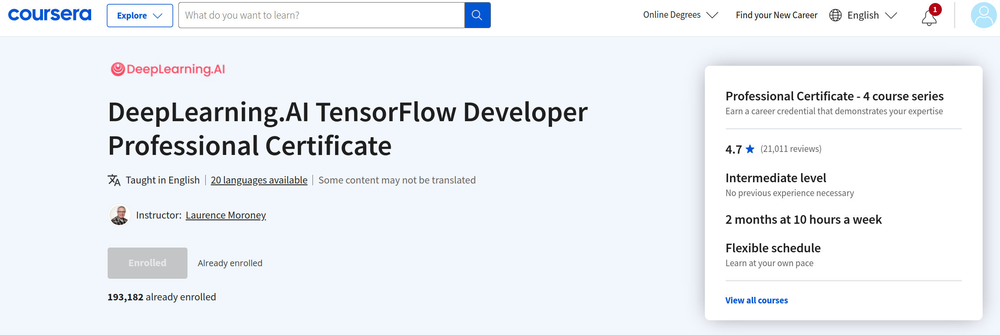

# DeepLearning.AI TensorFlow Developer Professional Certificate

## PROGRESO GENERAL: 

## INDICE:

-  [1 Introduction to TensorFlow for Artificial Intelligence, Machine Learning, and Deep Learning](1%20Introduction%20to%20TensorFlow%20for%20Artificial%20Intelligence%2C%20Machine%20Learning%2C%20and%20Deep%20Learning)
-  [2 Convolutional Neural Networks in TensorFlow](2%20Convolutional%20Neural%20Networks%20in%20TensorFlow)
-  [3 Natural Language Processing in TensorFlow](3%20Natural%20Language%20Processing%20in%20TensorFlow)
-  [4 Sequences, Time Series and Prediction](4%20Sequences%2C%20Time%20Series%20and%20Prediction)

[DeepLearning.AI TensorFlow Developer Professional Certificate](https://www.coursera.org/professional-certificates/tensorflow-in-practice)

## Acerca de TensorFlow
TensorFlow es uno de los marcos de aprendizaje profundo de código abierto más demandados y populares de la actualidad. El programa DeepLearning.AI TensorFlow Developer Professional Certificate le enseña habilidades aplicadas de aprendizaje automático con TensorFlow para que pueda construir y entrenar modelos potentes. 

## Acerca de esta Especialización
En este programa práctico de Certificación Profesional de cuatro cursos, aprenderá las herramientas necesarias para construir aplicaciones escalables potenciadas por IA con TensorFlow. Tras finalizar este programa, podrá aplicar sus nuevos conocimientos de TensorFlow a una amplia gama de problemas y proyectos. Este programa puede ayudarle a prepararse para el 
[examen](https://www.tensorflow.org/certificate)
 del Certificado Google TensorFlow y acercarle un paso más a la obtención del Certificado Google TensorFlow.

¿Listo para desplegar sus modelos al mundo? Aprenda a poner en marcha sus modelos con la 
[Especialización en TensorFlow: Datos y Despliegue](https://bit.ly/3pqKpu6)
.

¿Busca personalizar y construir potentes modelos del mundo real para escenarios complejos? Eche un vistazo a la Especialización TensorFlow: 
[Técnicas Avanzadas](https://bit.ly/32zBUTZ)
. 

## Proyecto de aprendizaje aplicado

En el programa DeepLearning.AI TensorFlow Developer Professional Certificate, obtendrá experiencia práctica a través de 16 tareas de programación en Python. Al final de este programa, estará preparado para: 

- Construir y entrenar redes neuronales utilizando TensorFlow

- Mejorar el rendimiento de su red utilizando convoluciones mientras la entrena para identificar imágenes del mundo real

- Enseñar a las máquinas a comprender, analizar y responder al habla humana con sistemas de procesamiento del lenguaje natural

- Procese texto, represente frases como vectores y entrene un modelo para crear poesía original